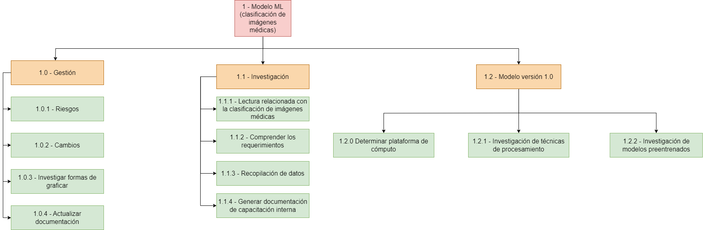

= TP Principal - Laboratorio de Construcción de Software
Ebertz Ximena <xebertz@campus.ungs.edu.ar>; Franco Leandro <leandro00fr@gmail.com>; López Gonzalo <gonzagonzalopez20@gmail.com>; Torrez Mauro <sntorrez9@gmail.com>; Venditto Pedro <pedrovenditto41@gmail.com>; Villalba Gastón <gastonleovillalba@gmail.com>;
v1, {docdate}
:toc:
:title-page:
:toc-title: Secciones
:numbered:
:source-highlighter: highlight.js
:tabsize: 4
:nofooter:
:pdf-page-margin: [3cm, 3cm, 3cm, 3cm]

== Introducción

La Inteligencia Artificial o _IA_ es un poderoso campo de estudio que está en constante crecimiento. Cada día, los modelos de Inteligencia Artificial evolucionan y se incorporan en nuestro día a día, funcionando como una potente herramienta de trabajo.

Existen muchos campos donde la Inteligencia Artificial se está desarrollando: detección de imágenes, texto, audio, etcétera. Resulta lógico pensar que se pueden desarrollar herramientas para campos más específicos, como medicina, finanzas, o investigación.

== Objetivos del proyecto

Nuestro objetivo es, mediante la aplicación de tecnologías relacionadas a las inteligencias artificiales, desarrollar un software que pueda ayudar a nuestros profesionales del área de la medicina a lograr un diagnóstico más rápido y preciso sobre alguna enfermedad o malestar en específico.

Para esto, realizaremos tareas de investigación, de análisis de datos y de desarrollo, entre otras.

== Objetivos del documento

El principal objetivo de este documento es especificar las decisiones que se tomen en los días previos al inicio del proyecto; tales como la distribución de roles de trabajo, los posibles riesgos del equipo y del proyecto, el tema a trabajar, las metodologías que se utilizarán, entre otras cosas relacionadas a la organización necesaria del proyecto.

== Metodología de trabajo
Somos parte del _Agile Release Train_ (que plantea el marco de trabajo *_SAFe_*) en conjunto con los demás grupos. Para coordinar nuestro trabajo adaptaremos el _framework_ ágil *_Scrum_* según las preferencias del equipo para optimizarla. Cada _Sprint_ dura *dos semanas*.

- *_Sprint Planning_*: se realizará el primer día del _Sprint_ y en ocasiones participará el _Release Train Engineer_.

- *_Daily Scrum_* cada 2 días: los integrantes del equipo tienen tiempos diferentes y un día de trabajo quizá no sea suficiente para tener un avance considerable para plantearlo en las _Daily_. Por incovenientes o bloqueo de un integrante, en el día que no hay _Daily_, se comunicarán por algunos de los medios detallados más adelante.

- *_Sprint Review_*: el último día del _Sprint_ se hará una presentación de los informes solicitados mostrando el avance del equipo.

- *_Sprint Retrospective_*: luego de la revisión de _Sprint_ se hará una retrospectiva del avance.

== Equipo de trabajo y roles

Los roles que se utilizarán en el equipo son los siguientes:

[cols="3*",options="header"]
|===
|Rol            |Encargado         |Suplente

|Scrum Master   |Villalba, Gastón  |Ebertz, Ximena
|Líder Técnico  |Ebertz, Ximena    |
|Desarrollador  |Franco, Leandro   |
|Desarrollador  |Torrez, Mauro     |
|Desarrollador  |López, Gonzalo    |
|Desarrollador  |Venditto, Pedro   |
|===

//modificar roles

== Gestión

=== WBS
.WBS

=== Visión

Nuestra visión es utilizar la tecnología de inteligencia artificial y aprendizaje automático para mejorar la atención médica y el diagnóstico. A través de nuestro trabajo en el presente trabajo práctico, buscamos desarrollar un modelo de clasificación de imágenes médicas que asista a los profesionales de la salud en la toma de decisiones clínicas. 

=== Misión

Nuestra misión es aplicar nuestros conocimientos y habilidades en procesamiento de imágenes y aprendizaje automático para crear soluciones innovadoras y efectivas que impacten positivamente en el ambito sanitario y el bienestar de las personas.

=== Alcance

Desarrollo y Entrenamiento del Modelo de IA:

- Investigación exhaustiva de algoritmos de aprendizaje automático, con el objetivo de seleccionar el más adecuado para el problema de clasificación de imágenes médicas.
- Implementación y entrenamiento del modelo utilizando el conjunto de datos previamente preparado.
- Optimización y validación del modelo para asegurar su eficacia y precisión en la clasificación de las imágenes médicas
- Se considerará la posibilidad de mejorar el modelo de inteligencia artificial si es necesario.

=== Plan de comunicaciones

Nuestros medios de comunicación son:

*Gather*: es una plataforma que nos permite tener una oficina virtual, donde cada uno tiene su personaje dentro de esta oficina. La utilizamos porque no tiene límites de tiempo, permite la comunicación a través de voz, compartir pizarras y es menos monótona que otras plataformas como _Meet_. Es una vía de comunicación formal que empleamos para las ceremonias _Scrum_.

*WhatsApp*: es un medio de comunicación informal que utilizamos para coordinar los horarios de las reuniones en _Gather_ y discutir cuestiones relacionadas con el proyecto que no requieran la presencia de todo el equipo en ese momento. Se trata de un método de comunicación [.underline]#asincrónica#.

*Telegram*: similar al uso que le damos a WhatsApp, pero para contactarnos con los demás equipos de trabajo. Principalmente es para coordinar reuniones o solicitar ayuda con alguna cuestión del proyecto.

*Email*: en caso de que sea necesario, por algún incoveniente externo que no permita las vías convencionales, utilizaremos el email de los integrantes para coordinar al equipo. Además, es la principal vía para comunicarnos con nuestro _Product Owner_.

*Jira/Trello*: comunicación de tareas y responsables de la ejecución de las mismas.

*Moodle*: se realizarán las entregas de documentación solicitada para realizar el _Sprint Review_.

La actualización de la documentación se hará formalmente al final de cada _Sprint_.

=== Riesgos

Matriz de evaluación de riesgos.

[cols="7*",options="header"]
|===
|Descripción                         |Probabilidad de que ocurrencia         |Severidad      |Exposición al riesgo|Acciones para mitigarlos|Contingencia|Responsable

|Solapamiento de _datasets_ con el grupo 2|1|3|3|Tener varios _datasets_. Acordar con el grupo 2|Cambiar a otro _dataset_.| Ebertz, Ximena; Villalba, Gastón
|||||||
|||||||
|||||||
|||||||
|||||||
|||||||
|===

=== Administración en el Manejo de bugs

Utilizaremos los _issues_ de _GitHub_ para reportar bugs. Además se agregarán al tablero Jira de los PO, SM y LT. Posteriormente a un (Trello/Jira) de nuestro equipo para gestionar el estado el bug.

=== Administración de Cambios

Tras recibir una petición de cambio, documentaremos las nuevas funcionalidades que se solicitan y posteriormente se agregarán al _Product Backlog_. Esta nueva modificación se evaluará, se estimará con los integrantes del proyecto, se modificará la WBS, Diccionario y se agregará al _Sprint Backlog_.

== Tecnologías

Las tecnologías a utilizar serán las siguientes:

- *Google Collab* para el desarrollo del modelo de IA, ya que el entorno de trabajo contiene todo lo necesario.
- *Python* como lenguaje de programación, por su simplicidad y utilidad en el desarrollo de este tipo de modelos.
- *TensorFlow - Keras* como biblioteca principal de desarrollo, ya que provee distintas funcionalidades para la creación de modelos de IA.
- *NumPy* debido a la necesidad de trabajar las imágenes como arrays multidimensionales o _tensores_.
- *Pandas* ya que permite obtener información de archivos .csv.
- *cv2* como biblioteca de lectura y procesamiento de imágenes.
- *matplotlib.pyplot* para generar gráficos.
- *GitHub* como repositorio de trabajo.

=== Repositorio de GitHub

https://github.com/ximeeb/tp-principal-grupo-0-lcs.git

Acá podríamos poner enlaces
