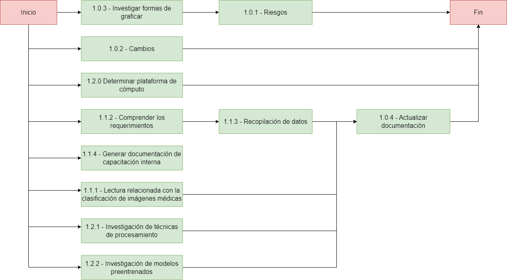

= TP Principal - Laboratorio de Construcción de Software
Ebertz Ximena <xebertz@campus.ungs.edu.ar>; Franco Leandro <leandro00fr@gmail.com>; López Gonzalo <gonzagonzalopez20@gmail.com>; Torrez Mauro <sntorrez9@gmail.com>; Venditto Pedro <pedrovenditto41@gmail.com>; Villalba Gastón <gastonleovillalba@gmail.com>;
v1, {docdate}
:toc:
:title-page:
:toc-title: Secciones
:numbered:
:source-highlighter: highlight.js
:tabsize: 4
:nofooter:
:pdf-page-margin: [3cm, 3cm, 3cm, 3cm]

== Introducción

La Inteligencia Artificial o _IA_ es un poderoso campo de estudio que está en constante crecimiento. Cada día, los modelos de Inteligencia Artificial evolucionan y se incorporan en nuestro día a día, funcionando como una potente herramienta de trabajo.

Existen muchos campos donde la Inteligencia Artificial se está desarrollando: detección de imágenes, texto, audio, etcétera. Resulta lógico pensar que se pueden desarrollar herramientas para campos más específicos, como medicina, finanzas, o investigación.

== Objetivos del proyecto

Nuestro objetivo es, mediante la aplicación de tecnologías relacionadas a las inteligencias artificiales, desarrollar un software que pueda ayudar a nuestros profesionales del área de la medicina a lograr un diagnóstico más rápido y preciso sobre alguna enfermedad o malestar en específico.

Para esto, realizaremos tareas de investigación, de análisis de datos y de desarrollo, entre otras.

== Objetivos del documento

El principal objetivo de este documento es especificar las decisiones que se tomen en los días previos al inicio del proyecto; tales como la distribución de roles de trabajo, los posibles riesgos del equipo y del proyecto, el tema a trabajar, las metodologías que se utilizarán, entre otras cosas relacionadas a la organización necesaria del proyecto.

== Metodología de trabajo

Somos parte del _Agile Release Train_ (que plantea el marco de trabajo *_SAFe_*) en conjunto con los demás grupos. Para coordinar nuestro trabajo adaptaremos el _framework_ ágil *_Scrum_* según las preferencias del equipo para optimizarla. Cada _Sprint_ dura *dos semanas*.

- *_Sprint Planning_*: se realizará el primer día del _Sprint_ y en ocasiones participará el _Release Train Engineer_.

- *_Daily Scrum_* cada 2 días: los integrantes del equipo tienen tiempos diferentes y un día de trabajo quizá no sea suficiente para tener un avance considerable para plantearlo en las _Daily_. Por inconvenientes o bloqueo de un integrante, en el día que no hay _Daily_, se comunicarán por algunos de los medios detallados más adelante.

- *_Sprint Review_*: el último día del _Sprint_ se hará una presentación de los informes solicitados mostrando el avance del equipo.

- *_Sprint Retrospective_*: luego de la revisión de cada _Sprint_ se hará una retrospectiva del avance.

== Equipo de trabajo y roles

Los roles que se utilizarán en el equipo son los siguientes:

[cols="3*", options="header"]
|===
|Rol            |Encargado         |Suplente

|Scrum Master   |Villalba, Gastón  |Ebertz, Ximena
|Líder Técnico  |Ebertz, Ximena    |Franco, Leandro
|Data Scientist  |Franco, Leandro   |
|Data Scientist  |Torrez, Mauro     |
|Machine Learning Engineer  |López, Gonzalo    |
|Data Scientist  |Venditto, Pedro   |
|===

== Gestión

=== WBS

.WBS
image::img/wbs.png[]

=== Diccionario WBS

[cols="5*", options="header"]
|===
|ID
|Nombre
|Descripción
|Tarea
|Peso

|1
|Modelo de ML (Clasificación de imágenes médicas)
|En este proyecto se busca diseñar, entrenar y optimizar un modelo de clasificación de imágenes médicas utilizando técnicas de inteligencia artificial y aprendizaje automático. El objetivo es crear un modelo que pueda clasificar imágenes médicas con alta precisión y rapidez, lo que podría tener un gran impacto en la industria médica.
|
|

|1.1
|Investigación
|En esta etapa se realizará una investigación exhaustiva sobre el problema de clasificación de imágenes médicas. Se leerán artículos y publicaciones relacionados con el tema, se entrevistará a expertos en el campo médico para obtener información sobre las características importantes a considerar en la clasificación de imágenes médicas, se comprenderán los requerimientos del proyecto y se definirán las especificaciones necesarias para el conjunto de datos y el modelo. También se recopilarán y prepararán los datos necesarios para el entrenamiento del modelo, incluyendo la limpieza y el preprocesamiento de imágenes según sea necesario.
|Realizar investigación sobre el problema de clasificación de imágenes médicas, incluyendo la lectura relacionada con el tema, la entrevista a expertos y la comprensión de los requerimientos. También se debe realizar la recopilación de datos necesarios para el entrenamiento del modelo.
|

|1.1.1
|Lectura relacionada con la clasificación de imágenes médicas.
|En esta tarea se leerán artículos y publicaciones relacionados con la clasificación de imágenes médicas para comprender mejor el problema y las técnicas utilizadas en la industria. Se buscará información sobre los diferentes tipos de imágenes médicas, las características importantes a considerar al clasificar estas imágenes y las técnicas de procesamiento de imágenes utilizadas en la industria.
|Leer artículos y publicaciones relacionados con la clasificación de imágenes médicas para comprender mejor el problema y las técnicas utilizadas en la industria.
|1,2

|1.1.2
|Entrevistar expertos
|En esta tarea se entrevistará a expertos en el campo médico para obtener información sobre las características importantes a considerar en la clasificación de imágenes médicas. Se buscará información sobre los diferentes tipos de imágenes médicas, las características importantes a considerar al clasificar estas imágenes y las técnicas de procesamiento de imágenes utilizadas en la industria. También se preguntará sobre los principales desafíos que enfrentan los profesionales médicos al clasificar imágenes médicas y cómo un modelo de aprendizaje automático podría ayudar a abordar estos desafíos.
|Entrevistar a expertos en el campo médico para obtener información sobre las características importantes a considerar en la clasificación de imágenes médicas.
|2,4

|1.1.3
|Comprender los requerimientos
|En esta tarea se comprenderán los requerimientos del proyecto y se definirán las especificaciones necesarias para el conjunto de datos y el modelo. Se buscará información sobre los requisitos específicos del modelo, como el tamaño mínimo del conjunto de datos, la precisión requerida y el tiempo máximo permitido para la clasificación de una imagen. También se definirán las especificaciones necesarias para el conjunto de datos, como el tamaño mínimo de imagen, la cantidad mínima de imágenes por clase y el equilibrio entre las clases.
|Comprender los requerimientos del proyecto y definir las especificaciones necesarias para el conjunto de datos y el modelo.
|1,02

|1.1.4
|Recopilación de datos
|En esta tarea se recopilarán y prepararán los datos necesarios para el entrenamiento del modelo, incluyendo la limpieza y el preprocesamiento de imágenes según sea necesario. Se buscarán conjuntos de datos públicos o privados que puedan ser utilizados para entrenar y validar el modelo. También se realizará una limpieza básica de los datos, eliminando imágenes irrelevantes o corruptas y ajustando el tamaño y formato de las imágenes según sea necesario.
|Recopilar y preparar los datos necesarios para el entrenamiento del modelo, incluyendo la limpieza y el preprocesamiento de imágenes según sea necesario.
|2,76

|1.2
|Modelo versión 1.0
|En esta etapa se diseñará, entrenará y optimizará un modelo de clasificación de imágenes médicas utilizando técnicas de inteligencia artificial y aprendizaje automático. Se investigarán las técnicas de procesamiento de imágenes necesarias para preparar los datos para el entrenamiento del modelo, refinando los datos, nivelando las clases y aumentando los datos si es necesario. También se investigarán modelos pre-entrenados que puedan ser utilizados como punto de partida para el diseño del nuevo modelo. Luego se definirá la arquitectura del modelo, se entrenará con los datos preparados en la etapa anterior y se optimizará para maximizar la precisión y minimizar el tiempo necesario para clasificar una imagen.
|Diseñar, entrenar y optimizar un modelo de clasificación de imágenes médicas utilizando técnicas de inteligencia artificial y aprendizaje automático.
|

|1.2.1
|Procesamiento de imágenes
|En esta tarea se investigarán las técnicas de procesamiento de imágenes necesarias para preparar los datos para el entrenamiento del modelo. Se refinan los datos, nivelan las clases y aumentan los datos si es necesario, todo con el objetivo de mejorar la calidad del conjunto de datos utilizado para entrenar al modelo. También se investigará cómo mejorar la calidad del conjunto de datos mediante técnicas como la normalización, la reducción del ruido y la eliminación del fondo no deseado en las imágenes.
|Investigar las técnicas de procesamiento de imágenes necesarias para preparar los datos para el entrenamiento del modelo, refinando los datos, nivelando las clases y aumentando los datos si es necesario.
|

|1.2.1.1
|Investigación de técnicas de procesamiento
|En esta tarea se investigarán diferentes técnicas de procesamiento de imágenes que pueden ser útiles para preparar los datos para el entrenamiento del modelo. Se buscará información sobre técnicas como la normalización, la reducción del ruido y la eliminación del fondo no deseado en las imágenes, entre otras posibles técnicas que puedan ser utilizadas para mejorar la calidad del conjunto de datos utilizado para entrenar al modelo.
|Investigar diferentes técnicas de procesamiento de imágenes que pueden ser útiles para preparar los datos para el entrenamiento del modelo.
|1,72

|1.2.1.2
|Refinamiento de datos
|En esta tarea se refinan los datos utilizando diferentes técnicas como la normalización, la reducción del ruido y la eliminación del fondo no deseado en las imágenes, entre otras posibles técnicas que puedan ser utilizadas para mejorar la calidad del conjunto de datos utilizado para entrenar al modelo. El objetivo es eliminar cualquier ruido o distorsión en las imágenes que puedan afectar negativamente al rendimiento del modelo durante el entrenamiento o la validación.
|Refinar los datos utilizando diferentes técnicas como la normalización, la reducción del ruido y la eliminación del fondo no deseado en las imágenes, entre otras posibles técnicas que puedan ser utilizadas para mejorar la calidad del conjunto de datos utilizado para entrenar al modelo.
|2,04

|1.2.1.3
|Nivelación de clases
|En esta tarea se nivelan las clases en el conjunto de datos utilizado para entrenar al modelo, asegurando que cada clase tenga un número similar de muestras disponibles durante el entrenamiento. Esto es importante porque si una clase tiene muchas más muestras que otra, puede afectar negativamente al rendimiento del modelo durante el entrenamiento o la validación. Se utilizarán técnicas como submuestreo o sobremuestreo según sea necesario para equilibrar las clases en el conjunto de datos utilizado para entrenar al modelo.
|Nivelar las clases en el conjunto de datos utilizado para entrenar al modelo, asegurando que cada clase tenga un número similar de muestras disponibles durante el entrenamiento utilizando técnicas como submuestreo o sobremuestreo según sea necesario.
|1,2

|1.2.1.4
|Aumento de datos
|En esta tarea se aumentará el conjunto de datos utilizado para entrenar al modelo mediante técnicas como rotación, traslación o cambio en la escala para crear nuevas muestras a partir del conjunto original. Esto es importante porque si el conjunto original es pequeño, puede haber problemas durante el entrenamiento debido a la falta de variabilidad en los datos disponibles.
|Aumentar el conjunto de datos utilizado para entrenar al modelo mediante técnicas como rotación, traslación o cambio en la escala para crear nuevas muestras a partir del conjunto original con el objetivo incrementar la variabilidad en los datos disponibles durante el entrenamiento.
|1,56

|1.2.2.1
|Investigación de procesamiento modelos preentrenados
|En esta tarea se investigará sobre el procesamiento de modelos preentrenados para utilizarlos en el modelo de clasificación de imágenes médicas. Se buscarán modelos preentrenados que sean relevantes para el problema específico de clasificación de imágenes médicas, se comprenderán las características y limitaciones de estos modelos y se seleccionará el modelo más adecuado para el proyecto. También se explorarán técnicas de transferencia de aprendizaje y se definirán las capas necesarias para adaptar el modelo preentrenado al problema específico de clasificación de imágenes médicas.
|Investigar sobre el procesamiento de modelos preentrenados para utilizarlos en el modelo de clasificación de imágenes médicas, seleccionar el modelo más adecuado para el proyecto y definir las capas necesarias para adaptar el modelo preentrenado al problema específico de clasificación de imágenes médicas.
|1,88

|1.2.2.2
|Definición de arquitectura
|En esta tarea se definirá la arquitectura del modelo de clasificación de imágenes médicas. Se seleccionarán las capas adecuadas para el problema específico de clasificación de imágenes médicas, se definirá la estructura general del modelo y se especificarán los hiperparámetros necesarios para entrenar el modelo. También se explorarán técnicas para evitar el sobreajuste y se definirá un plan para la evaluación del modelo.
|Definir la arquitectura del modelo de clasificación de imágenes médicas, seleccionar las capas adecuadas, definir la estructura general del modelo y especificar los hiperparámetros necesarios para entrenar el modelo.
|1,72

|1.2.2.3
|Entrenamiento del modelo
|En esta tarea se entrenará el modelo de clasificación de imágenes médicas utilizando los datos preparados en la etapa anterior. Se definirá un plan de entrenamiento que incluya la selección del optimizador y la función de pérdida adecuados, la definición del tamaño del lote y el número de épocas necesarias para entrenar el modelo. También se implementará una técnica para el seguimiento del progreso del entrenamiento y se ajustarán los hiperparámetros a medida que sea necesario.
|Entrenar el modelo de clasificación de imágenes médicas utilizando los datos preparados en la etapa anterior, implementar una técnica para el seguimiento del progreso del entrenamiento y ajustar los hiperparámetros a medida que sea necesario.
|3,24

|1.2.2.4
|Optimización del modelo
|En esta tarea se optimizará el modelo de clasificación de imágenes médicas para mejorar su precisión y rendimiento. Se explorarán técnicas como la regularización, la normalización y el aumento de datos para mejorar la capacidad del modelo para generalizar a nuevos datos. También se evaluará el rendimiento del modelo utilizando métricas relevantes y se ajustarán los hiperparámetros a medida que sea necesario.
|Optimizar el modelo de clasificación de imágenes médicas utilizando técnicas como la regularización, la normalización y el aumento de datos, evaluar su rendimiento utilizando métricas relevantes y ajustar los hiperparámetros a medida que sea necesario.
|2,08

|1.3.1
|Ajuste del modelo
|En esta tarea se ajustará el modelo de clasificación de imágenes médicas para mejorar su precisión y rendimiento en los datos de validación. Se explorarán técnicas como la selección del umbral adecuado, la calibración del modelo y la combinación de modelos para mejorar la precisión del modelo en los datos de validación. También se evaluará el rendimiento del modelo utilizando métricas relevantes y se ajustarán los hiperparámetros a medida que sea necesario.
|Ajustar el modelo de clasificación de imágenes médicas para mejorar su precisión y rendimiento en los datos de validación utilizando técnicas como la selección del umbral adecuado, la calibración del modelo y la combinación de modelos, evaluar su rendimiento utilizando métricas relevantes y ajustar los hiperparámetros a medida que sea necesario.
|2,6

|1.3.2
|Confirmación con expertos
|En esta tarea se confirmará el rendimiento del modelo con expertos en el campo médico para asegurarse de que es adecuado para su uso en la industria médica. Se presentará el modelo a expertos en el campo médico y se recopilarán comentarios sobre su precisión, velocidad y facilidad de uso. También se identificarán posibles mejoras o limitaciones del modelo y se definirán planes para futuras iteraciones del proyecto.
|Confirmar el rendimiento del modelo con expertos en el campo médico, presentando el modelo a expertos en el campo médico y recopilando comentarios sobre su precisión, velocidad y facilidad de uso. Identificar posibles mejoras o limitaciones del modelo y definir planes para futuras iteraciones del proyecto.
|4,48
|===

=== Diagrama de precedencia

.diagrama de precedencia

=== Visión

Nuestra visión es utilizar la tecnología de inteligencia artificial y aprendizaje automático para mejorar la atención médica y el diagnóstico. A través de nuestro trabajo en el presente trabajo práctico, buscamos desarrollar un modelo de clasificación de imágenes médicas que asista a los profesionales de la salud en la toma de decisiones clínicas. 

=== Misión

Nuestra misión es aplicar nuestros conocimientos y habilidades en procesamiento de imágenes y aprendizaje automático para crear soluciones innovadoras y efectivas que impacten positivamente en el ámbito sanitario y el bienestar de las personas.

=== Alcance

Desarrollo y Entrenamiento del Modelo de IA:

- Investigación exhaustiva de algoritmos de aprendizaje automático, con el objetivo de seleccionar el más adecuado para el problema de clasificación de imágenes médicas.
- Implementación y entrenamiento del modelo utilizando el conjunto de datos previamente preparado.
- Optimización y validación del modelo para asegurar su eficacia y precisión en la clasificación de las imágenes médicas
- Se considerará la posibilidad de mejorar el modelo de inteligencia artificial si es necesario.

=== Plan de comunicaciones

Nuestros medios de comunicación son:

*Gather*: es una plataforma que nos permite tener una oficina virtual, donde cada uno tiene su personaje dentro de esta oficina. La utilizamos porque no tiene límites de tiempo, permite la comunicación a través de voz, compartir pizarras y es menos monótona que otras plataformas como _Meet_. Es una vía de comunicación formal que empleamos para las ceremonias _Scrum_.

*WhatsApp*: es un medio de comunicación informal que utilizamos para coordinar los horarios de las reuniones en _Gather_ y discutir cuestiones relacionadas con el proyecto que no requieran la presencia de todo el equipo en ese momento. Se trata de un método de comunicación [.underline]#asincrónica#.

*Telegram*: similar al uso que le damos a WhatsApp, pero para contactarnos con los demás equipos de trabajo. Principalmente es para coordinar reuniones o solicitar ayuda con alguna cuestión del proyecto.

*Email*: en caso de que sea necesario, por algún inconveniente externo que no permita las vías convencionales, utilizaremos el email de los integrantes para coordinar al equipo. Además, es la principal vía para comunicarnos con nuestro _Product Owner_.

*Jira/Trello*: comunicación de tareas y responsables de la ejecución de las mismas.

*Moodle*: se realizarán las entregas de documentación solicitada para realizar el _Sprint Review_.

La actualización de la documentación se hará formalmente al final de cada _Sprint_.

=== Riesgos

Matriz de evaluación de riesgos.

[cols="7*", options="header"]
|===
|Descripción|Probabilidad de ocurrencia|Severidad|Exposición al riesgo|Acciones para mitigarlos|Contingencia|Responsable

|Solapamiento de _datasets_ con el grupo 2|1|3|3|Tener varios _datasets_. Acordar con el grupo 2|Cambiar a otro _dataset_| Ebertz, Ximena; Villalba, Gastón
|Escasez de recursos computacionales|2|3|6|Tener alternativas de entornos de trabajo|Cambiar de entorno de trabajo| Ebertz, Ximena
|Ausencia de miembros del equipo en fechas 2023-10-05, 2023-11-02, 2023-06-11 por motivos de estudio|3|3|9|Definir reemplazantes, planificar ausencias|Reemplazos| Ebertz, Ximena
|Pérdida de trabajo en el entorno, por solapamiento|3|3|9|Backups periódicos, registro de cambios|Restablecer backup| López, Gonzalo
|||||||
|||||||
|||||||
|===

=== Administración en el Manejo de bugs

Utilizaremos los _issues_ de _GitHub_ para reportar bugs. Además se agregarán al tablero Jira de los Product Owner, Scrum Master y Líder Técnico. Posteriormente a un Trello de nuestro equipo para gestionar el estado el bug.

=== Administración de Cambios

Tras recibir una petición de cambio, documentaremos las nuevas funcionalidades que se solicitan y posteriormente se agregarán al _Product Backlog_. Esta nueva modificación se evaluará, se estimará con los integrantes del proyecto, se modificará la WBS, Diccionario y se agregará al _Sprint Backlog_.

=== Indicadores

*Burndown Chart*: Al utilizar Scrum
precisamos ver el avance de nuestro trabajo 
a medida de cada Sprint. 
El trabajo se expresará en Story Point, teniendo en cuenta que un Story Point es igual a una hora.

== Tecnologías

Las tecnologías a utilizar serán las siguientes:

- *Google Collab* para el desarrollo del modelo de IA, ya que el entorno de trabajo contiene todo lo necesario.
- *Python* como lenguaje de programación, por su simplicidad y utilidad en el desarrollo de este tipo de modelos.
- *TensorFlow - Keras* como biblioteca principal de desarrollo, ya que provee distintas funcionalidades para la creación de modelos de IA.
- *NumPy* debido a la necesidad de trabajar las imágenes como arrays multidimensionales o _tensores_.
- *Pandas* ya que permite obtener información de archivos .csv.
- *cv2* como biblioteca de lectura y procesamiento de imágenes.
- *matplotlib.pyplot* para generar gráficos.
- *GitHub* como repositorio de trabajo.

=== Repositorio de GitHub

El repositorio de GitHub se encuentra https://github.com/ximeeb/tp-principal-grupo-0-lcs.git[aquí].

Acá podríamos poner enlaces
