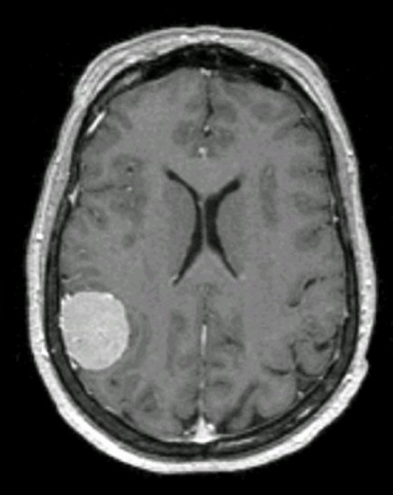
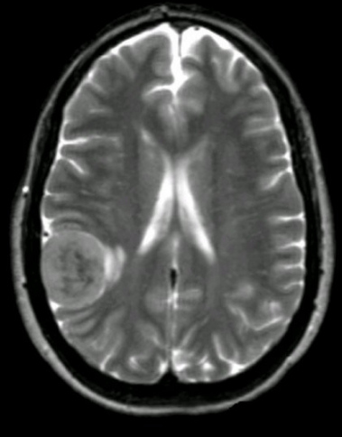
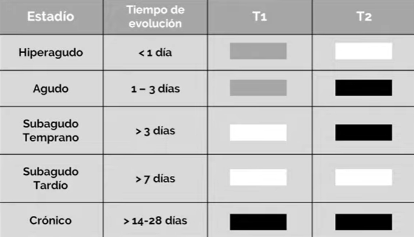

= Clasificación de Imágenes Médicas
Ebertz Ximena <xebertz@campus.ungs.edu.ar>; Franco Leandro <leandro00fr@gmail.com>; López Gonzalo <gonzagonzalopez20@gmail.com>; Venditto Pedro <pedrovenditto41@gmail.com>; Villalba Gastón <gastonleovillalba@gmail.com>;
v1, {docdate}
:toc:
:title-page:
:toc-title: Secciones
:numbered:
:source-highlighter: highlight.js
:tabsize: 4
:nofooter:
:pdf-page-margin: [3cm, 3cm, 3cm, 3cm]

== Introducción

En este documento se determinarán las distintas formas de clasificación de imágenes médicas para distintos tipos de imágenes; y principalmente para imágenes de _MRI_ cerebrales que determinan la presencia o ausencia de un tumor en el cerebro.

== Imágenes por resonancia magnética

Para generar este tipo de imágenes se utilizan ondas de radio y campos magnéticos; lo que permite observar los órganos a través del movimiento de los protones.

Este método se utiliza para generar imágenes de órganos blandos tales como el cerebro, el corazón, o el hígado. También son utilizadas para lesiones de rodilla y hombro, ya que aportan una visión más clara que los rayos X.

=== Uso en el cerebro

Se escoge frente a la tomografía computarizada debido a las imágenes de calidad que genera, ya que brinda un fuerte contraste entre la materia gris y la materia blanca.

Existen dos tipos de magnetización, que generan imágenes con características invertidas según la magnetización que se utiliza:

* *Magnetización Longitudinal o T1:* Las sustancias blancas y estructuras con tiempos de relajación cortos tienen una señal alta, lo que permite que se visualicen de color claro. En cambio, la sustancia gris y las estructuras con tiempos de relajación largos, como el líquido cefalorraquídeo, tienen una señal baja, por lo que se ven más oscuro.

* *Magnetización Transversal o T2:* La sustancia gris y las estructuras con tiempos de relajación largos tienen una señal alta, por lo que se ven más claros. Las sustancias blancas y estructuras con tiempos de relajación cortos tienen una señal baja, lo que genera que se visualicen de color oscuro.

* *Magnetización Flair:* Es una magnetización basada en T2 en la que se eliminan las señales altas.

En ambos tipos de magnetizaciones se puede utilizar un agente de contraste en el paciente para destacar de mejor forma a la lesión. En la imagen esto se ve como un halo con señal hiperintensa.

Es importante aclarar que el encéfalo es un órgano simétrico. Es decir, la comparación de sus lados puede evidenciar las anomalías existentes.

Existen dos tipos de lesiones: las lesiones intra axiales y las extra axiales. Se puede ver una comparación entre ellas en la siguiente imagen:

image:imgs/tipos-de-lesiones.png[align="center"]

La figura *A* corresponde a un cerebro sin lesiones, la *B* corresponde a un cerebro con una lesión extra axial; y la *C* corresponde a un cerebro con una lesión intra axial.

==== Masas Intra Axiales

Las masas intra axiales son las que se encuentran dentro del parénquima cerebral. La lesión se rodea por el parénquima encefálico. Los tipos más comunes son las metástasis o secundarismo, y los gliomas.

La metástasis se presenta como una formación de un tumor a partir de celular cancerosas de un tumor previo. No necesariamente se forma en el mismo lugar, ya que las células tienen la capacidad de viajar por el cuerpo a través de la sangre o el sistema linfático.

.diferencias de visualización según magnetización
[cols="a,a", frame=none, grid=none, role=right]
|===
|   image:imgs/metastasis-t1.png[150, 250, align="right"]
|   image:imgs/metastasis-t2.png[150, 250 align="right"]
|   magnetización T1  |magnetización T2
|===

Las imágenes anteriores muestran dos imágenes del cerebro de una paciente con metástasis. Es clara la diferencia de visualización según el tipo de magnetización utilizada en la resonancia magnética.

==== Masas Extra Axiales

Las masas extra axiales son las que se encuentran en el límite del parénquima cerebral. Generan que la corteza del cerebro se desplace hacia la sustancia blanca, y puede haber un límite de líquido cefalorraquídeo entre la lesión y el parénquima cerebral.

Los más comunes son los meningiomas, es decir, los tumores benignos.

.diferencias de visualización según magnetización
[cols="a,a", frame=none, grid=none, role=right]
|===
|   
|   
|   magnetización T1  |magnetización T2
|===

Las imágenes anteriores muestran el cerebro de una paciente con un meningioma. Se puede observar que en este caso la magnetización T1 arrojó mejores resultados.

==== Naturaleza de lesiones

Las lesiones pueden tener diferentes composiciones, ya sea quística, sólida, hermorrágica, u otra. Tienen tamaño, forma, y delimitación de la forma; y pueden ser múltiples.

En las imágenes se observan con distinta intensidad, según la lesión y el tipo de magnetización.

.Visualización de lesiones
[cols="3*", options="header"]
|===
|Sustancia o tejido |Imagen T1          |Imagen T2
|Agua               |Hipointenso        |Hiperintenso
|Hueso              |Muy hipointenso    |Muy hipointenso
|Músculo            |Gris intermedio    |Gris intermedio
|Grasa              |Hiperintenso       |Hipointenso
|Ligamentos         |Hipointenso        |Hipointenso
|Sangre             |Hiperintenso       |Hiperintenso
|===

Según el período de tiempo en el que se analiza, los tumores se pueden visualizar mejor o peor en una resonancia magnética.

En los periodos hiperagudo y agudo es difícil identificarlo en ambas secuencias, sin embargo, en el período agudo se observan mejor en T2.

En el período subagudo temprano es más fácil detectar un tumor en T1, y en el periodo subagudo tardío es más fácil identificarlo en ambos.

Por último, en el período crónico, se puede identificar pero no con tanta facilidad como el el periodo subagudo temprano.

=== Artificios

Los artificios son distorsiones en las imágenes que no tienen relación con la condición médica del paciente.

Existen distintos tipos de artificios:

.Tipos de artificios
[cols="3*", options="header"]
|===
|Tipo                           |Imagen                                     |Causa
|De movimiento                  |Borrosa, con líneas sucesivas              |Movimientos
|De solapamiento                |Superposición de anatomía                  |Área reducida
|De truncamiento                |Banda de hipo o hiperintensa en el borde   |Defecto de reconstrucción de imagen
|De susceptibilidad magnética   |Área de vacío de señal                     |Sustancias magnéticas
|===

Estos artificios pueden interferir en el diagnóstico del profesional.

== Radiografía

La radiografía utiliza radiación electromagnética para generar imágenes del interior del cuerpo.

Se emiten ondas de alta energía, que son absorbidas (o no) por ciertos órganos del cuerpo, lo que permite que se visualicen mejor.

=== Qué se puede visualizar

Las ondas generadas se absorben en distintos grados según el receptor. Los tejidos blandos no absorben estas ondas, por lo que se presentan en distintos tonos de gris en la imagen. Los tejidos duros, en cambio, absorben estas ondas de mejor manera; por lo que se ven de color casi blanco. Los metales, por otra parte, se ven completamente blancos; y el aire y gas se ven de color negro.

Esta diferenciación se da debido a las densidades de los tejidos. A mayor densidad, mayor absorción de rayos X. Por este motivo el metal se presenta de color blanco.

En este tipo de imágenes también existe la posibilidad de introducir un medio de contraste en el paciente, para mejor visualización.

=== Usos

La tecnología de imágenes por radiografía se utiliza en muchas partes del cuerpo. Por ejemplo:

* _Huesos y dientes:_ se utiliza para identificar fracturas, infecciones, artritis, caries dentales, osteoporosis y cáncer de huesos.

* _Tórax:_ se utiliza para identificar infecciones, afecciones pulmonares, cáncer mamario, corazón dilatado y vasos sanguíneos obstruidos.

* _Abdomen:_ se utiliza para identificar problemas en el tubo digestivo y objetos tragados.

En particular, se utilizan mucho para identificar fracturas, ya que el color claro de los huesos contrasta con el gris de los músculos adyacentes; neumonía, ya que el aire de los pulmones, de color negro, contrasta con los tejidos infectados, que se presentan de color blanco; y obstrucciones intestinales, ya que el aire del interior del intestino contrasta con el color gris de los tejidos que lo rodean.

=== Tipos

==== Radiografías con medio de contraste

Se aplica al paciente un medio de contraste radiopaco, mediante inyección intravenosa, por vía oral, o mediante enema. Esto hace que el tejido a analizar se vea más blanco en la imagen resultante.

También se puede utilizar bario o gastrografín mediante ingesta, lo que facilita la visualización del esófago, estómago y el intestino delgado. Esto ayuda a la detección de úlceras, tumores, obstrucciones, pólipos y diverticulosis.

==== Radioscopia

La radioscopia genera imágenes que muestran movimiento, por lo que son útiles para observar el funcionamiento de los órganos o estructuras. Se utiliza comúnmente para detectar ritmos anómalos del corazón, detectar si un catéter está bien colocado, evaluar el tracto gastrointestinal, y observar el movimiento de los huesos y articulaciones.

//== Tomografía Computarizada

//== Ecografía

== Fuentes

https://www.postdicom.com/es/blog/medical-imaging-types-and-modalities[Postdicom - Tipos de Imágenes Médicas]

https://www.redalyc.org/articulo.oa?id=231022506005[D. Rivera, S. Puentes, L. Caballero - Resonancia magnética cerebral: secuencias básicas e interpretación]

https://www.youtube.com/watch?v=0eFvBrpPBk0&ab_channel=Radiolog%C3%ADa2.0[Radiología 2.0 - Análisis de las imágenes en la RM Cerebro]

https://www.msdmanuals.com/es/hogar/temas-especiales/pruebas-de-diagn%C3%B3stico-por-la-imagen-habituales/radiograf%C3%ADas-simples[Manual MSD - Radiografías simples]

https://www.mayoclinic.org/es/tests-procedures/x-ray/about/pac-20395303[Mayo Clinic - Radiografía]