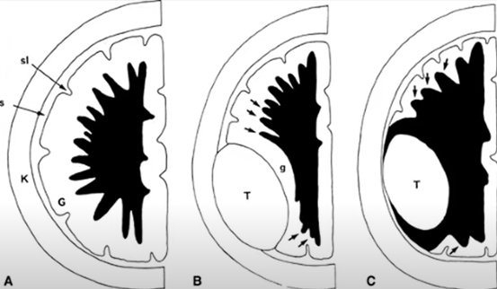
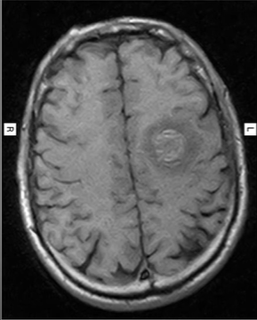
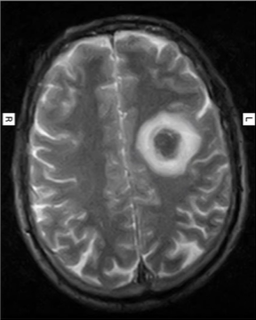

= Clasificación de Imágenes Médicas
Ebertz Ximena <xebertz@campus.ungs.edu.ar>; Franco Leandro <leandro00fr@gmail.com>; López Gonzalo <gonzagonzalopez20@gmail.com>; Torrez Mauro <sntorrez9@gmail.com>; Venditto Pedro <pedrovenditto41@gmail.com>; Villalba Gastón <gastonleovillalba@gmail.com>;
v1, {docdate}
:toc:
:title-page:
:toc-title: Secciones
:numbered:
:source-highlighter: highlight.js
:tabsize: 4
:nofooter:
:pdf-page-margin: [3cm, 3cm, 3cm, 3cm]

== Introducción

En este documento se determinarán las distintas formas de clasificación de imágenes médicas para distintos tipos de imágenes; y principalmente para imágenes de _MRI_ cerebrales que determinan la presencia o ausencia de un tumor en el cerebro.

== Tipos de imágenes médicas

=== Imágenes por resonancia magnética

Para generar este tipo de imágenes se utilizan ondas de radio y campos magnéticos; lo que permite observar los órganos a través del movimiento de los protones.

Este método se utiliza para generar imágenes de órganos blandos tales como el cerebro, el corazón, o el hígado. También son utilizadas para lesiones de rodilla y hombro, ya que aportan una visión más clara que los rayos X.

==== Uso en el cerebro

Se escoge frente a la tomografía computarizada debido a las imágenes de calidad que genera, ya que brinda un fuerte contraste entre la materia gris y la materia blanca.

Existen dos tipos de magnetización, que generan imágenes con caracterísiticas invertidas según la magnetización que se utiliza:

* *Magnetización Longitudinal o T1:* Las sustancias blancas y estructuras con tiempos de relajación cortos tienen una señal alta, lo que permite que se visualicen de color claro. En cambio, la sustancia gris y las estructuras con tiempos de relajación largos, como el líquido cefalorraquídeo, tienen una señal baja, por lo que se ven más oscuro.

* *Magnetización Transversal o T2:* La sustancia gris y las estructuras con tiempos de relajación largos tienen una señal alta, por lo que se ven más claros. Las sustancias blancas y estructuras con tiempos de relajación cortos tienen una señal baja, lo que genera que se visualicen de color oscuro.

En ambos tipos de magnetizaciones se puede utilizar un agente de contraste en el paciente para destacar de mejor forma a la lesión. En la imagen esto se ve como un halo con señal hiperintensa.

Es importante aclarar que el encéfalo es un órgano simétrico. Es decir, la comparación de sus lados puede evidenciar las anomalías existentes.

Existen dos tipos de lesiones: las lesiones intra axiales y las extra axiales. Se puede ver una comparación entre ellas en la siguiente imagen:

La figura *A* corresponde a un cerebro sin lesiones, la *B* corresponde a un cerebro con una lesión extra axial; y la *C* corresponde a un cerebro con una lesión intra axial.

===== Masas Intra Axiales

Las masas intra axiales son las que se encuentran dentro del parénquima cerebral. La lesión se rodea por el parénquima encefálico. Los tipos más comunes son las metástasis o secundarismo, y los gliomas.

La metástasis se presenta como una formación de un tumor a partir de célular cancerosas de un tumor previo. No necesariamente se forma en el mismo lugar, ya que las células tienen la capacidad de viajar por el cuerpo a través de la sangre o el sistema linfático.

.diferencias de visualización según magnetización
[cols="a,a", frame=none, grid=none, role=right]
|===
|   
|   
|   magnetización T1  |magnetización T2
|===

Las imágenes anteriores muestran dos imágenes del cerebro de una paciente con metástasis. Es clara la diferencia de visualización según el tipo de magnetización utilizada en la resonancia magnética.

===== Masas Extra Axiales

Las masas extra axiales son las que se encuentran en el límite del parénquima cerebral. Generan que la corteza del cerebro se desplace hacia la sustancia blanca, y puede haber un límite de líquido cefalorraquídeo entre la lesión y el parénquima cerebral.

Los más comunes son los meningiomas, es decir, los tumores benignos.

===== Naturaleza de lesiones

Las lesiones pueden tener diferentes composiciones, ya sea quística, sólida, hermorrágica, u otra. Tienen tamaño, forma, y delimitación de la forma; y pueden ser múltiples.

En las imágenes se observan con distinta intensidad, según la lesion y el tipo de magnetización.

.Visualización de lesiones
[cols="3*", options="header"]
|===
|Sustancia o tejido |Imagen T1          |Imagen T2
|Agua               |Hipointenso        |Hiperintenso
|Hueso              |Muy hipointenso    |Muy hipointenso
|Músculo            |Gris intermedio    |Gris intermedio
|Grasa              |Hiperintenso       |Hipointenso
|Ligamentos         |Hipointenso        |Hipointenso
|Sangre             |Hiperintenso       |Hiperintenso
|===

===== Artificios

Los artificios son distorsiones en las imágenes que no tienen relación con la condición médica del paciente.

Existen distintos tipos de artificios:

.Tipos de artificios
[cols="3*", options="header"]
|===
|Tipo                           |Imagen                                     |Causa
|De movimiento                  |Borrosa, con líneas sucesivas              |Movimientos
|De solapamiento                |Superposición de anatomía                  |Área reducida
|De truncameinto                |Banda de hipo o hiperintensa en el borde   |Defecto de reconstrucción de imágen
|De susceptibilidad magnética   |Área de vacío de señal                     |Sustancias magnéticas
|===

