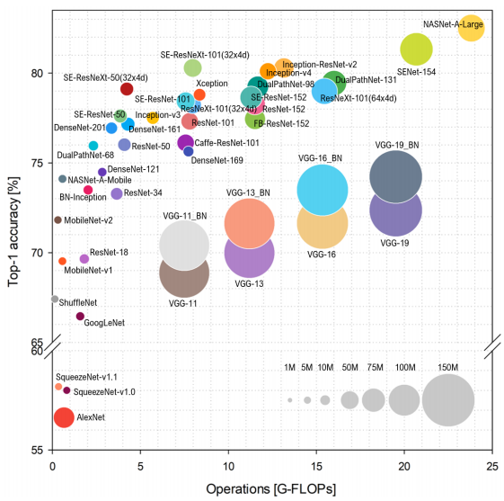
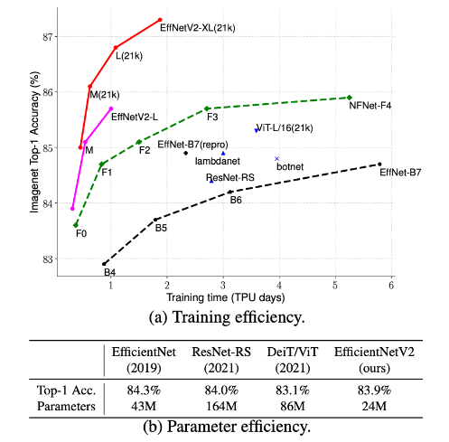

= Modelos Preentrenados de IA de Clasificación con TensorFlow
Ebertz Ximena <xebertz@campus.ungs.edu.ar>; Franco Leandro <leandro00fr@gmail.com>; López Gonzalo <gonzagonzalopez20@gmail.com>; Torrez Mauro <sntorrez9@gmail.com>; Venditto Pedro <pedrovenditto41@gmail.com>; Villalba Gastón <gastonleovillalba@gmail.com>;
v1, {docdate}
:toc:
:title-page:
:toc-title: Secciones
:numbered:
:source-highlighter: highlight.js
:tabsize: 4
:nofooter:
:pdf-page-margin: [3cm, 3cm, 3cm, 3cm]

== Transfer Learning

Los modelos preentrenados nos permiten aprovechar el entrenamiento previo de un modelo para iniciar con una base de aprendizaje que nos permita entrenar al modelo más rápido, según lo que queramos realizar.

Utilizar un modelo preentrenado y entrenarlo con nuevos datos es una técnica conocida como _Tranfer Learning_. Muchos modelos se pueden modificar en cuanto a tamaño, capas, hiperparámetros, o tamaño de entrada; y se pueden utilizar como base para añadir más capas y lograr un mejor resultado.

A continuación, mencionaremos algunos modelos preentrenados sugeridos y sus características.

== Modelos y funciones de cada uno

*Redes neuronales convolucionales*: Puedes diseñar una CNN para aprender automáticamente características y patrones en las imágenes, lo que es especialmente útil cuando las formas geométricas tienen variaciones en tamaño, rotación y posición.

*Mask R-CNN*: Este modelo es útil si necesitas no solo identificar formas geométricas, sino también segmentarlas y detectar sus contornos en la imagen.

*Transformada de Hough*: Es una técnica clásica para la detección de formas geométricas como líneas y círculos en imágenes. Puedes combinarla con otros enfoques para identificar formas geométricas más complejas.

*SVM (Support Vector Machine)*: SVMs son eficaces para la clasificación binaria y multicategoría. Puedes extraer características de las imágenes y entrenar un SVM para clasificar diferentes formas geométricas. Esto se denomina Clasificación basada en características.

*Redes Neuronales Recurrentes (RNN)*: Las RNN se utilizan para tareas que involucran secuencias de imágenes, como el procesamiento de videos y la generación de descripciones de imágenes.

== Recomendaciones del Senior en cuanto a aplicar modelos para tomografías

La aplicación de modelos de machine learning para la identificación de formas geométricas en imágenes de tomografías médicas puede ser útil en diversos contextos clínicos y de investigación. Aquí te indico cómo puedes abordar este problema específico:

*Segmentación de regiones de interés (ROI):* La aplicación de modelos de machine learning para la identificación de formas geométricas en imágenes de tomografías médicas puede ser útil en diversos contextos clínicos y de investigación. Aquí te indico cómo puedes abordar este problema específico:

*Detección de formas geométricas:* Una vez que hayas segmentado las regiones de interés, puedes aplicar modelos de machine learning para identificar formas geométricas específicas dentro de estas regiones. Aquí tienes algunas opciones:

- *CNNs personalizadas:* Puedes entrenar CNNs personalizadas para clasificar y localizar formas geométricas dentro de las ROIs segmentadas. Debes etiquetar manualmente un conjunto de datos con las formas geométricas que deseas identificar.

- *Modelos de detección de objetos:* Si las formas geométricas son objetos claramente definidos dentro de las imágenes de tomografía, podrías considerar el uso de modelos de detección de objetos como Faster R-CNN o RetinaNet.

*Postprocesamiento y análisis:* Después de identificar las formas geométricas en las imágenes de tomografía, es importante realizar análisis adicionales según el contexto clínico. Esto podría incluir medir tamaños, relaciones espaciales o características específicas de las formas geométricas identificadas.

*Validación clínica:* Es fundamental realizar una validación clínica rigurosa para garantizar que los resultados del modelo sean precisos y clínicamente relevantes. Esto generalmente implica la colaboración con profesionales de la salud y la evaluación en conjuntos de datos clínicos reales.

=== *Redes neuronales convolucionales (CNN)*

Puedes diseñar una CNN para aprender automáticamente características y patrones en las imágenes, lo que es especialmente útil cuando las formas geométricas tienen variaciones en tamaño, rotación y posición. Las redes neuronales convolucionales poseen las siguientes características:

- *Capas convolucionales:* La característica central de las CNN son las capas convolucionales, que son responsables de extraer características locales de las imágenes. En lugar de conectar cada píxel de la imagen a cada neurona de la capa siguiente, las capas convolucionales utilizan filtros (kernels) que se desplazan por la imagen para realizar operaciones de convolución. Esto permite que la red aprenda características como bordes, texturas y formas en diferentes regiones de la imagen.

- *Submuestreo (Pooling):* Después de las capas convolucionales, se suelen aplicar capas de submuestreo o pooling para reducir la dimensionalidad de las características extraídas y hacer que la red sea más robusta a las pequeñas variaciones en la posición de las características. El submuestreo puede realizarse utilizando operaciones como el max-pooling, que toma el valor máximo en una región local de la imagen.

- *Capas completamente conectadas:* Después de varias capas convolucionales y de submuestreo, las CNN a menudo incluyen una o más capas completamente conectadas para realizar la clasificación final. Estas capas toman las características aprendidas y las utilizan para realizar la clasificación en las categorías de interés.

- *Función de activación:* Las CNN suelen usar funciones de activación no lineales, como ReLU (Rectified Linear Unit), para introducir no linealidades en la red y permitir que esta aprenda representaciones más complejas de las imágenes.

- *Aprendizaje automático de características:* Una de las principales ventajas de las CNN es su capacidad para aprender automáticamente características relevantes de las imágenes a partir de los datos de entrenamiento. Esto significa que no es necesario diseñar manualmente características específicas para una tarea, como bordes o texturas; la red aprende estas características durante el entrenamiento.

- *Transferencia de aprendizaje:* Las CNN pre-entrenadas en grandes conjuntos de datos, como ImageNet, se pueden utilizar como base para tareas específicas de visión por computadora. Esto se conoce como transferencia de aprendizaje y permite aprovechar el conocimiento previo de la red para tareas nuevas y relacionadas.

=== *Mask R-CNN*

Este modelo es útil si se necesita no solo identificar formas geométricas, sino también segmentarlas y detectar sus contornos en la imagen. Es una extensión del modelo Faster R-CNN, que combina la capacidad de detectar objetos con la capacidad de segmentarlos a nivel de píxel. Este modelo ha demostrado ser especialmente eficaz en aplicaciones de visión por computadora donde es importante no solo identificar objetos, sino también comprender su forma y ubicación precisa en la imagen. *Puedes implementar Mask R-CNN utilizando bibliotecas de aprendizaje profundo como TensorFlow y PyTorch. Además hay implementaciones preentrenadas disponibles que facilitan su uso en diversas aplicaciones.*

- *Detección de objetos:* Mask R-CNN hereda la capacidad de Faster R-CNN para detectar objetos en una imagen. Utiliza regiones de interés (RoI) generadas por una red de detección para identificar objetos en la imagen y generar cajas delimitadoras (bounding boxes) alrededor de ellos.

- *Segmentación semántica:* A diferencia de Faster R-CNN, Mask R-CNN va más allá de la detección de objetos y realiza segmentación semántica a nivel de píxel. Para cada objeto detectado, este genera una máscara binaria que representa la ubicación precisa de ese objeto en la imagen.

- *Arquitectura:* Está compuesto por tres partes principales: una red de convolución que extrae características de la imagen de entrada, una rama de detección que genera las cajas delimitadoras y las etiquetas de clase de los objetos detectados, y una rama de segmentación que genera las máscaras de segmentación para cada objeto. Estas tres partes trabajan en conjunto y se entrenan de manera conjunta para realizar tanto la detección como la segmentación de objetos.

- *Backbone:* Mask R-CNN utiliza una variedad de backbones de red, como ResNet o FPN (Feature Pyramid Network), para extraer características de la imagen. Esto permite que la red aprenda características jerárquicas a diferentes escalas y niveles de abstracción.

- *Aprendizaje de características:* Mask R-CNN utiliza una función de pérdida compuesta que incluye pérdida de detección y pérdida de segmentación. La pérdida de segmentación se calcula utilizando la diferencia entre las máscaras de segmentación generadas por la red y las máscaras verdaderas proporcionadas en los datos de entrenamiento.

- *Aplicaciones:* Mask R-CNN es ampliamente utilizado en aplicaciones de visión por computadora donde se requiere segmentación precisa de objetos, como la segmentación de instancias en imágenes médicas (por ejemplo, para separar diferentes células o estructuras) y la segmentación de objetos en imágenes naturales (por ejemplo, para separar personas de fondo).

=== *Transformada de Hough*

Es una técnica clásica para la detección de formas geométricas como líneas y círculos en imágenes. Puedes combinarla con otros enfoques para identificar formas geométricas más complejas.

- *Detección de líneas rectas:* La Transformada de Hough se utiliza comúnmente para detectar líneas rectas en una imagen. El objetivo es encontrar todas las líneas rectas presentes en una imagen, independientemente de su orientación y posición exacta.

- *Representación paramétrica:* En lugar de representar una línea mediante su ecuación en el espacio euclidiano (y = mx + b), la Transformada de Hough utiliza una representación paramétrica polar para describir una línea en términos de su longitud y el ángulo de inclinación con respecto al eje horizontal. Esto hace que sea más fácil de manejar líneas de cualquier orientación.

- *Acumulación en el espacio Hough:* La Transformada de Hough acumula votos en un espacio de parámetros llamado espacio Hough. Cada punto en el espacio de la imagen vota por todas las posibles líneas que pueden pasar por ese punto en el espacio Hough. El resultado es un pico en el espacio Hough que representa la línea más prominente en la imagen.

- *Transformada de Hough estándar:* Para detectar líneas rectas, la Transformada de Hough estándar utiliza una representación paramétrica de línea en coordenadas polares. En este espacio Hough, cada píxel de la imagen vota por todas las líneas posibles que pasan por él. Las líneas se detectan como picos en el espacio Hough, y la posición y orientación de estas líneas se pueden recuperar a partir de esos picos.

- *Transformada de Hough generalizada:* La Transformada de Hough se puede generalizar para detectar otros patrones geométricos, como círculos o elipses, utilizando diferentes representaciones paramétricas en el espacio Hough. Por ejemplo, para detectar círculos, se utiliza una representación paramétrica de círculo en lugar de una representación de línea.

- *Parámetros y optimización:* La detección de líneas o patrones en la Transformada de Hough a menudo requiere ajustar parámetros, como la sensibilidad de umbral y la resolución del espacio Hough, para obtener resultados precisos. La optimización de estos parámetros puede ser un desafío y puede requerir técnicas de ajuste fino.

=== Support Vector Machine (SVM)

Las máquinas de soporte vectorial (SVM) son un tipo de modelo de aprendizaje supervisado utilizado tanto para problemas de clasificación como para regresión.

*Clasificación y regresión:* Las SVM se utilizan en problemas de clasificación para separar puntos de datos en diferentes clases, y en problemas de regresión para predecir valores numéricos. El objetivo principal de SVM es encontrar un hiperplano (una línea en 2D, un plano en 3D o un hiperplano en dimensiones superiores) que maximice la separación entre las diferentes clases (en el caso de *clasificación*) o que se ajuste de la mejor manera posible a los puntos de datos (en el caso de *regresión*).

*Márgenes y vectores de soporte:* Las SVM buscan encontrar el hiperplano que tenga el margen máximo entre las clases. Los puntos de datos que están más cerca de este hiperplano se llaman "vectores de soporte". La idea es que estos vectores de soporte son los más importantes para la separación entre clases.

*Funciones de kernel:* Una de las características clave de las SVM es su capacidad para manejar datos no lineales utilizando funciones de kernel. Un kernel es una función que transforma los datos en un espacio de mayor dimensión donde la separación lineal es más fácil. Los kernels más comunes son el kernel lineal, el kernel polinómico y el kernel radial (RBF).

*Regularización:* Las SVM también incluyen un término de regularización que controla el equilibrio entre maximizar el margen y minimizar la clasificación incorrecta. Este parámetro se ajusta durante el entrenamiento para encontrar el equilibrio adecuado.

*Ventajas:* Las SVM tienen varias ventajas, como su capacidad para manejar datos de alta dimensionalidad, su robustez ante valores atípicos y su capacidad para trabajar en problemas de clasificación binaria y multiclase. También son efectivas en conjuntos de datos pequeños o con un número desigual de muestras por clase.

*Limitaciones:* Aunque son poderosas, las SVM pueden ser computacionalmente costosas en conjuntos de datos muy grandes y pueden requerir una optimización cuidadosa de los hiperparámetros. Además, su capacidad para manejar problemas de clasificación multiclase puede requerir estrategias adicionales, como la clasificación uno contra todos (OvA) o uno contra uno (OvO).

=== Redes Neuronales Recurrentes (RNN) 

#OPCIONAL, LEER COMENTARIO# 

////
quizas sirva para ver lo que se habló en clase sobre los textos dentro de las imágenes, aunque es solo una idea que se me ocurrió cuando lo leí, no lo pensé tanto.
////

Son un tipo de arquitectura de red neuronal que se utiliza en el procesamiento de secuencias y datos temporales.

*Procesamiento de texto:* En el procesamiento de lenguaje natural (NLP), las RNN se utilizan para tareas como la clasificación de texto, la generación de texto, la traducción automática y el análisis de sentimientos.

== Modelos preentrenados de Keras

Existen diversos modelos preentrenados en la librería _Keras_, disponible para TensorFlow. Esto es una gran ventaja, ya que Keras facilita la importación y el uso de los modelos.

En el siguiente gráfico, se pueden ver los modelos disponibles, su niver de _accuracy_, y su tamaño, representado mediante el tamaño del círculo.

Los modelos grandes en tamaño suelen realizar predicciones más precisas, pero tienen la desventaja de su lentitud en cuanto a procesamiento.

Podemos ver las comparaciones en cuanto a precision en esta 
https://keras.io/api/applications/[tabla].

//modelos de keras https://keras.io/api/applications/
//repos (hay readmes con info mas resumida que los papers) https://github.com/tensorflow/tpu/tree/master/models/official

=== Inception V3

_Inception V3_ es un modelo que tiene 48 capas de profundidad, que recibe imágenes de 299x299 en tres canales de color.

Está conformado por bloques de compilación que incluyen capas de tipo convolucionales, de reducción promedio, de reducción máxima, concatenaciones, retirados; y capas densas. La pérdida es calculada con la función _softmax_.

La red está preentrenada con el dataset _ImageNet_, que contiene 1.331.167, con 1.281.167 imágenes de entrenamiento y 50 000 imágenes de prueba.

Este modelo es ampliamente utilizado para la clasificación de imágenes, y es la base de muchos modelos; pero también se puede utilizar para:

* Detección de objetos en una imagen
* Segmentación semántica
* Transfer learning

=== Xception

Xception es una versión de _Inception V3_ con una ligera mejoría en cuanto a su eficacia, debido a que fue construida utilizando capas convolucionales separables en profundidad. Esto implica que la cantidad de parámetros de cada capa se reduce, por lo que el modelo se entrena más rápido.

=== EfficientNet

_EfficientNet_ es un conjunto de modelos de clasifiación de imágenes que se caracterizan por ser más chicos en tamaño y más rápidos que modelos previos. Existen muchos modelos en esta familia. En Keras se incluyen los modelos desde _B1_ hasta _B7_, siendo el mode B7 el mejor logrado hasta la fecha.

Este modelo alcanza un 84.4% de _eficacia top-1_ y un 97.1% de _eficacia top-5_. Esto quiere decir que un 84.4% de las imágenes de la principal clase fueron clasificadas correctamente, y un 97.1% de imágenes las principales cinco clases fueron clasificadas correctamente. Si se compara con otros modelos según su nivel de precisión en relación a la cantidad de parámetros, se puede ver que las redes EfficientNet alcanzan valores altos de precisión con pocos parámetros, comparada con las otras.

Otra particularidad es que, en su entrenamiento, se le proporcionó imágenes modificadas mediante técnicas de aumento de datos, por lo que el aprendizaje se llevó a cabo con un conjunto de datos más variado.

=== EfficientNetV2

Como _EfficientNet_, _EfficientNetV2_ es una familia de modelos preentrenados que se caracterizan por su eficiencia. Estan basados en los modelos previos, y mejoran su eficiencia alcanzando un alto nivel de eficacia con aproximadamente la mitad de datos de entrenamiento que sus predecesoras.

=== ConvNeXt

_ConvNeXt_ es una familia de remasterizaciones de una red _ResNet_ y una red convolucional, que alcanza un nivel de eficacia top-1 de 87.8%.

Está basada en _Vision Transformers_, redes neuronales diseñadas, en principio, para el procesamiento del lenguaje natural. Esta arquitectura se modificó para funcionar en procesamiento de imágenes, lo que generó un gran porcentaje de eficacia, posicionando a las redes de este tipo como una de las principales competidoras de las redes convolucionales. _ConvNeXt_ combina este tipo de redes con redes convolucionales convolucionales, aprovechando lo mejor de ambas.

Existe también tiene una versión mejorada llamada _ConvNeXt V2_, que utiliza técnicas de aprendizaje auto-supervisado y mejoras arquitectónicas para mejorar aún más el rendimiento del modelo

=== VGG16 y VGG19

_VGG16_ y _VGG19_ son dos modelos de redes neuronales convolucionales preentrenados que se utilizan comúnmente en tareas de clasificación de imágenes. 

La arquitectura _VGG16_ consta de 16 capas, mientras que la arquitectura _VGG19_ consta de 19 capas, por lo que _VGG19_ puede ser más lento, ya que requiere más parámetros. Ambas arquitecturas utilizan filtros convolucionales de tamaño 3x3 y max-pooling para reducir el tamaño de los mapas de características.

=== ResNet y ResNetV2

=== MobileNet

=== DenseNet

=== NasNet

=== InceptionResNet

