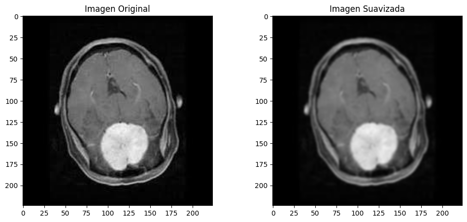
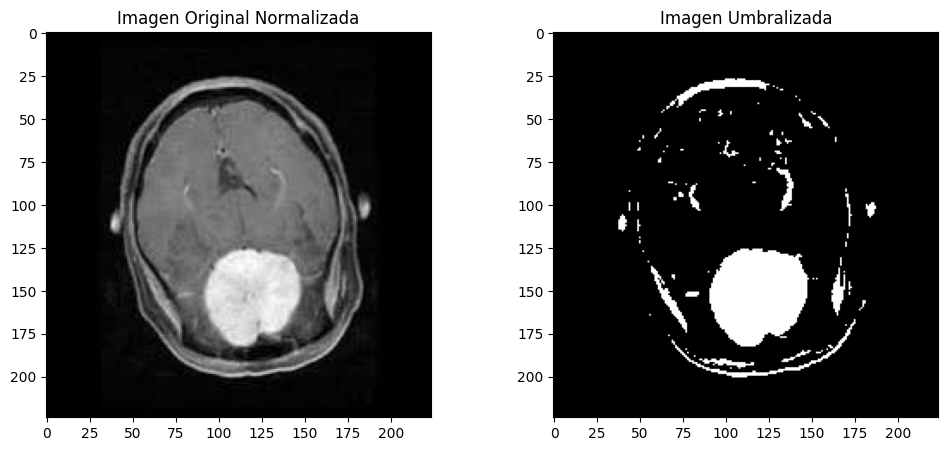

= Técnicas de Procesamiento de Imágenes
Ebertz Ximena <xebertz@campus.ungs.edu.ar>; Franco Leandro <leandro00fr@gmail.com>; López Gonzalo <gonzagonzalopez20@gmail.com>; Torrez Mauro <sntorrez9@gmail.com>; Venditto Pedro <pedrovenditto41@gmail.com>; Villalba Gastón <gastonleovillalba@gmail.com>;
v1, {docdate}
:toc:
:title-page:
:toc-title: Secciones
:numbered:
:source-highlighter: highlight.js
:tabsize: 4
:nofooter:
:pdf-page-margin: [3cm, 3cm, 3cm, 3cm]

== Introducción

En este documento, exploraremos diversas técnicas de procesamiento de imágenes en el contexto de la clasificación de imágenes mediante Deep Learning.

== Procesamiento

El procesamiento se refiere a una serie de pasos y transformaciones que se aplican a las imágenes antes de ser utilizadas como entrada para un modelo. El objetivo de este procesamiento es preparar los datos de manera que el modelo pueda aprender de manera efectiva y producir resultados precisos. 

Teniendo en cuenta la introducción, algunos de los procesos que se pueden realizar son: Redimensionamiento, normalización, cambios de colores, eliminación de ruido, segmentación, codificación de etiquetas, extracción de características, etc...

== Balanceo de clases

En ocasiones, nos enfrentamos al desafío de trabajar con conjuntos de imágenes que presentan un desequilibrio significativo entre las clases. Este desequilibrio puede generar problemas en el proceso de aprendizaje de nuestro modelo, ya que podría inclinarse hacia la clasificación de la clase mayoritaria. Por ejemplo, si tenemos una gran cantidad de imágenes de la Clase 1 y muy pocas de la Clase 2, el modelo podría tender a clasificar la mayoría de las imágenes como pertenecientes a la Clase 1.

Para mitigar este problema y garantizar un entrenamiento más equitativo y preciso, es esencial equilibrar la cantidad de imágenes en cada clase. Esto implica igualar o acercar la cantidad de imágenes en cada categoría tanto como sea posible.

== Redimensionamiento

La igualdad en las dimensiones de las imágenes es un requisito común en la mayoría de los modelos de Deep Learning. Es muy probable que necesitemos realizar el proceso de redimensionamiento de imágenes para cumplir con esta exigencia.

Esta práctica conlleva beneficios significativos, entre ellos:

- Optimización del Rendimiento: Al mantener todas las imágenes en el mismo tamaño, se logra una optimización eficiente del rendimiento durante el entrenamiento del modelo.

- Mejora en la Generalización del Modelo: La igualdad en las dimensiones de las imágenes facilita que el modelo aprenda patrones y características relevantes de manera consistente.

== Selección de colores

Es recomendable utilizar imágenes en blanco y negro (escala de grises) cuando no necesitamos información de color en el entrenamiento del modelo. Esto se debe a que las imágenes en blanco y negro poseen solo un canal de color en lugar de los tres presentes en las imágenes RGB, lo cual conlleva una reducción significativa en la dimensionalidad de los datos. Esta reducción, a su vez, resulta en un entrenamiento más ágil y en un ahorro considerable de recursos computacionales.

== Etiquetado

El etiquetado de imágenes desempeña un papel fundamental en el proceso de entrenamiento de modelos supervisados. Al proporcionar etiquetas precisas para cada imagen, se establece una correspondencia entre los datos visuales y la información asociada, como diagnósticos médicos, categorías de objetos o características específicas.

Esta información etiquetada permite al modelo aprender patrones y relaciones entre los datos visuales y las etiquetas correspondientes. Por lo que, el etiquetado cuidadoso y preciso es esencial para lograr un rendimiento óptimo del modelo y garantizar que pueda cumplir su objetivo.

== División de conjuntos

Las imágenes a trabajar generalmente se dividen en tres conjuntos principales: entrenamiento, prueba y validación. Sin embargo, en algunos casos, especialmente cuando los datos son escasos, se pueden usar solo dos conjuntos: entrenamiento y prueba.

El conjunto de entrenamiento se utiliza para entrenar el modelo. Las imágenes y sus etiquetas correspondientes se utilizan para ajustar los parámetros del modelo durante el proceso de entrenamiento.

Por otro lado, el conjunto de prueba se utiliza para ajustar los hiperparámetros del modelo y evaluar su rendimiento durante el entrenamiento. Ayuda a evitar el sobreajuste y permite optimizar el modelo de manera eficiente.

Por último, el conjunto de validación se reserva exclusivamente para evaluar el rendimiento final del modelo, una vez que se ha completado todo el entrenamiento y ajuste de hiperparámetros. El modelo nunca ha visto estas imágenes durante el proceso de entrenamiento ni de prueba, lo que proporciona una evaluación objetiva de su capacidad de generalización.

== Normalización de píxeles

Normalizar los valores de los píxeles de las imágenes puede ayudar a que el modelo converja más rápido y a obtener resultados más estables. Se divide por 255 a la imagen y cada píxel queda en un rango de [0,1], donde el 0 es negro y 1 blanco. La imagen se vuelve más oscura donde ya lo era y viceversa con los colores blancos.

== Aumento de datos

Implica aplicar transformaciones aleatorias a las imágenes de entrenamiento, como rotación, traslación, cambio de escala, recorte y cambio de brillo. Esto aumenta la cantidad de datos de entrenamiento y ayuda al modelo a generalizar mejor. Esto se realiza iterando la misma imagen y realizar lo anterior mencionado.

== Reducción de ruido
Eliminación o disminución de señales no deseadas para mejorar su calidad y hacer que los objetos de interés sean más visibles, o sea, la imagen se suaviza, pero puede volverse borrosa si se abusa en el porcentaje seleccionado.

== Segmentar
Divide una imagen en segmentos con características similares. Esto puede ayudar a identificar objetos en la imagen. Esto se realiza resaltando los colores oscuros y viceversa con los blancos.

== Extracción de características
Proceso de identificar y seleccionar las características o atributos más relevantes y representativos de los datos de entrada para alimentar un algoritmo de aprendizaje automático. Estas características son las propiedades o medidas que se utilizan para describir los datos y, en última instancia, permiten al modelo aprender patrones y realizar predicciones. La extracción de características en imágenes se puede realizar tanto manualmente como automáticamente utilizando modelos de aprendizaje profundo. La elección entre ambos enfoques depende de la complejidad del problema.

=== Extracción manual de características
En este enfoque se identifica y selecciona manualmente características específicas en las imágenes que se consideran relevantes para el problema en cuestión. Estas características pueden incluir bordes, texturas, formas geométricas, colores, o cualquier otro atributo visual que sea importante. Luego, estas características se utilizan como entrada para el modelo de aprendizaje automático.

=== Extracción automática de características con modelos de aprendizaje profundo 
Este enfoque utiliza redes neuronales convolucionales (CNN) u otros modelos de aprendizaje profundo para aprender automáticamente características relevantes de las imágenes. En lugar de depender de la intervención humana para definir las características, estos modelos aprenden representaciones jerárquicas de las imágenes a partir de los datos de entrenamiento. Esto puede incluir la detección de bordes, la identificación de objetos, la textura y características más abstractas.
