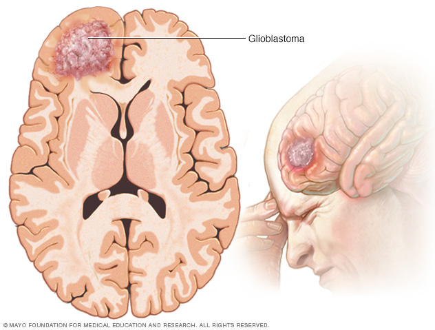
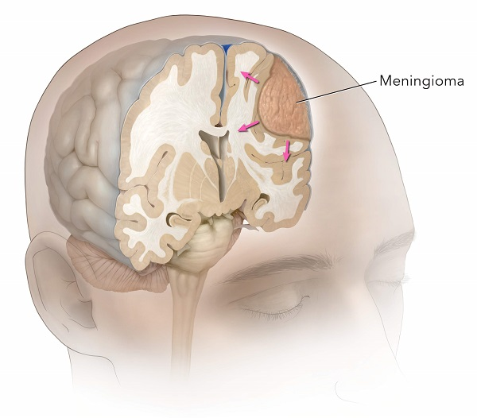
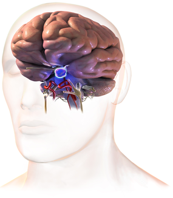
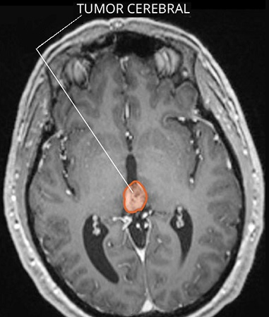
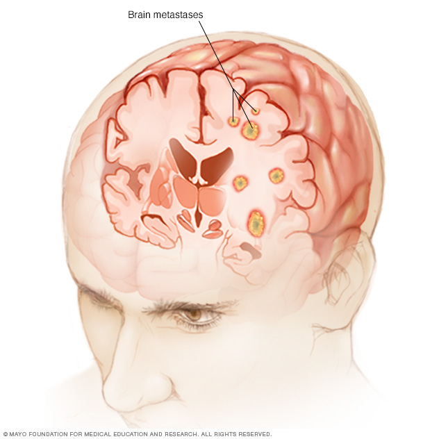

= Tumores Cerebrales
Ebertz Ximena <xebertz@campus.ungs.edu.ar>; Franco Leandro <leandro00fr@gmail.com>; López Gonzalo <gonzagonzalopez20@gmail.com>; Venditto Pedro <pedrovenditto41@gmail.com>; Villalba Gastón <gastonleovillalba@gmail.com>;
v1, {docdate}
:toc:
:title-page:
:toc-title: Secciones
:numbered:
:source-highlighter: highlight.js
:tabsize: 4
:nofooter:
:pdf-page-margin: [3cm, 3cm, 3cm, 3cm]

== Introducción

Un tumor cerebral es una masa de células innecesarias que crecen en el cerebro o en el conducto vertebral. Hay dos tipos básicos de tumores cerebrales: tumores cerebrales primarios y tumores cerebrales metastásicos.

== Tumores cerebrales primarios

Los tumores cerebrales primarios se originan en el cerebro o en el conducto vertebral. Los tipos más comunes de tumores cerebrales primarios son:

=== Gliomas
Tumores que se originan en las células gliales, que son las células que sostienen y protegen las neuronas.

.Glioblastoma

=== Meningiomas
Tumores que se originan en las meninges, que son las membranas que rodean el cerebro y la médula espinal.

.Meningioma

=== Tumores de la hipófisis
Tumores que se originan en la hipófisis, que es una glándula endocrina que se encuentra en la base del cerebro.

.Tumor en la Glándula Pituitaria

=== Tumores de la glándula pineal 
Tumores que se originan en la glándula pineal, que es una glándula endocrina que se encuentra en el centro del cerebro.

.Pineoblastoma

== Tumores cerebrales metastásicos

Los tumores cerebrales metastásicos son tumores que se originan en otros órganos del cuerpo y se extienden al cerebro. Los tipos más comunes de tumores cerebrales metastásicos son:

* Cáncer de pulmón
* Cáncer de mama
* Cáncer de piel
* Cáncer de riñón
* Cáncer de colon

.Metástasis Cerebral

== Síntomas de los tumores cerebrales

Los síntomas de los tumores cerebrales pueden variar según la ubicación y el tamaño del tumor. Los síntomas comunes incluyen:

* Dolores de cabeza
* Náuseas y vómitos
* Convulsiones
* Problemas de visión
* Cambios en la personalidad o el comportamiento
* Problemas de equilibrio o coordinación

=== Lóbulos Cerebrales

Cada lado de tu cerebro posee cuatro lóbulos. El lóbulo frontal es importante para las funciones cognitivas y el control de la actividad o el movimiento voluntario. El lóbulo parietal procesa información relacionada con la temperatura, el gusto, el tacto y el movimiento; mientras que el lóbulo occipital es el responsable de la visión. El lóbulo temporal procesa los recuerdos y los integra con las sensaciones del gusto, el oído, la vista y el tacto.

.Lóbulos Cerebrales
image::imgs/lobulos-cerebrales.png[align="center"]

==== Lóbulos Frontales
Los tumores cerebrales en la parte frontal del cerebro pueden causar problemas de equilibrio, dificultades para caminar, cambios en la personalidad y problemas de memoria.

==== Lóbulos Parietales
Los tumores cerebrales en el centro del cerebro pueden causar problemas relacionados con los sentidos, como problemas visuales y auditivos.

==== Lóbulos Occipitales
Los tumores cerebrales en la parte posterior del cerebro pueden causar pérdida de la visión.

==== Lóbulos Temporales
Los tumores cerebrales en la parte inferior del cerebro pueden causar problemas con la memoria y alucinaciones.

== Diagnóstico de tumores cerebrales

El diagnóstico de tumores cerebrales se basa en una combinación de pruebas, que incluyen:

* Imágenes cerebrales, como una tomografía computarizada (TC) o una resonancia magnética (RM).
* Análisis de sangre.
* Punción lumbar.

== Tratamiento de los tumores cerebrales

El tratamiento de los tumores cerebrales depende del tipo, el tamaño y la ubicación del tumor. Las opciones de tratamiento incluyen:

* Cirugía: la cirugía es el tratamiento principal para muchos tumores cerebrales.
* Radioterapia: la radioterapia utiliza radiación para destruir las células cancerosas.
* Quimioterapia: la quimioterapia utiliza medicamentos para destruir las células cancerosas.
* Terapia dirigida: la terapia dirigida utiliza medicamentos para atacar las células cancerosas de forma específica.

== Pronóstico de los tumores cerebrales

El pronóstico de los tumores cerebrales depende del tipo, el tamaño y la ubicación del tumor. Los tumores cerebrales primarios de crecimiento lento suelen tener un pronóstico mejor que los tumores cerebrales primarios de crecimiento rápido. Los tumores cerebrales metastásicos suelen tener un pronóstico peor que los tumores cerebrales primarios.

== Bibliografía
https://www.mayoclinic.org/es/diseases-conditions/brain-tumor/symptoms-causes/syc-20350084[Tumores Cerebrales - Mayo Clinic]
