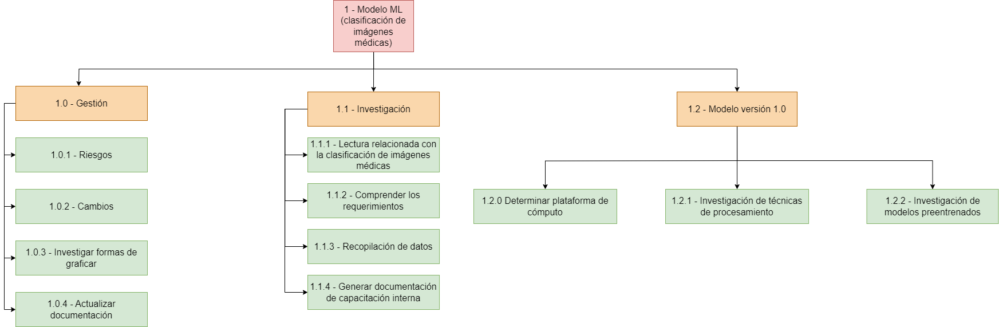
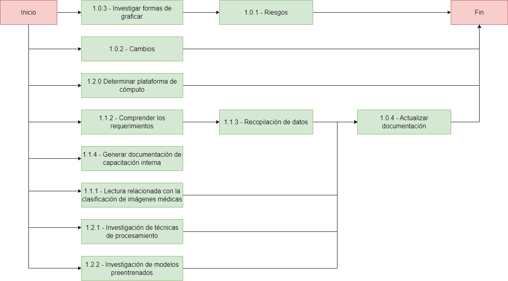
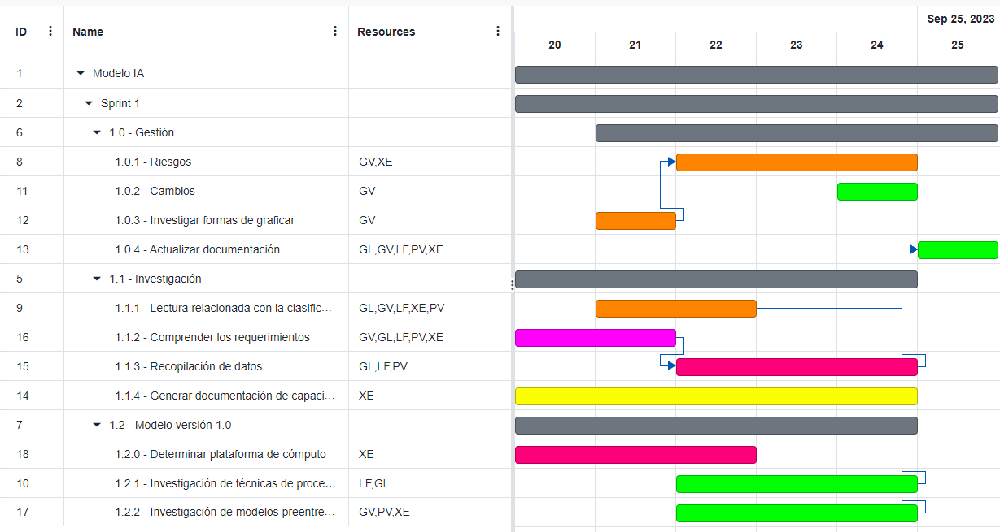
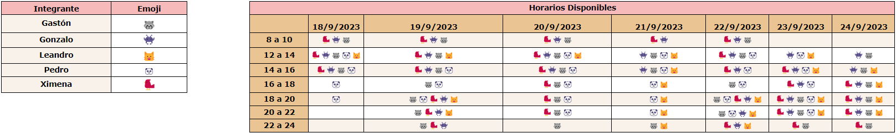
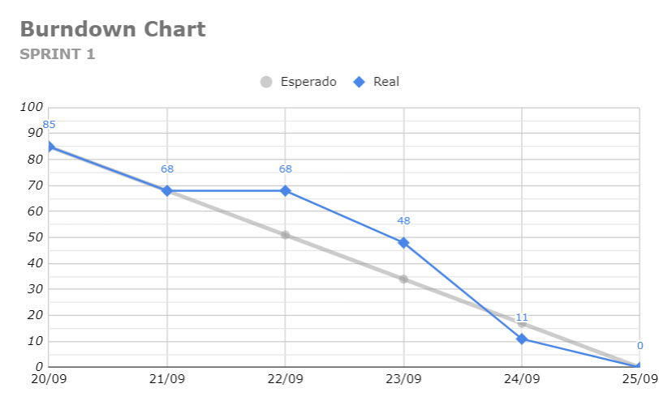

= TP Principal - Laboratorio de Construcción de Software - Sprint 1
Ebertz Ximena <xebertz@campus.ungs.edu.ar>; Franco Leandro <leandro00fr@gmail.com>; López Gonzalo <gonzagonzalopez20@gmail.com>; Venditto Pedro <pedrovenditto41@gmail.com>; Villalba Gastón <gastonleovillalba@gmail.com>;
v1, {docdate}
:toc:
:title-page:
:toc-title: Secciones
:numbered:
:source-highlighter: highlight.js
:tabsize: 4
:nofooter:
:pdf-page-margin: [3cm, 3cm, 3cm, 3cm]

== Introducción

La Inteligencia Artificial o _IA_ es un poderoso campo de estudio que está en constante crecimiento. Cada día, los modelos de Inteligencia Artificial evolucionan y se incorporan en nuestro día a día, funcionando como una potente herramienta de trabajo.

Existen muchos campos donde la Inteligencia Artificial se está desarrollando: detección de imágenes, texto, audio, etcétera. Resulta lógico pensar que se pueden desarrollar herramientas para campos más específicos, como medicina, finanzas, o investigación.

== Objetivos del proyecto

Nuestro objetivo es, mediante la aplicación de tecnologías relacionadas a las inteligencias artificiales, desarrollar un software que pueda ayudar a nuestros profesionales del área de la medicina a lograr un diagnóstico más rápido y preciso sobre alguna enfermedad o malestar en específico.

Para esto, realizaremos tareas de investigación, de análisis de datos y de desarrollo, entre otras.

== Objetivos del documento

El principal objetivo de este documento es especificar las decisiones que se tomen en los días previos al inicio del proyecto; tales como la distribución de roles de trabajo, los posibles riesgos del equipo y del proyecto, el tema a trabajar, las metodologías que se utilizarán, entre otras cosas relacionadas a la organización necesaria del proyecto.

== Metodología de trabajo

Somos parte del _Agile Release Train_ (que plantea el marco de trabajo *_SAFe_*) en conjunto con los demás grupos. Para coordinar nuestro trabajo adaptaremos el _framework_ ágil *_Scrum_* según las preferencias del equipo para optimizarla. Cada _Sprint_ dura *dos semanas*.

- *_Sprint Planning_*: se realizará el primer día del _Sprint_ y en ocasiones participará el _Release Train Engineer_.

- *_Daily Scrum_* cada 2 días: los integrantes del equipo tienen tiempos diferentes y un día de trabajo quizá no sea suficiente para tener un avance considerable para plantearlo en las _Daily_. Por inconvenientes o bloqueo de un integrante, en el día que no hay _Daily_, se comunicarán por algunos de los medios detallados más adelante.

- *_Sprint Review_*: el último día del _Sprint_ se hará una presentación de los informes solicitados mostrando el avance del equipo.

- *_Sprint Retrospective_*: luego de la revisión de cada _Sprint_ se hará una retrospectiva del avance.

== Equipo de trabajo y roles

Los roles que se utilizarán en el equipo son los siguientes:

[cols="3*", options="header"]
|===
|Rol            |Encargado         |Suplente

|Scrum Master   |Villalba, Gastón  |Ebertz, Ximena
|Líder Técnico  |Ebertz, Ximena    |Franco, Leandro
|Machine Learning Engineer  |López, Gonzalo    |
|Data Scientist  |Franco, Leandro   |
|Data Scientist  |Venditto, Pedro   |
|===

== Gestión

=== Visión

Nuestra visión es utilizar la tecnología de inteligencia artificial y aprendizaje automático para mejorar la atención médica y el diagnóstico. A través de nuestro trabajo en el presente trabajo práctico, buscamos desarrollar un modelo de clasificación de imágenes médicas que asista a los profesionales de la salud en la toma de decisiones clínicas. 

=== Misión

Nuestra misión es aplicar nuestros conocimientos y habilidades en procesamiento de imágenes y aprendizaje automático para crear soluciones innovadoras y efectivas que impacten positivamente en el ámbito sanitario y el bienestar de las personas.

=== Alcance

Desarrollo y Entrenamiento del Modelo de IA:

- Investigación exhaustiva de algoritmos de aprendizaje automático, con el objetivo de seleccionar el más adecuado para el problema de clasificación de imágenes médicas.
- Implementación y entrenamiento del modelo utilizando el conjunto de datos previamente preparado.
- Optimización y validación del modelo para asegurar su eficacia y precisión en la clasificación de las imágenes médicas.
- Se considerará la posibilidad de mejorar el modelo de inteligencia artificial si es necesario.
- Despliegue del modelo de IA. Recibe como inputs una imagen y determiados datos y devuelve un resultado.

=== Requerimientos

==== Requerimientos Funcionales
1. El modelo debe recibir imágenes y procesarlas de acuerdo a la arquitectura del modelo.

2. El modelo debe realizar una predicción de la imagen mediante técnicas de _Machine Learning_.

3. El modelo debe recibir datos y combinarlos con el resultado de la imagen para mejorar la precisión.

4. El modelo debe retornar los resultados.

==== Requerimientos No Funcionales
1. El modelo debe responder rápidamente. Para ello se aplicarán las mejores prácticas para aumentar su *rendimiento*.

2. El modelo debe mantener un porcentaje de aciertos mayor o igual al 85% para mantener la *confiabilidad*.

3. El modelo debe estar *disponible* para su uso en cualquier momento. Para comprobarlo se creará un _endpoint_ el cual retornará el estado del servicio.

=== WBS

.WBS Sprint 1

=== Diccionario WBS Sprint 1

[cols="5*", options="header"]
|===
|ID
|Nombre
|Descripción
|Tarea
|Peso
|1
|Modelo de ML (Clasificación de imágenes médicas)
|En este proyecto se busca diseñar, entrenar y optimizar un modelo de clasificación de imágenes médicas utilizando técnicas de inteligencia artificial y aprendizaje automático.
|
|85
|1.0
|Gestión
|Gestionar el proyecto, así como los riesgos, cambios y realizar informes para Reuniones Formales.
|Realizar una documentación de la gestión de proyecto.
|19
|1.0.1
|Riesgos
|Tener en consideración los riesgos internos del equipo y los riesgos externos con otros grupos.                                                        
|Realizar una matriz de riesgos y actualizarla cuando lo requiera.
|5
|1.0.2
|Cambios
|Estar al tanto de cualquier cambio en cuanto al alcance del proyecto o tecnología a utilizar.                                                          
|Documentar los cambios.
|1
|1.0.3
|Investigar formas de graficar
|Investigar las distintas maneras de interpretar los datos del equipo para mostrarlos gráficamente.
|Capacitación en herramientas de hojas de cálculo y tableros tipo Kanban.                               
|2
|1.0.4
|Actualizar documentación                            
|Mantener actualizada la documentación de lo realizado por el equipo.                                                                                     
|Actualizar los informes, diagramas y tablas en base a lo investigado y realizado por el equipo.      
|11
|1.1
|Investigación                                        
|En esta etapa se realizará una investigación exhaustiva sobre el problema de clasificación de imágenes médicas. Se leerán artículos y publicaciones relacionados con el tema, se comprenderán los requerimientos del proyecto y se definirán las especificaciones necesarias para el conjunto de datos y el modelo. También se recopilarán los datos necesarios para el entrenamiento del modelo.              
|Realizar investigación sobre el problema de clasificación de imágenes médicas, incluyendo la lectura relacionada con el tema, la entrevista a expertos y la comprensión de los requerimientos. También se debe realizar la recopilación de datos necesarios para el entrenamiento del modelo. 
|30
|1.1.1
|Lectura relacionada con la clasificación de imágenes médicas.
|En esta tarea se leerán artículos y publicaciones relacionados con la clasificación de imágenes médicas para comprender mejor el problema y las técnicas utilizadas en la industria. Se buscará información sobre los diferentes tipos de imágenes médicas, las características importantes a considerar al clasificar estas imágenes y las técnicas de procesamiento de imágenes utilizadas en la industria.
|Leer artículos y publicaciones relacionados con la clasificación de imágenes médicas para comprender mejor el problema y las técnicas utilizadas en la industria.
|7
|1.1.2
|Comprender los requerimientos                       
|En esta tarea se comprenderán los requerimientos del proyecto y se definirán las especificaciones necesarias para el conjunto de datos y el modelo. Se buscará información sobre los requisitos específicos del modelo, como el tamaño mínimo del conjunto de datos, la precisión requerida y el tiempo máximo permitido para la clasificación de una imagen. También se definirán las especificaciones necesarias para el conjunto de datos, como el tamaño mínimo de imagen, la cantidad mínima de imágenes por clase y el equilibrio entre las clases.           
|Comprender los requerimientos del proyecto y definir las especificaciones necesarias para el conjunto de datos y el modelo.
|7
|1.1.3
|Recopilación de datos                               
|En esta tarea se recopilarán los datos necesarios para el entrenamiento del modelo. Se buscarán conjuntos de datos que puedan ser utilizados para entrenar y validar el modelo.                                                           
|Recopilar y preparar los datos necesarios para el entrenamiento del modelo.                            
|11
|1.1.4
|Generar documentación de capacitación interna         
|La Líder Técnico, por su experiencia junto al Machine Learning Engineer en uso de ML en imágenes, realiza un informe para el resto del equipo con unas nociones básicas para entender el funcionamiento de la IA en imágenes.                                                    
|Realizar un informe sobre lo utilizado en otro proyecto de IA con imágenes.                            
|5
|1.2
|Modelo versión 1.0                                    
|Se realizará una investigación sobre procesamiento de imágenes y modelos preentrenados para poder desarrollar nuestro modelo.                                                                 
|Diseñar, entrenar y optimizar un modelo de clasificación de imágenes médicas utilizando técnicas de inteligencia artificial y aprendizaje automático.                        
|36
|1.2.0
|Determinar plataforma de cómputo                    
|Encontrar una plataforma del estilo Google Colab la cual permita desarrollar al modelo de IA.                                                                                       
|Determinar la plataforma en la cuál se desarrollará y probará el modelo de IA.                           
|8
|1.2.1
|Investigación de técnicas de procesamiento            
|En esta tarea se investigarán diferentes técnicas de procesamiento de imágenes que pueden ser útiles para preparar los datos para el entrenamiento del modelo. Se buscará información sobre técnicas como la normalización, la reducción del ruido y la eliminación del fondo no deseado en las imágenes, entre otras posibles técnicas que puedan ser utilizadas para mejorar la calidad del conjunto de datos utilizado para entrenar al modelo.                                                                                                          
|Investigar diferentes técnicas de procesamiento de imágenes que pueden ser útiles para preparar los datos para el entrenamiento del modelo.                                              
|13
|1.2.2
|Investigación de procesamiento modelos preentrenados  
|En esta tarea se investigará sobre el procesamiento de modelos preentrenados para utilizarlos en el modelo de clasificación de imágenes médicas. Se buscarán modelos preentrenados que sean relevantes para el problema específico de clasificación de imágenes médicas, se comprenderán las características y limitaciones de estos modelos y se seleccionará el modelo más adecuado para el proyecto. También se explorarán técnicas de transferencia de aprendizaje y se definirán las capas necesarias para adaptar el modelo preentrenado al problema específico de clasificación de imágenes médicas.                          
|Investigar sobre el procesamiento de modelos preentrenados para utilizarlos en el modelo de clasificación de imágenes médicas, seleccionar el modelo más adecuado para el proyecto y definir las capas necesarias para adaptar el modelo preentrenado al problema específico de clasificación de imágenes médicas. 
|15
|===

=== Diagrama de precedencia

.diagrama de precedencia

=== Calendario

.Calendario Sprint 1

Consideramos como **hito** actualizar la documentación referida a la investigación ya que es el paso previo a desarrollar los modelos de los Sprints 2 y 3, nos brinda un soporte de conocimientos para determinar qué tipo de modelo elegir y cómo estructurarlo.

=== Plan de comunicaciones

Nuestros medios de comunicación son:

*Gather*: es una plataforma que nos permite tener una oficina virtual, donde cada uno tiene su personaje dentro de esta oficina. La utilizamos porque no tiene límites de tiempo, permite la comunicación a través de voz, compartir pizarras y es menos monótona que otras plataformas como _Meet_. Es una vía de comunicación formal que empleamos para las ceremonias _Scrum_.

*WhatsApp*: es un medio de comunicación informal que utilizamos para coordinar los horarios de las reuniones en _Gather_ y discutir cuestiones relacionadas con el proyecto que no requieran la presencia de todo el equipo en ese momento. Se trata de un método de comunicación [.underline]#asincrónica#.

*Telegram*: similar al uso que le damos a WhatsApp, pero para contactarnos con los demás equipos de trabajo. Principalmente es para coordinar reuniones o solicitar ayuda con alguna cuestión del proyecto.

*Email*: en caso de que sea necesario, por algún inconveniente externo que no permita las vías convencionales, utilizaremos el email de los integrantes para coordinar al equipo. Además, es la principal vía para comunicarnos con nuestro _Product Owner_.

*Jira/Trello*: comunicación de tareas y responsables de la ejecución de las mismas.

*Moodle*: se realizarán las entregas de documentación solicitada para realizar el _Sprint Review_.

La actualización de la documentación se hará formalmente al final de cada _Sprint_.

==== Horarios

Se armó una tabla con rangos de horarios en los cuales cada integrante del equipo indicaba cuándo se encontraba disponible en este primer Sprint.

.Horarios Sprint 1

=== Riesgos

Matriz de evaluación de riesgos.

[cols="7*", options="header"]
|===
|Descripción|Probabilidad de ocurrencia|Severidad|Exposición al riesgo|Acciones para mitigarlos|Contingencia|Responsable

|Escasez de recursos computacionales|2|3|6|Tener alternativas de entornos de trabajo|Cambiar de entorno de trabajo| Ebertz, Ximena
|Ausencia de miembros del equipo por estudio|3|2|6|Calendarización de ausencia|Reemplazo| Ebertz, Ximena; Villalba, Gastón
|Pérdida de posibilidad de trabajo en el entorno|1|3|3|Backups periódicos, alternativas de entornos|Cambiar de entorno de trabajo, restablecer backup| Ebertz, Ximena; López, Gonzalo
|===

=== Administración en el Manejo de bugs
Los _bugs_ encontrados serán agregados como _card_ en el tablero del equipo en *Trello*.

=== Administración de Cambios

Tras recibir una petición de cambio, documentaremos las nuevas funcionalidades que se solicitan y posteriormente se agregarán al _Product Backlog_. Esta nueva modificación se evaluará, se estimará con los integrantes del proyecto, se modificará la WBS, Diccionario y se agregará al _Sprint Backlog_.

En este primer Sprint contamos con dos cambios:

- *Cambio de alcance*: en una primera instancia se había asumido que nuestro equipo realizaba tareas de investigación, recopilación de datos y desarrollo de modelos de IA. El cambio surge al momento en el que se determina que cada equipo debe realizar un despliegue en la nube, por lo que el alcance del grupo 0 aumentó -> Deployment API Modelo.

- *Cambio de tecnología*: se cambió la manera de registrar _bugs_. Ahora se registran en una _card_ en Trello a diferencia de crear un _issue_ en GitHub. Se decidió por la facilidad de agregar registros y de actualizarlos, además de tenerlos en el tablero interno del equipo para que todos puedan verlo.

=== Indicadores
*Burndown Chart*: Al utilizar Scrum precisamos ver el avance de nuestro trabajo de cada Sprint. 
El trabajo se expresará en Story Points, teniendo en cuenta que un Story Point es igual a 1 hora.

.Burndown Chart Sprint 1

El día 22/09 no hubo avance al preparar consultas para la clase presencial.

== Tecnologías

Las tecnologías a utilizar serán las siguientes:

- *Saturn Cloud* para el desarrollo del modelo de IA, ya que el entorno de trabajo contiene todo lo necesario.
- *Python* como lenguaje de programación, por su simplicidad y utilidad en el desarrollo de este tipo de modelos.
- *TensorFlow - Keras* como biblioteca principal de desarrollo, ya que provee distintas funcionalidades para la creación de modelos de IA.
- *NumPy* debido a la necesidad de trabajar las imágenes como arrays multidimensionales o _tensores_.
- *Pandas* ya que permite obtener información de archivos .csv.
- *cv2* como biblioteca de lectura y procesamiento de imágenes.
- *matplotlib.pyplot* para generar gráficos.
- *GitHub* como repositorio de trabajo.

=== Repositorio de GitHub

El repositorio de GitHub se encuentra https://github.com/ximeeb/tp-principal-grupo-0-lcs.git[aquí].
