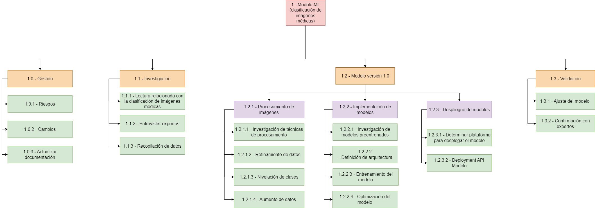
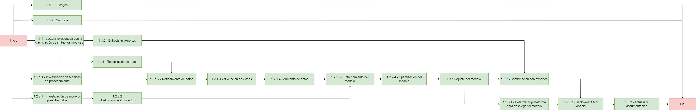
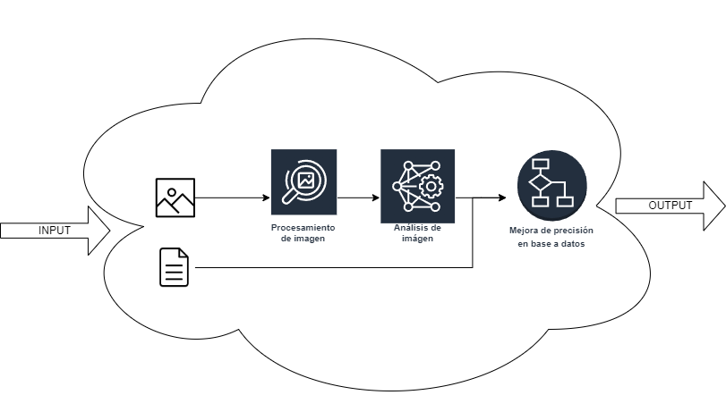

= TP Principal - Laboratorio de Construcción de Software - Plan Sprint 2 y 3
Ebertz Ximena <xebertz@campus.ungs.edu.ar>; Franco Leandro <leandro00fr@gmail.com>; López Gonzalo <gonzagonzalopez20@gmail.com>; Venditto Pedro <pedrovenditto41@gmail.com>; Villalba Gastón <gastonleovillalba@gmail.com>;
v1, {docdate}
:toc:
:title-page:
:toc-title: Secciones
:numbered:
:source-highlighter: highlight.js
:tabsize: 4
:nofooter:
:pdf-page-margin: [3cm, 3cm, 3cm, 3cm]

== Introducción

Este documento tiene como objetivo plantear, en términos generales, el plan del grupo 0 en los Sprints 2 y 3.

El Sprint 1 fue una etapa de **investigación** y **capacitación** para desarrollar modelos de IA de análisis de imágenes.

En el Sprint Planning del Sprint 2 se realizará una planificación más detallada al tener mayor conocimiento del área de _Machine Learning_ en análisis de imágenes y sobre la enfermedad seleccionada para implementar el modelo.

== Gestión

=== WBS

.WBS Sprint 2

=== Diagrama de precedencia

.Diagrama de precedencia

=== Arquitectura de Solución

Una vez hecho el _deploy_, nuestro modelo recibe una imagen y determinados datos (que posteriormente se definirán) desde el _backend_. Nuestro servidor procesa la imagen para que el modelo pueda analizarla. Luego del análisis se complementará el resultado con los datos extra brindados para mejorar la precisión. Finalmente devuelve la predicción final al _backend_.

.Representación del proceso de predicción

=== Riesgos

Matriz de evaluación de riesgos.

[cols="7*", options="header"]
|===
|Descripción|Probabilidad de ocurrencia|Severidad|Exposición al riesgo|Acciones para mitigarlos|Contingencia|Responsable
|Imposibilidad de entrevista a profesional|3|3|9|Contactar con gran variedad de profesionales|Estudiar diagnósticos previos y compararlos con el modelo|Villalba, Gastón
|Cancelación de entrevista a profesional|3|3|9|Acordar fecha y hora de entrevista. Consultar por posibles inconvenientes|Reagendar entrevista|Villalba, Gastón
|Escasez de recursos computacionales|2|3|6|Tener alternativas de entornos de trabajo|Cambiar de entorno de trabajo| Ebertz, Ximena
|Ausencia de miembros del equipo por estudio|3|2|6|Calendarización de ausencia|Reemplazo| Ebertz, Ximena; Villalba, Gastón
|Pérdida de posibilidad de trabajo en el entorno|1|3|3|Backups periódicos, alternativas de entornos|Cambiar de entorno de trabajo, restablecer backup| Ebertz, Ximena; López, Gonzalo
|===

== Aclaraciones

Para el Sprint 2 se desarrollará un modelo de IA que analice imágenes de *tumores cerebrales*.

Para el Sprint 3 se desarrollará un modelo de IA que analice imágenes sobre el *tórax*, aún no está definido en detalle.

La manera de encarar los Sprints 2, 3 y (seguramente) 4 será muy similar.

Son tres etapas del Sprint:

''''

**Investigación**

- Investigar y recopilar datos sobre la enfermedad elegida.

- Dividir al grupo para que se encuentre el mejor modelo de IA estudiando modelos preentrenados.

- Documentar las decisiones tomadas.

- Determinar el proceso de imágenes óptimo según el modelo.

- Solicitar entrevistas a profesionales de la salud.

''''

**Prueba**

- Determinar parámetros de imagen.

- Testeo del modelo. Evaluar el porcentaje de precisión y tomar acciones.

- Mejorar precisión.

- Determinar umbral de precisión.

- Determinar datos para mejorar precisión.

''''

**Deploy**

- Determinar plataforma para el despliegue.

- Configuración de API.
