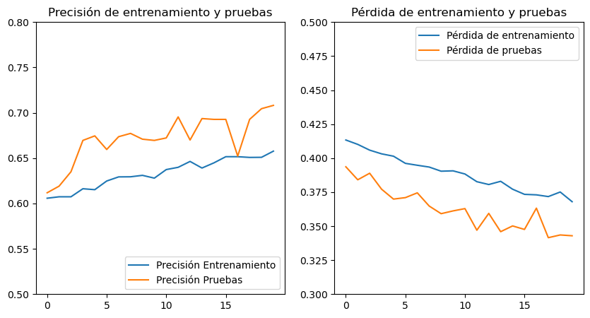
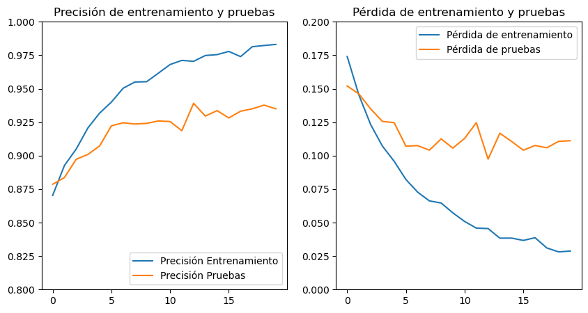
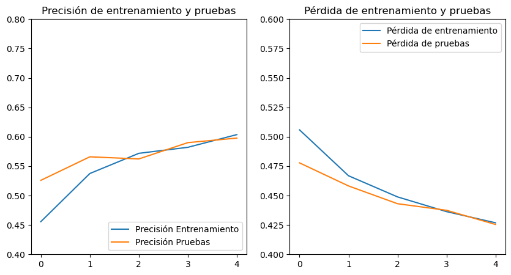
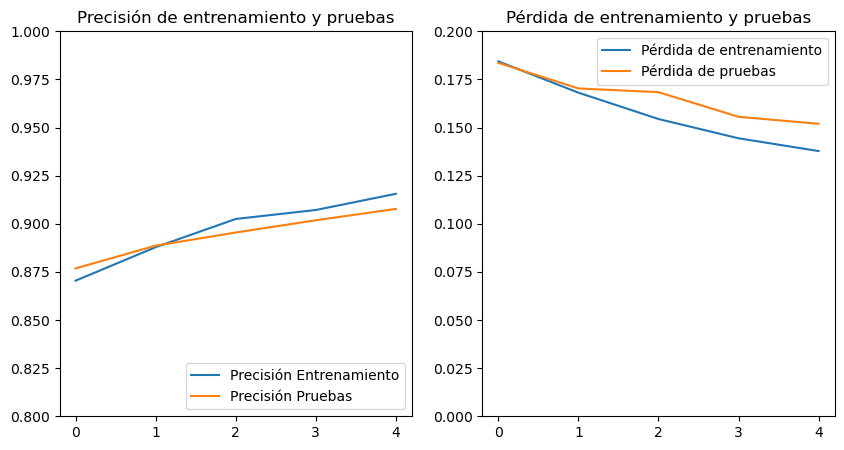

= Modelo ResNet
Ebertz Ximena <xebertz@campus.ungs.edu.ar>; Franco Leandro <leandro00fr@gmail.com>; López Gonzalo <gonzagonzalopez20@gmail.com>; Venditto Pedro <pedrovenditto41@gmail.com>; Villalba Gastón <gastonleovillalba@gmail.com>;
v1, {docdate}
:toc:
:title-page:
:toc-title: Secciones
:numbered:
:source-highlighter: highlight.js
:tabsize: 4
:nofooter:
:pdf-page-margin: [3cm, 3cm, 3cm, 3cm]

== Modelo

ResNet, que es la abreviatura de "Redes Residuales" (en inglés, "Residual Networks"), es una arquitectura de red neuronal profunda que se utiliza comúnmente en el campo de la visión por computadora y el procesamiento de imágenes.

La arquitectura ResNet ha demostrado ser muy efectiva en tareas de clasificación de imágenes, detección de objetos, segmentación semántica y otras tareas relacionadas con el procesamiento de imágenes. Ha establecido récords en varios conjuntos de datos de referencia y se ha convertido en una base importante para muchas aplicaciones de visión por computadora.

== Variantes

La arquitectura ResNet ha dado lugar a una serie de variantes. A continuación, se presentan algunas de las variantes más conocidas:

- ResNet50: Una de las variantes más populares de la arquitectura ResNet. Se caracteriza por su profundidad, constando de 50 capas en total. Utiliza conexiones residuales y bloques básicos de construcción, que incluyen dos capas de convolución seguidas de una capa de Batch Normalization (normalización por lotes) y una función de activación ReLU.

- ResNet50V2: Una versión mejorada de ResNet50 que aborda algunas limitaciones y desafíos en el entrenamiento de redes profundas. La principal diferencia radica en la forma en que se aplica la normalización por lotes (Batch Normalization) en los bloques residuales; en ResNet50V2, la normalización por lotes se aplica antes de la activación, lo que se conoce como "pre-activación". Además, esta variante utiliza una estructura de bloques residuales ligeramente diferente, lo que reduce la cantidad de parámetros y mejora la eficiencia del modelo. ResNet50V2 ha demostrado ser más fácil de entrenar y generalmente logra resultados similares o mejores que ResNet50 en términos de precisión de clasificación.

- ResNet152: Una variante profunda de ResNet con 152 capas, utilizada en tareas de visión por computadora en las que se requiere una gran capacidad de representación.

- ResNet152V2: Una versión mejorada de ResNet152 que implementa la normalización por lotes antes de la activación y reduce el número de parámetros para facilitar el entrenamiento y mejorar la eficiencia del modelo.

== Entrenamiento y prueba

Hemos evaluado el modelo utilizando un https://www.kaggle.com/datasets/gonzajl/tumores-cerebrales-mri-dataset/data[dataset] que creamos nosotros mismos y que consta de 44,000 imágenes. Sin embargo, decidimos trabajar solo con 11,000 de estas imágenes. De ese total, 8,800 imágenes se utilizaron para el conjunto de entrenamiento, mientras que las 2,200 restantes se reservaron para las pruebas.

La elección de limitar el conjunto de datos a este tamaño se debió a las restricciones de nuestros recursos computacionales y a la complejidad inherente del modelo preentrenado que estábamos empleando. Cuando intentamos utilizar un conjunto de datos más grande, nos encontramos con errores durante la ejecución de algunas secciones del código. Por lo tanto, decidimos optar por esta configuración más manejable que nos permitió llevar a cabo nuestras evaluaciones de manera efectiva.

La arquitectura utilizada en las cuatro variantes es la siguiente:

[source, python]
----
base_model = tf.keras.applications.Variante(
    include_top=False,
    weights="imagenet",
    input_shape=(224, 224, 3),
)

base_model.trainable = False

num_classes = 4
x = layers.GlobalAveragePooling2D()(base_model.output)
output = layers.Dense(num_classes, activation='sigmoid')(x)
model = Model(inputs=base_model.input, outputs=output)
----

`base_model = tf.keras.applications.Variante(...)` crea la base del modelo utilizando una de las posibles variantes. En lugar de `Variante` se especificaría el nombre de la arquitectura específica que se desea utilizar (ResNet50, ResNet50V2, ResNet152, etc.). La opción `include_top=False` indica que se omitirán las capas totalmente conectadas (top) del modelo preentrenado, ya que se agregarán capas personalizadas para adaptar el modelo a una tarea específica. También se especifica el tamaño de entrada de las imágenes con `input_shape=(224, 224, 3)` (imágenes de 224x224 píxeles, con 3 canales de color).

`base_model.trainable = False` congela las capas del modelo base, lo que significa que sus pesos no se actualizarán durante el proceso de entrenamiento. Esto es útil cuando se utiliza un modelo preentrenado y se quiere mantener sus características aprendidas.

`x = layers.GlobalAveragePooling2D()(base_model.output)` agrega una capa de reducción de dimensionalidad llamada "Global Average Pooling 2D" a la salida del modelo base. Esta capa calcula el promedio global de las activaciones en cada canal de la última capa convolucional y reduce la dimensionalidad de los datos.

`output = layers.Dense(num_classes, activation='sigmoid')(x)` agrega una capa de salida con un número de neuronas igual al número de clases definido anteriormente, y utiliza una función de activación sigmoide. Esto es común en problemas de clasificación multiclase donde cada clase es independiente.

`model = Model(inputs=base_model.input, outputs=output)` crea el modelo completo que toma las imágenes como entrada y produce las salidas de clasificación. Especifica las entradas (base_model.input) y las salidas (output) del modelo.

== Resultados

=== ResNet50

*Precisión en entrenamiento:* 65%

*Precisión en prueba:* 70%

.Prueba de predicciones
[source, console]
----
Cantidad de predicciones: 2200
Etiquetas:   [G,  M,  P,  N]
Total:       [520, 367, 655, 658]
Correctas:   [322, 237, 493, 506]
Incorrectas: [198, 130, 162, 152]
----

=== ResNet50V2

*Precisión en entrenamiento:* 98%

*Precisión en prueba:* 93%

.Prueba de predicciones
[source, console]
----
Cantidad de predicciones: 2200
Etiquetas:   [G,  M,  P,  N]
Total:       [507, 602, 539, 552]
Correctas:   [482, 516, 516, 543]
Incorrectas: [25, 86, 23, 9]
----

=== ResNet152

*Precisión en entrenamiento:* 60%

*Precisión en prueba:* 59%

.Prueba de predicciones
[source, console]
----
Cantidad de predicciones: 2200
Etiquetas:   [G,  M,  P,  N]
Total:       [565, 442, 707, 486]
Correctas:   [312, 243, 393, 367]
Incorrectas: [253, 199, 314, 119]
----

=== ResNet152V2

*Precisión en entrenamiento:* 91%

*Precisión en prueba:* 90%

.Prueba de predicciones
[source, console]
----
Cantidad de predicciones: 2200
Etiquetas:   [G,  M,  P,  N]
Total:       [527, 512, 601, 560]
Correctas:   [475, 444, 552, 526]
Incorrectas: [52, 68, 49, 34]
----

== Variante óptima

Los resultados destacan claramente que la variante que sobresalió por su excelente rendimiento, tanto en el conjunto de entrenamiento como en el de prueba, fue ResNet50V2. Esta variante logró una precisión del 98% en el conjunto de entrenamiento y un impresionante 93% en el conjunto de prueba.
