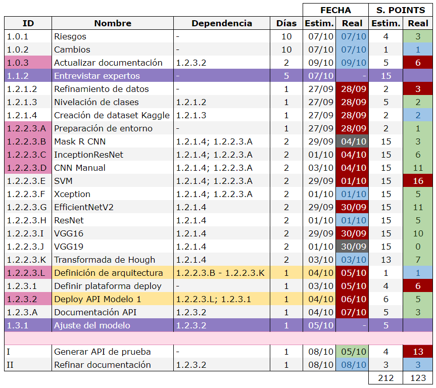

= TP Principal - Laboratorio de Construcción de Software - Sprint 2
Ebertz Ximena <xebertz@campus.ungs.edu.ar>; Franco Leandro <leandro00fr@gmail.com>; López Gonzalo <gonzagonzalopez20@gmail.com>; Venditto Pedro <pedrovenditto41@gmail.com>; Villalba Gastón <gastonleovillalba@gmail.com>;
v1, {docdate}
:toc:
:title-page:
:toc-title: Secciones
:numbered:
:source-highlighter: highlight.js
:tabsize: 4
:nofooter:
:pdf-page-margin: [3cm, 3cm, 3cm, 3cm]

== Introducción

La Inteligencia Artificial o _IA_ es un poderoso campo de estudio que está en constante crecimiento. Cada día, los modelos de Inteligencia Artificial evolucionan y se incorporan en nuestro día a día, funcionando como una potente herramienta de trabajo.

Existen muchos campos donde la Inteligencia Artificial se está desarrollando: detección de imágenes, texto, audio, etcétera. Resulta lógico pensar que se pueden desarrollar herramientas para campos más específicos, como medicina, finanzas, o investigación.

== Objetivos del proyecto

Nuestro objetivo es, mediante la aplicación de tecnologías relacionadas a las inteligencias artificiales, desarrollar un software que pueda ayudar a nuestros profesionales del área de la medicina a lograr un diagnóstico más rápido y preciso sobre alguna enfermedad o malestar en específico.

Para esto, realizaremos tareas de investigación, de análisis de datos y de desarrollo, entre otras.

== Objetivos del documento

El principal objetivo de este documento es especificar las decisiones que se tomen en los días previos al inicio del proyecto; tales como la distribución de roles de trabajo, los posibles riesgos del equipo y del proyecto, el tema a trabajar, las metodologías que se utilizarán, entre otras cosas relacionadas a la organización necesaria del proyecto.

== Metodología de trabajo

Somos parte del _Agile Release Train_ (que plantea el marco de trabajo *_SAFe_*) en conjunto con los demás grupos. Para coordinar nuestro trabajo adaptaremos el _framework_ ágil *_Scrum_* según las preferencias del equipo para optimizarla. Cada _sprint_ dura *dos semanas*.

- *_Sprint Planning_*: se realizará el primer día del _sprint_ y en ocasiones participará el _Release Train Engineer_.

- *_Daily Scrum_* cada 2 días: los integrantes del equipo tienen tiempos diferentes y un día de trabajo quizá no sea suficiente para tener un avance considerable para plantearlo en las _Daily_. Por inconvenientes o bloqueo de un integrante, en el día que no hay _Daily_, se comunicarán por algunos de los medios detallados más adelante.

- *_Sprint Review_*: el último día del _sprint_ se hará una presentación de los informes solicitados mostrando el avance del equipo.

- *_Sprint Retrospective_*: luego de la revisión de cada _sprint_ se hará una retrospectiva del avance.

== Equipo de trabajo y roles

Los roles que se utilizarán en el equipo son los siguientes:

[cols="3,2,2", options="header"]
|===
|Rol            |Encargado         |Suplente

|Product Owner | Dikenstein, Leandro|
|Scrum Master   |Villalba, Gastón  |Ebertz, Ximena
|Líder Técnico  |Ebertz, Ximena    |Franco, Leandro
|Machine Learning Engineer  |López, Gonzalo    |
|Data Scientist  |Franco, Leandro   |
|Data Scientist  |Venditto, Pedro   |
|===

== Gestión

=== Visión

Nuestra visión es utilizar la tecnología de inteligencia artificial y aprendizaje automático para mejorar la atención médica y el diagnóstico. A través de nuestro trabajo en el presente trabajo práctico, buscamos desarrollar un modelo de clasificación de imágenes médicas que asista a los profesionales de la salud en la toma de decisiones clínicas. 

=== Misión

Nuestra misión es aplicar nuestros conocimientos y habilidades en procesamiento de imágenes y aprendizaje automático para crear soluciones innovadoras y efectivas que impacten positivamente en el ámbito sanitario y el bienestar de las personas.

=== Alcance

Desarrollo y Entrenamiento del Modelo de IA:

- Investigación exhaustiva de algoritmos de aprendizaje automático, con el objetivo de seleccionar el más adecuado para el problema de clasificación de imágenes médicas.
- Implementación y entrenamiento del modelo utilizando el conjunto de datos previamente preparado.
- Optimización y validación del modelo para asegurar su eficacia y precisión en la clasificación de las imágenes médicas.
- Se considerará la posibilidad de mejorar el modelo de inteligencia artificial si es necesario.
- Despliegue del modelo de IA. Recibe como inputs una imagen y determiados datos y devuelve un resultado.

=== Requerimientos

==== Requerimientos Funcionales
1. El modelo debe recibir imágenes y procesarlas de acuerdo a la arquitectura del modelo.

2. El modelo debe realizar una predicción de la imagen mediante técnicas de _Machine Learning_.

3. El modelo debe recibir datos y combinarlos con el resultado de la imagen para mejorar la precisión.

4. El modelo debe retornar los resultados.

==== Requerimientos No Funcionales
1. El modelo debe responder rápidamente. Para ello se aplicarán las mejores prácticas para aumentar su *rendimiento*.

2. El modelo debe mantener un porcentaje de aciertos mayor o igual al 85% para mantener la *confiabilidad*.

3. El modelo debe estar *disponible* para su uso en cualquier momento. Para comprobarlo se creará un _endpoint_ el cual retornará el estado del servicio.

=== WBS

.WBS Sprint 2

=== Diccionario WBS Sprint 2

[cols="1,3,6,6,1", options="header"]
|===
|ID
|Nombre
|Descripción
|Tarea
|Peso
|1
|Modelo de ML (Clasificación de imágenes médicas)
|En este proyecto se busca diseñar, entrenar y optimizar un modelo de clasificación de imágenes médicas utilizando técnicas de inteligencia artificial y aprendizaje automático.
|-
|196
|1.0
|Gestión
|Gestionar el proyecto, así como los riesgos, cambios y realizar informes para Reuniones Formales.
|Realizar una documentación de la gestión de proyecto.
|10
|1.0.1
|Riesgos
|Tener en consideración los riesgos internos del equipo y los riesgos externos con otros grupos.
|Realizar una matriz de riesgos y actualizarla cuando lo requiera.
|4
|1.0.2
|Cambios
|Estar al tanto de cualquier cambio en cuanto al alcance del proyecto o tecnología a utilizar.
|Documentar los cambios.
|1
|1.0.3
|Actualizar documentación
|Mantener actualizado la documentación de lo realizado por el equipo.
|Actualizar los informes, diagramas y tablas en base a lo investigado y realizado por el equipo.
|5
|1.1
|Investigación
|Referido a la investigación, en este _sprint_ esperamos que un especialista nos brinde información sobre qué cosas tener en cuenta para el desarrollo y uso del modelo de machine learning.
|Realizar entrevistas a profesionales de la salud.
|15
|1.1.2
|Entrevistar expertos
|Se requiere acordar entrevistas con profesionales de la salud para obtener feedback sobre lo que se está desarrollando y brindar conocimiento sobre este dominio.
|Se entrevistará a expertos en el campo médico para obtener información sobre las características importantes a considerar en la clasificación de imágenes médicas. 
|15
|1.2
|Modelo versión 1.0
|Se realizará una investigación sobre procesamiento de imágenes y modelos preentrenados para poder desarrollar nuestro modelo.
|Diseñar, entrenar y optimizar un modelo de clasificación de imágenes médicas utilizando técnicas de inteligencia artificial y aprendizaje automático.
|166
|1.2.1
|Procesamiento de imágenes
|En este _sprint_, el procesamiento de imágenes está centrado en crear el dataset  aplicando determinadas transformaciones a las imágenes para el entrenamiento en igualdad de condiciones de todos los modelos a desarrollar.
|Investigar las técnicas de procesamiento de imágenes necesarias para preparar los datos para el entrenamiento del modelo, refinando los datos, nivelando las clases y aumentando los datos si es necesario.
|7
|1.2.1.2
|Refinamiento de datos
|En esta tarea se refinan los datos utilizando diferentes técnicas como la normalización, la reducción del ruido y la eliminación del fondo no deseado en las imágenes, entre otras posibles técnicas que puedan ser utilizadas para mejorar la calidad del conjunto de datos utilizado para entrenar al modelo. El objetivo es eliminar cualquier ruido o distorsión en las imágenes que puedan afectar negativamente al rendimiento del modelo durante el entrenamiento o la validación.
|Refinar los datos utilizando diferentes técnicas como la normalización, la reducción del ruido y la eliminación del fondo no deseado en las imágenes, entre otras posibles técnicas que puedan ser utilizadas para mejorar la calidad del conjunto de datos utilizado para entrenar al modelo.
|2
|1.2.1.3
|Nivelación de clases
|Nivelar las clases es una tarea importante para que, durante el entrenamiento, el modelo no tienda a predecir sobre una clase en la que tiene más muestras. Su objetivo es que el entrenamiento sea lo más parejo.
|Nivelar las clases en el conjunto de datos utilizado para entrenar al modelo, asegurando que cada clase tenga un número similar de muestras disponibles durante el entrenamiento utilizando técnicas como submuestreo o sobremuestreo según sea necesario.
|5
|1.2.2
|Implementación de modelos
|Implica realizar todo lo relacionado al modelo, su desarrollo y optimización.
|Desarrollar modelos, probarlos y optimizarlos para luego definir el modelo más conveniente.
|149
|1.2.2.2
|Definición de arquitectura
|Llegar a un acuerdo con el equipo sobre cuál arquitectura interna del modelo es la que mejor resultados arrojó.	
|Definir la arquitectura del modelo de clasificación de imágenes médicas, seleccionar las capas adecuadas, definir la estructura general del modelo y especificar los hiperparámetros necesarios para entrenar el modelo.
|1
|1.2.2.3
|Desarrollo del modelo
|Implica el entrenamiento, prueba y optimización de varios modelos de machine learning para determinar cuál es el más conveniente en nuestro dominio.
|Entrenar el modelo de clasificación de imágenes médicas utilizando los datos preparados en la etapa anterior, implementar una técnica para el seguimiento del progreso del entrenamiento y ajustar los hiperparámetros a medida que sea necesario.
|148
|1.2.3
|Despliegue de modelos
|Una vez elegido el modelo a utilizar, se requiere que se despliegue para consumirse mediante API para la comunicación con otros grupos.
|Realizar el deploy del modelo elegido en una plataforma que nos brinde recursos necesarios para correr el modelo.
|10
|1.2.3.1
|Determinar plataforma para desplegar el modelo
|Existen varias plataformas que brindan un servicio de servidor para alojar diversos programas. En nuestro caso se requiere alojar un modelo de machine learning que pueda recibir una imagen y devolver un resultado.
|Determinar la plataforma en la cuál el modelo estará alojado para su consumo mediante API.
|4
|1.2.3.2
|Deploy API modelo
|Se requiere configurar el servidor para que la API funcione correctamente.
|Realizar el despliegue del modelo de machine learning en la plataforma elegida.
|6
|1.3
|Validación
|Se comprueban los resultados del modelo, como pueden ser la precisión, tiempo de ejecución. Se espera que el modelo pueda clasificar correctamente imágenes en clases según el entrenamiento recibido.
|Realizar pruebas ingresándo imágenes y corroborar que sea clasificada correctamente. Someter al modelo a una serie de análisis de imágenes para obtener el porcentaje de precisión.
|5
|1.3.1
|Ajuste del modelo
|Contempla la modificación del modelo en base a su funcionamiento como API (por rendimiento y/o precisión) y comentarios de un profesional de la salud.	
|Ajustar el modelo de clasificación de imágenes médicas para mejorar su precisión y rendimiento en los datos de validación utilizando técnicas como la selección del umbral adecuado, la calibración del modelo, evaluar su rendimiento utilizando métricas relevantes y ajustar los hiperparámetros a medida que sea necesario.	
|5
|===

=== Diagrama de precedencia

.Diagrama de precedencia

El diagrama de precedencia cuenta con los pesos estimados en días para la finalización de cada tarea. Aquellas con color rosa son las tareas incluidas en el camino crítico.

Se puede observar que tiene una longitud de *11* días. Como el _sprint_ dura *13* días si no contamos el _Sprint Review_, la holgura total de esas tareas no puede superar los *2* días.

=== Calendario
==== Estimado

.Calendario Sprint 2

.Referencia de color

Consideramos como **hito** definir la arquitectura del modelo de IA y el despliegue del mismo para su consumo mediante API.

==== Comparativa estimado vs real

.Comparativa

.Referencia de color
image:.img/comparativa-color.png[120,120, align="center"]

Las tareas asignadas durante el _sprint_ se encuentran por debajo de la fila de color rosa claro, cuyos ID son en números romanos.

=== Plan de comunicaciones

Nuestros medios de comunicación son:

*Gather*: es una plataforma que nos permite tener una oficina virtual, donde cada uno tiene su personaje dentro de esta oficina. La utilizamos porque no tiene límites de tiempo, permite la comunicación a través de voz, compartir pizarras y es menos monótona que otras plataformas como _Meet_. Es una vía de comunicación formal que empleamos para las ceremonias _Scrum_.

*WhatsApp*: es un medio de comunicación informal que utilizamos para coordinar los horarios de las reuniones en _Gather_ y discutir cuestiones relacionadas con el proyecto que no requieran la presencia de todo el equipo en ese momento. Se trata de un método de comunicación [.underline]#asincrónica#.

*Telegram*: similar al uso que le damos a WhatsApp, pero para contactarnos con los demás equipos de trabajo. Principalmente es para coordinar reuniones o solicitar ayuda con alguna cuestión del proyecto.

*Email*: en caso de que sea necesario, por algún inconveniente externo que no permita las vías convencionales, utilizaremos el email de los integrantes para coordinar al equipo. Además, es la principal vía para comunicarnos con nuestro _Product Owner_.

*Jira/Trello*: comunicación de tareas y responsables de la ejecución de las mismas.

*Moodle*: se realizarán las entregas de documentación solicitada para realizar el _Sprint Review_.

La actualización de la documentación se hará formalmente al final de cada _sprint_.

==== Horarios

Se armó una tabla con rangos de horarios en los cuales cada integrante del equipo indicaba cuándo se encontraba disponible en el _sprint_.

.Horarios Sprint 2
image::.img/horarios-sprint.png[align="center"]

=== Riesgos

Matriz de evaluación de riesgos.

[cols="2,1,1,1,3,3,1", options="header"]
|===
|Descripción
|Prob
|Sev
|Exp
|Mitigación
|Contingencia
|Resp
|*S*|*E*|*M*|*A*|*N*|*A*|*2*
|Escasez de recursos computacionales|2|3|6
|Tener alternativas de entornos de trabajo
|Cambiar de entorno de trabajo
|XE
|Ausencia de miembros del equipo por estudio|3|2|6
|Calendarización de ausencia
|Reemplazo
|XE
|Pérdida de posibilidad de trabajo en el entorno|1|3|3
|Backups periódicos, alternativas de entornos
|Cambiar de entorno de trabajo, restablecer backup
|XE;GL
|Mala comunicación con los otros grupos del proyecto
|1|1|1
|Acordar medios de comunicación y horarios disponibles
|Comunicar por los medios acordados los inconvenientes surgidos
|GV;XE
|*S*|*E*|*M*|*A*|*N*|*A*|*3*
|Imposibilidad de entrevista a profesional|3|3|9
|Contactar con gran variedad de profesionales
|Estudiar diagnósticos previos y compararlos con el modelo
|GV
|Cancelación de entrevista a profesional|3|3|9
|Acordar fecha y hora de entrevista. Consultar por posibles inconvenientes
|Reagendar entrevista
|GV
|Ausencia de miembros del equipo el 2023-10-09 por motivos de estudio|3|3|9
|Definir reemplazantes, planificar ausencias
|Reemplazos
|XE
|Escasez de recursos computacionales|2|3|6
|Tener alternativas de entornos de trabajo
|Cambiar de entorno de trabajo
|XE
|Ausencia de miembros del equipo por estudio|3|2|6
|Calendarización de ausencia
|Reemplazo
|XE
|Pérdida de posibilidad de trabajo en el entorno|1|3|3
|Backups periódicos, alternativas de entornos
|Cambiar de entorno de trabajo, restablecer backup
|XE;GL
|Mala comunicación con los otros grupos del proyecto
|1|1|1
|===

==== Nivel de Riesgo

.Nivel de Riesgo en 3 semanas

=== Administración en el Manejo de bugs
Los _bugs_ encontrados serán agregados como _card_ en el tablero del equipo en *Trello*.

=== Administración de Cambios

Tras recibir una petición de cambio, documentaremos las nuevas funcionalidades que se solicitan y posteriormente se agregarán al _Product Backlog_. Esta nueva modificación se evaluará, se estimará con los integrantes del proyecto, se modificará la WBS, Diccionario y se agregará al _Sprint Backlog_.

En este _sprint_ contamos con un cambio:

- Cambios en las fechas y recursos debido a una petición del grupo 3 para realizar el _deploy_ de una API de prueba para que puedan testear sus funcionalidades.

=== Indicadores
*Burndown Chart*: Al utilizar _Scrum_ precisamos ver el avance de nuestro trabajo de cada _sprint_. 
El trabajo se expresará en Story Points, teniendo en cuenta que un Story Point es igual a 1 hora.

.Burndown Chart Sprint 2

Se puede apreciar la diferencia entre los _story points_ estimados con los reales. Al principio la diferencia es muy grande, al asumir linealidad en el desarollo de modelos. A medida que se iban desarrollando distintos modelos de IA, el conocimiento aprendido reducía el tiempo de desarrollo de los modelos posteriores.

Nos quedaron *20* _story points_ por quemar, *15* de la tarea **Entrevistar expertos** y *5* de **Ajuste del modelo** los cuales fueron desplazados al siguiente _sprint_.

== Tecnologías

Las tecnologías a utilizar serán las siguientes:

- *Saturn Cloud* para el desarrollo del modelo de IA, ya que el entorno de trabajo contiene todo lo necesario.
- *Python* como lenguaje de programación, por su simplicidad y utilidad en el desarrollo de este tipo de modelos.
- *TensorFlow - Keras* como biblioteca principal de desarrollo, ya que provee distintas funcionalidades para la creación de modelos de IA.
- *NumPy* debido a la necesidad de trabajar las imágenes como arrays multidimensionales o _tensores_.
- *Pandas* ya que permite obtener información de archivos .csv.
- *cv2* como biblioteca de lectura y procesamiento de imágenes.
- *matplotlib.pyplot* para generar gráficos.
- *GitHub* como repositorio de trabajo.

=== Repositorio de GitHub

El repositorio de GitHub se encuentra https://github.com/ximeeb/tp-principal-grupo-0-lcs.git[aquí].
