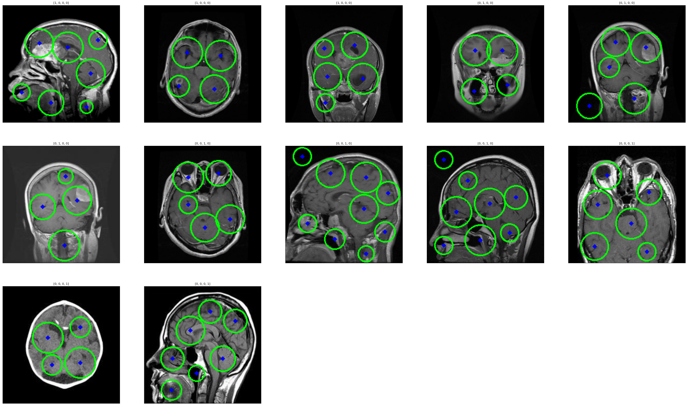
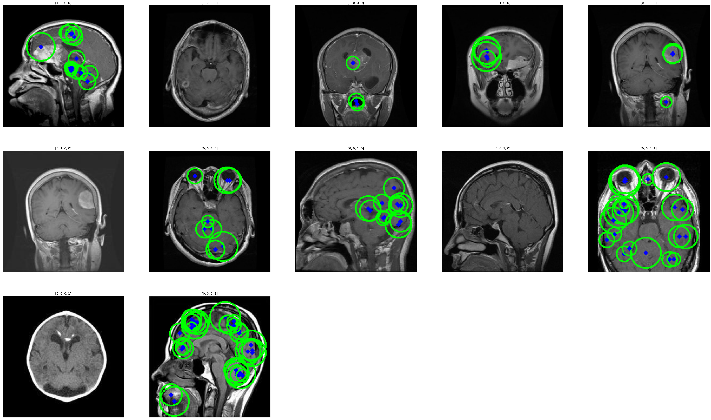

= Transformada de Hough: Pruebas
Ebertz Ximena <xebertz@campus.ungs.edu.ar>; Franco Leandro <leandro00fr@gmail.com>; López Gonzalo <gonzagonzalopez20@gmail.com>; Venditto Pedro <pedrovenditto41@gmail.com>; Villalba Gastón <gastonleovillalba@gmail.com>;
v1, {docdate}
:toc:
:title-page:
:toc-title: Secciones
:numbered:
:source-highlighter: highlight.js
:tabsize: 4
:nofooter:
:pdf-page-margin: [3cm, 3cm, 3cm, 3cm]

== Transformada de Hough

La transformada de Hough es una técnica de procesamiento de imágenes que permite detectar figuras en una imagen, tales como líneas, elipses y círculos. No es un modelo de inteligencia artificial, por lo que no se debe entrenar. Es decir, se puede importar y utilizar para una imagen en específico.

La biblioteca OpenCV cuenta con un dos implementaciones de esta técnica: `HoughCircles` y `HoughLines`. La primera es utilizada para detectar círculos en una imagen, y la segunda es para detectar líneas.

Para nuestro dominio, la implementación que podría ser útil es `HoughCircles`, debido que estos círculos pueden ser tumores cerebrales. Por este motivo, realizamos unas pruebas en base a nuestro https://www.kaggle.com/datasets/gonzajl/tumores-cerebrales-mri-dataset/data[dataset].

== Pruebas

Para utilizar esta técnica, se deben realizar dos pasos:

1. Obtener los círculos de una imagen
2. Dibujar estos círculos en la imagen

Luego, la imagen se puede mostrar, exportar, o lo que sea necesario.

Para obtener los círculos de una imagen, basta con utilizar la siguiente función:

[source, python]
----
circles = cv2.HoughCircles(image, method, dp, minDist, param1, param2, minRadius, maxRadius)
----

Los paámetros que recibe son los siguientes:

* `image`: la imagen a procesar, en formato _tensor_ con codificación _uint8_.
* `method`: el método de detección a utilizar. CV2 solo cuenta con `cv2.HOUGH_GRADIENT`.
* `dp`: resolución acumulativa en la detección de círculos. A medida que este valor disminuye, la resolución se considera que aumenta, y con eso la precisión de la detección de círculos
* `minDis`: la mínima distancia entre los centros de los círculos.
* `param1`: controla la sensibilidad de la detección de bordes en la imagen. Un valor menor de `param1` hará que el detector sea más sensible a los bordes.
* `param2`: controla cuántos votos se necesitan para considerar un punto como parte de un círculo. Un valor menor de `param2` hará que el detector sea más permisivo y detecte más círculos.
* `minRadius`: radio mínimo de los círculos.
* `maxRadius`: radio máximo de los círculos.

Esta función retorna un conjunto de círculos, que se pueden dibujar sobre la imagen de la siguiente manera

[source, python]
----
if circles is not None:    
        circles = np.uint16(np.around(circles))
        for i in circles[0,:]:
            cv2.circle(image, (i[0], i[1]), i[2], (0,255,0), 2) # dibujar círculo 
            cv2.circle(image, (i[0], i[1]), 2, (0,0,255), 3)    # dibujar centro
----

Es importante destacar que para mostrar la imagen *no* se debe utilizar el método `cv2.imshow()`, ya que está obsoleto y causa _kernel crash_ en cuadernos de Jupyter Notebook. Por lo que para mostrar la imagen se debe utilizar la biblioteca `matplotlib.pyplot` de la siguiente forma:

[source, python]
----
plt.xticks([])
plt.yticks([])
plt.imshow(image)
plt.show()
----

Luego, esto se probó con tres imágenes por clase de nuestro dataset.

Partimos desde la base de los siguientes parámetros:

[source, python]
----
cv2.HoughCircles(image, cv2.HOUGH_GRADIENT, 1, 1, param1=1, param2=1, minRadius=1, maxRadius=10)
----

Y, después de diversas pruebas, llegamos a la conclusión de que los siguientes parámetros son los mejores para la función

[source, python]
----
cv2.HoughCircles(image, cv2.HOUGH_GRADIENT, 1, 50, param1=3, param2=31, minRadius=3, maxRadius=30)
----

Con estos valores, llegamos al siguiente resultado para una imagen de un tumor de tipo _meningioma_:

[cols="a,a", frame=none, grid=none, role=right]
|===
|   image::imgs/meningioma.png[200, 350, align="center"]
|   image::imgs/deteccion-meningioma.png[200, 350, align="center"]
|===

Se puede ver que la detección no es la mejor, aunque puede definir un círculo en el tumor.

Otras detecciones para esta configuración fueron las siguientes:

Se puede ver que la función detecta demasiados círculos, lo que complejiza el análisis de las imagenes.

Para reducir la cantidad de círculos detectados, utilizamos un filtro umbral. Este filtro realza los colores claros y oscurece los colores más profundos, logrando la siguiente diferenciación:

[cols="a,a", frame=none, grid=none, role=right]
|===
|   image::imgs/meningioma.png[200, 350, align="center"]
|   image::imgs/umbral-meningioma.png[200, 350, align="center"]
|===

Se puede ver el realce del meningioma en color blanco, lo que facilitaría su detección. Sin embargo, no se obtuvieron resultados. Por este motivo, cambiamos los parámetros de la función por los siguientes:

[source, python]
----
cv2.HoughCircles(image, cv2.HOUGH_GRADIENT, 0.2, 1, param1=2, param2=21, minRadius=3, maxRadius=30)
----

Esto generó la siguiente detección:

[cols="a,a", frame=none, grid=none, role=right]
|===
|   image::imgs/deteccion-umbral-meningioma-orig.png[200, 350, align="center"]
|   image::imgs/deteccion-umbral-meningioma.png[200, 350, align="center"]
|===

La mejoría entre la detección previa y la actual es notoria. Sin embargo, si vemos todas las detecciones, podemos observar que no todas fueron muy buenas. La precisión varía demasiado entre una imagen y otra.

También podemos observar que la predicción es distinta para iguales imágenes, como las siguientes:

[cols="a,a", frame=none, grid=none, role=right]
|===
|   image::imgs/deteccion-umbral-meningioma-brillante.png[200, 350, align="center"]
|   image::imgs/deteccion-umbral-meningioma-orig.png[200, 350, align="center"]
|===

Esto se debe a la diferencia de contraste entre las imágenes. En la primera, debido a que es más brillante, el filtro umbral genera el efecto contrario al deseado.

[cols="a,a", frame=none, grid=none, role=right]
|===
|   image::imgs/deteccion-umbral-meningioma-brillante.png[200, 350, align="center"]
|   image::imgs/umbral-meningioma-brillante.png[200, 350, align="center"]
|===

Esto es contraproducente, ya que la detección va a estar determinada por factores como el brillo de la imagen.

== Conclusión

La técnica _Transformada de Hough_ es muy útil en cuanto a detección de formas en imágenes, pero consideramos que en nuestro dominio su implementación es riesgosa, ya que los resultados pueden variar mucho con pocos cambios en la imagen.

También, consideramos que la cantidad extra de círculos detectados puede entorpecer el diagnóstico del profesional, más que favorecerlo.