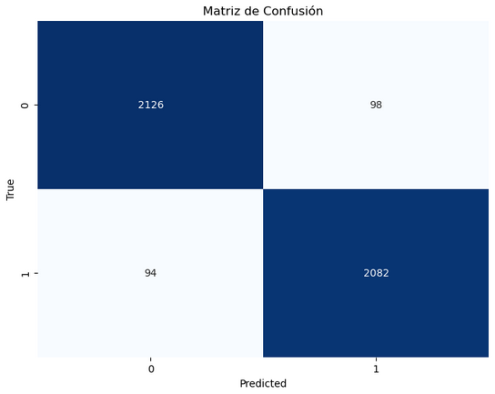

= SVM: Entrenamiento y pruebas
Ebertz Ximena <xebertz@campus.ungs.edu.ar>; Franco Leandro <leandro00fr@gmail.com>; López Gonzalo <gonzagonzalopez20@gmail.com>; Venditto Pedro <pedrovenditto41@gmail.com>; Villalba Gastón <gastonleovillalba@gmail.com>;
v1, {docdate}
:toc:
:title-page:
:toc-title: Secciones
:numbered:
:source-highlighter: highlight.js
:tabsize: 4
:nofooter:
:pdf-page-margin: [3cm, 3cm, 3cm, 3cm]

== Modelo

SVM esta relacionado con problemas de clasificación y regresión. Dado un conjunto de ejemplos de formación (de muestras) podemos etiquetar las clases y formar una SVM para construir un modelo que prediga la clase de una nueva muestra. Intuitivamente, una SVM es un modelo que representa a los puntos de muestra en el espacio, separando las clases a 2 espacios lo más amplios posibles mediante un hiperplano de separación definido como el vector entre los 2 puntos, de las 2 clases, más cercanos al que se llama vector soporte. Cuando las nuevas muestras se ponen en correspondencia con dicho modelo, en función de los espacios a los que pertenezcan, pueden ser clasificadas a una o la otra clase. 

Las SVM son inherentemente para dominios binarios, es decir, problemas de clasificación donde es o no es. Por ejemplo: un modelo para clasificar imágenes donde pueden ser una banana o no serlo.

== Implementación

Para su uso se utiliza la librería _sklearn_.

Como nuestro problema entra en el dominio de la multiclases, SVM no es precisamente la mejor solución. Pero decidimos utilizar el método de *Dividir y conquistar*, o sea, dividir el dominio en sub-dominios para conseguir una predicción multiclase utilizando SVM que es inherentemente binario. 

En nuestro dominio tenemos cuatro tipos de clases:

* glioma
* meningioma
* pituitary
* no_tumor

Entonces, decidimos dividir en los siguientes tres modelos:

* Si es glioma o no_tumor
* Si es meningioma o no_tumor
* Si es pituitary o no_tumor

====
[source,python]
.Ejemplo: Creación del modelo de predicción de tumores del estilo glioma.
----
.
.
.
gliomas = []
etiquetas_g = []

# Leer y procesar todas las imágenes
for i, fila in df.iterrows():
    if fila['glioma'] == 1 or fila['no_tumor'] == 1: 
        ruta_imagen = fila['imagen']
        # Leer la imagen desde la ruta
        imagen = cv2.imread(ruta_imagen, cv2.IMREAD_GRAYSCALE)
        imagen_normalizada = (imagen / 255.0 * 255).astype('uint8')
        # Etiqueta según la categoría (glioma o no_tumor)
        gliomas.append(imagen_normalizada.flatten())
        if fila['glioma'] == 1:
            etiquetas_g.append(1)
        elif fila['no_tumor'] == 1:
            etiquetas_g.append(0)
            
# Dividir los datos en conjuntos de entrenamiento y prueba
X_train, X_test, y_train, y_test = train_test_split(gliomas, etiquetas_g, test_size=0.2, random_state=123)

# Entrenar un modelo SVM
svm_model_glioma = SVC(kernel='linear')
svm_model_glioma.fit(X_train, y_train)
----
====

Al dividir el problema en sub-problemas podemos comparar los resultados de cada una utilizando una misma imagen, y con la comparación podemos deducir si la imagen es glioma, meningioma, pituitary o no_tumor.

====
[source,python]
.Decisión si la imagen es una de las 4 clases.
----
.
.
.
# Realizar la clasificación con cada modelo SVM
decision_glioma = modelo_glioma.predict([imagen_redimensionada.flatten()])[0]
decision_meningioma = modelo_meningioma.predict([imagen_redimensionada.flatten()])[0]
decision_pituitary = modelo_pituitary.predict([imagen_redimensionada.flatten()])[0]
# Clasificación final
if decision_glioma == 1:
    clase_final = "glioma"
elif decision_meningioma == 1:
    clase_final = "meningioma"
elif decision_pituitary == 1:
    clase_final = "pituitary"
else:
    clase_final = "no tumor"

print("Clase Final:", clase_final)
print("Decisión Glioma:", decision_glioma)
print("Decisión Meningioma:", decision_meningioma)
print("Decisión Pituitary:", decision_pituitary)

.
.
.
----
====

== Conclusiones

Todos los sub-modelos son completamente eficaz.
A continuación las matriz de confución de cada uno:

.Glioma
image::imgs/matriz_confusión_glioma.png[]
.Meningioma

.Pituitary
image::imgs/matriz_confusión_pituitary.png[]

Todos los sub-modelos superan el 96% de aciertos, pero hay un problema: Al realizar la comparación entre los 3 modelos, por lo general, cuando se utiliza el modelo para clasificar una tomografía con algún tumor, sin importar su tipo, puede clasificarla como dos o tres tipos de tumores. Por ejemplo: La tomografía recibida como input es un tumor de tipo Glioma, pero como son similares a los demás tumores es posible que lo clasifique con más de una categoría.

Entonces, por lo anteriormente dicho queda demostrado que SVM no es conveniente para el dominio de este problema.

Aunque no fue en vano su intento de implementación. Descubrimos un nuevo modelo que nos puede ayudar en problemas de dominio binario. En caso de que en los próximos Sprints tengamos un dominio binario, es una técnica que nos ayudará a concluir el problema más fácilmente por los conocimientos adquiridos.