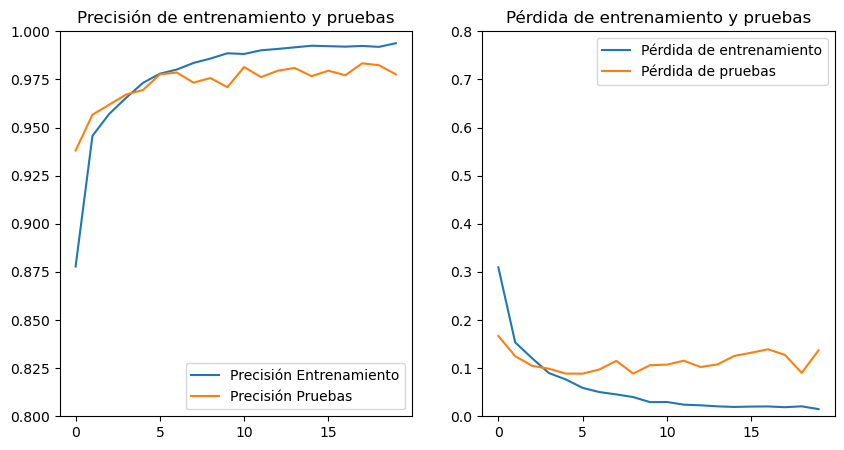

= Modelo CNN Manual - Pulmones: Entrenamiento y pruebas
Ebertz Ximena <xebertz@campus.ungs.edu.ar>; Franco Leandro <leandro00fr@gmail.com>; López Gonzalo <gonzagonzalopez20@gmail.com>; Venditto Pedro <pedrovenditto41@gmail.com>; Villalba Gastón <gastonleovillalba@gmail.com>;
v1, {docdate}
:toc:
:title-page:
:toc-title: Secciones
:numbered:
:source-highlighter: highlight.js
:tabsize: 4
:nofooter:
:pdf-page-margin: [3cm, 3cm, 3cm, 3cm]

== Modelo

Utilizamos una arquitectura definida manualmente para el entrenamiento un modelo de detección de neumoía a partir de imágenes de rayos X. La arquitectura establecida es la siguiente:

[source, python]
----
modelo_cnn = tf.keras.models.Sequential([
    tf.keras.layers.Conv2D(16, (3, 3), activation='relu', input_shape=(224, 224, 1)),
    tf.keras.layers.MaxPooling2D(3, 3),
    tf.keras.layers.Conv2D(32, (3, 3), activation='relu'),
    tf.keras.layers.MaxPooling2D(2, 2),
    tf.keras.layers.Dropout(0.3),
    tf.keras.layers.Flatten(),
    tf.keras.layers.Dense(64, activation='relu'),
    tf.keras.layers.Dropout(0.2),
    tf.keras.layers.Dense(32, activation='relu'),
    tf.keras.layers.Dropout(0.3),
    tf.keras.layers.Dense(2, activation='sigmoid')
])
----

Para nuestro caso, debido a la naturaleza binaria del problema, podemos utilizar dos funciones de activación: _Sigmoid_ y _Softmax_. No está claro cual de las dos puede ser mejor, por lo que entrenamos al modelo con ambas.

== Entrenamiento

Los entrenamientos se llevan a cabo con nuestro https://www.kaggle.com/datasets/gonzajl/neumona-x-rays-dataset[dataset] para la detección de neumonía en imágenes de rayos X de tórax. Este dataset cuenta con 10498 imágenes, siendo 5249 de radiografías de pacientes con neumonía, y 5249 de pacientes sin la enfermedad.

Se dividió la totalidad de las imágenes en dos conjuntos, uno de entrenamiento y otro de prueba; en una relación de 80-20%.

=== Primer entrenamiento

El primer entrenamiento se llevó a cabo con 10 vueltas. Como se mencionó, ambas funciones de activación fueron probadas.

==== Función de activación Sigmoid

Los resultados para este primer entrenamiento con la función Sigmoid fueron los siguientes:

[source, console]
----
Epoch 1/10
263/263 [==============================] - 57s 214ms/step - loss: 0.3099 - categorical_accuracy: 0.8720 - val_loss: 0.1696 - val_categorical_accuracy: 0.9400
Epoch 2/10
263/263 [==============================] - 55s 208ms/step - loss: 0.1710 - categorical_accuracy: 0.9405 - val_loss: 0.1353 - val_categorical_accuracy: 0.9495
Epoch 3/10
263/263 [==============================] - 55s 207ms/step - loss: 0.1372 - categorical_accuracy: 0.9507 - val_loss: 0.1090 - val_categorical_accuracy: 0.9629
Epoch 4/10
263/263 [==============================] - 53s 203ms/step - loss: 0.1079 - categorical_accuracy: 0.9599 - val_loss: 0.1040 - val_categorical_accuracy: 0.9638
Epoch 5/10
263/263 [==============================] - 55s 208ms/step - loss: 0.0866 - categorical_accuracy: 0.9664 - val_loss: 0.0874 - val_categorical_accuracy: 0.9724
Epoch 6/10
263/263 [==============================] - 54s 207ms/step - loss: 0.0666 - categorical_accuracy: 0.9736 - val_loss: 0.0852 - val_categorical_accuracy: 0.9752
Epoch 7/10
263/263 [==============================] - 54s 206ms/step - loss: 0.0550 - categorical_accuracy: 0.9788 - val_loss: 0.0803 - val_categorical_accuracy: 0.9767
Epoch 8/10
263/263 [==============================] - 54s 206ms/step - loss: 0.0424 - categorical_accuracy: 0.9833 - val_loss: 0.0973 - val_categorical_accuracy: 0.9743
Epoch 9/10
263/263 [==============================] - 53s 203ms/step - loss: 0.0429 - categorical_accuracy: 0.9829 - val_loss: 0.0981 - val_categorical_accuracy: 0.9795
Epoch 10/10
263/263 [==============================] - 53s 203ms/step - loss: 0.0343 - categorical_accuracy: 0.9855 - val_loss: 0.0800 - val_categorical_accuracy: 0.9838
----

Si evaluamos las metricas, podemos observar que el nivel de pérdida en el entrenamiento es extremadamente bajo, pero difiere con respecto al nivel de pérdida de las pruebas. Esto genera incertidumbre en cuanto a qué resultado es más preciso. Por otra parte, los niveles de precisión son elevados tanto en el entrenamiento como en las pruebas, y su valor es muy similar. Esto quiere decir que el aprendizaje es consistente.

Los gráficos de estos resultados son los siguientes:

.primer entrenamiento: 10 vueltas, Sigmoid
image::imgs/primer-entrenamiento-sigmoid.png[200, 700, align="center"]

Con respecto al error del modelo, podemos observar que el nivel de error es muy bajo. De 2100 imágenes sólo clasificó mal 34.

[source, console]
----
Cantidad de predicciones: 2100
Etiquetas:   [Neum, No_Neum]
Total:       [1078, 1022]
Correctas:   [1060, 1006]
Incorrectas: [18, 16]
----

Esto es una precisión mayor al 98%.

==== Función de activación Softmax

Los resultados para este primer entrenamiento con la función Softmax fueron los siguientes:

[source, console]
----
Epoch 1/10
263/263 [==============================] - 56s 210ms/step - loss: 0.3086 - categorical_accuracy: 0.8640 - val_loss: 0.1699 - val_categorical_accuracy: 0.9300
Epoch 2/10
263/263 [==============================] - 54s 205ms/step - loss: 0.1589 - categorical_accuracy: 0.9415 - val_loss: 0.1197 - val_categorical_accuracy: 0.9581
Epoch 3/10
263/263 [==============================] - 54s 204ms/step - loss: 0.1278 - categorical_accuracy: 0.9542 - val_loss: 0.1097 - val_categorical_accuracy: 0.9605
Epoch 4/10
263/263 [==============================] - 54s 204ms/step - loss: 0.1026 - categorical_accuracy: 0.9630 - val_loss: 0.1070 - val_categorical_accuracy: 0.9629
Epoch 5/10
263/263 [==============================] - 55s 208ms/step - loss: 0.0852 - categorical_accuracy: 0.9677 - val_loss: 0.0953 - val_categorical_accuracy: 0.9733
Epoch 6/10
263/263 [==============================] - 55s 209ms/step - loss: 0.0597 - categorical_accuracy: 0.9776 - val_loss: 0.1152 - val_categorical_accuracy: 0.9695
Epoch 7/10
263/263 [==============================] - 53s 203ms/step - loss: 0.0504 - categorical_accuracy: 0.9819 - val_loss: 0.0947 - val_categorical_accuracy: 0.9800
Epoch 8/10
263/263 [==============================] - 57s 216ms/step - loss: 0.0515 - categorical_accuracy: 0.9819 - val_loss: 0.0914 - val_categorical_accuracy: 0.9733
Epoch 9/10
263/263 [==============================] - 57s 215ms/step - loss: 0.0337 - categorical_accuracy: 0.9886 - val_loss: 0.0773 - val_categorical_accuracy: 0.9829
Epoch 10/10
263/263 [==============================] - 55s 208ms/step - loss: 0.0314 - categorical_accuracy: 0.9882 - val_loss: 0.1405 - val_categorical_accuracy: 0.9719
----

Nuevamente, el nivel de error en las pruebas difiere con el del entrenamiento, pero a escala mayor. El niver de precisión de las pruebas es levemente inferior al anterior.

Los gráficos de estos resultados son los siguientes:

.primer entrenamiento: 10 vueltas, Softmax

Estos resultados se visualizan en las pruebas, ya que el modelo clasificó erroneamente 59 imágenes.

[source, console]
----
Cantidad de predicciones: 2100
Etiquetas:   [Neum, No_Neum]
Total:       [1043, 1057]
Correctas:   [1030, 1011]
Incorrectas: [13, 46]
----

Este es un nivel de precisión de, aproximadamente, 97%.

=== Segundo entrenamiento

Con la finalidad de mejorar el modelo, se llevó a cabo un segundo entrenamiento con 20 vueltas.

==== Función de activación Sigmoid

Los resultados para este segundo entrenamiento con la función Sigmoid fueron los siguientes:

[source, console]
----
Epoch 1/20
263/263 [==============================] - 57s 212ms/step - loss: 0.3294 - categorical_accuracy: 0.8506 - val_loss: 0.1606 - val_categorical_accuracy: 0.9390
Epoch 2/20
263/263 [==============================] - 54s 206ms/step - loss: 0.1766 - categorical_accuracy: 0.9361 - val_loss: 0.1278 - val_categorical_accuracy: 0.9452
Epoch 3/20
263/263 [==============================] - 54s 205ms/step - loss: 0.1380 - categorical_accuracy: 0.9462 - val_loss: 0.1255 - val_categorical_accuracy: 0.9586
Epoch 4/20
263/263 [==============================] - 54s 205ms/step - loss: 0.1169 - categorical_accuracy: 0.9568 - val_loss: 0.1042 - val_categorical_accuracy: 0.9590
Epoch 5/20
263/263 [==============================] - 53s 203ms/step - loss: 0.0895 - categorical_accuracy: 0.9667 - val_loss: 0.1463 - val_categorical_accuracy: 0.9590
Epoch 6/20
263/263 [==============================] - 53s 203ms/step - loss: 0.0825 - categorical_accuracy: 0.9689 - val_loss: 0.0978 - val_categorical_accuracy: 0.9700
Epoch 7/20
263/263 [==============================] - 53s 203ms/step - loss: 0.0646 - categorical_accuracy: 0.9770 - val_loss: 0.0961 - val_categorical_accuracy: 0.9695
Epoch 8/20
263/263 [==============================] - 55s 208ms/step - loss: 0.0597 - categorical_accuracy: 0.9789 - val_loss: 0.0824 - val_categorical_accuracy: 0.9743
Epoch 9/20
263/263 [==============================] - 57s 217ms/step - loss: 0.0441 - categorical_accuracy: 0.9823 - val_loss: 0.0788 - val_categorical_accuracy: 0.9767
Epoch 10/20
263/263 [==============================] - 55s 209ms/step - loss: 0.0364 - categorical_accuracy: 0.9879 - val_loss: 0.0787 - val_categorical_accuracy: 0.9771
Epoch 11/20
263/263 [==============================] - 54s 206ms/step - loss: 0.0376 - categorical_accuracy: 0.9867 - val_loss: 0.0987 - val_categorical_accuracy: 0.9781
Epoch 12/20
263/263 [==============================] - 54s 205ms/step - loss: 0.0253 - categorical_accuracy: 0.9915 - val_loss: 0.1214 - val_categorical_accuracy: 0.9752
Epoch 13/20
263/263 [==============================] - 54s 205ms/step - loss: 0.0270 - categorical_accuracy: 0.9900 - val_loss: 0.0942 - val_categorical_accuracy: 0.9790
Epoch 14/20
263/263 [==============================] - 53s 203ms/step - loss: 0.0181 - categorical_accuracy: 0.9940 - val_loss: 0.0895 - val_categorical_accuracy: 0.9805
Epoch 15/20
263/263 [==============================] - 54s 206ms/step - loss: 0.0214 - categorical_accuracy: 0.9924 - val_loss: 0.1214 - val_categorical_accuracy: 0.9790
Epoch 16/20
263/263 [==============================] - 54s 204ms/step - loss: 0.0248 - categorical_accuracy: 0.9906 - val_loss: 0.1042 - val_categorical_accuracy: 0.9810
Epoch 17/20
263/263 [==============================] - 54s 204ms/step - loss: 0.0243 - categorical_accuracy: 0.9919 - val_loss: 0.1458 - val_categorical_accuracy: 0.9748
Epoch 18/20
263/263 [==============================] - 54s 204ms/step - loss: 0.0149 - categorical_accuracy: 0.9948 - val_loss: 0.1164 - val_categorical_accuracy: 0.9800
Epoch 19/20
263/263 [==============================] - 54s 204ms/step - loss: 0.0183 - categorical_accuracy: 0.9935 - val_loss: 0.0973 - val_categorical_accuracy: 0.9814
Epoch 20/20
263/263 [==============================] - 54s 205ms/step - loss: 0.0147 - categorical_accuracy: 0.9946 - val_loss: 0.1260 - val_categorical_accuracy: 0.9805
----

Se puede ver que el nivel de pérdida aumentó, siendo éste 0.1260 en el entrenamiento y 0.0147 en las pruebas. El nivel de precisión, sin embargo, aumentó a más de 98%.

.segundo entrenamiento: 20 vueltas, Sigmoid

En las pruebas, el modelo clasificó erróneamente41 imágenes.

[source, console]
----
Cantidad de predicciones: 2100
Etiquetas:   [Neum, No_Neum]
Total:       [1047, 1053]
Correctas:   [1041, 1018] 
Incorrectas: [6, 35]
----

Este es un nivel de precisión de, aproximadamente, 98%.

==== Función de activación Softmax

Los resultados para este segundo entrenamiento con la función Softmax fueron los siguientes:

[source, console]
----
Epoch 1/20
263/263 [==============================] - 56s 210ms/step - loss: 0.3096 - categorical_accuracy: 0.8778 - val_loss: 0.1669 - val_categorical_accuracy: 0.9381
Epoch 2/20
263/263 [==============================] - 54s 205ms/step - loss: 0.1536 - categorical_accuracy: 0.9457 - val_loss: 0.1250 - val_categorical_accuracy: 0.9567
Epoch 3/20
263/263 [==============================] - 54s 206ms/step - loss: 0.1207 - categorical_accuracy: 0.9571 - val_loss: 0.1048 - val_categorical_accuracy: 0.9619
Epoch 4/20
263/263 [==============================] - 54s 205ms/step - loss: 0.0898 - categorical_accuracy: 0.9655 - val_loss: 0.0988 - val_categorical_accuracy: 0.9671
Epoch 5/20
263/263 [==============================] - 54s 205ms/step - loss: 0.0766 - categorical_accuracy: 0.9732 - val_loss: 0.0888 - val_categorical_accuracy: 0.9695
Epoch 6/20
263/263 [==============================] - 54s 204ms/step - loss: 0.0591 - categorical_accuracy: 0.9780 - val_loss: 0.0885 - val_categorical_accuracy: 0.9776
Epoch 7/20
263/263 [==============================] - 54s 205ms/step - loss: 0.0503 - categorical_accuracy: 0.9801 - val_loss: 0.0974 - val_categorical_accuracy: 0.9786
Epoch 8/20
263/263 [==============================] - 54s 206ms/step - loss: 0.0455 - categorical_accuracy: 0.9836 - val_loss: 0.1151 - val_categorical_accuracy: 0.9733
Epoch 9/20
263/263 [==============================] - 54s 204ms/step - loss: 0.0399 - categorical_accuracy: 0.9858 - val_loss: 0.0887 - val_categorical_accuracy: 0.9757
Epoch 10/20
263/263 [==============================] - 54s 206ms/step - loss: 0.0294 - categorical_accuracy: 0.9886 - val_loss: 0.1061 - val_categorical_accuracy: 0.9710
Epoch 11/20
263/263 [==============================] - 54s 205ms/step - loss: 0.0297 - categorical_accuracy: 0.9882 - val_loss: 0.1073 - val_categorical_accuracy: 0.9814
Epoch 12/20
263/263 [==============================] - 54s 206ms/step - loss: 0.0242 - categorical_accuracy: 0.9901 - val_loss: 0.1155 - val_categorical_accuracy: 0.9762
Epoch 13/20
263/263 [==============================] - 55s 208ms/step - loss: 0.0228 - categorical_accuracy: 0.9908 - val_loss: 0.1024 - val_categorical_accuracy: 0.9795
Epoch 14/20
263/263 [==============================] - 54s 206ms/step - loss: 0.0206 - categorical_accuracy: 0.9917 - val_loss: 0.1078 - val_categorical_accuracy: 0.9810
Epoch 15/20
263/263 [==============================] - 54s 207ms/step - loss: 0.0194 - categorical_accuracy: 0.9925 - val_loss: 0.1255 - val_categorical_accuracy: 0.9767
Epoch 16/20
263/263 [==============================] - 54s 204ms/step - loss: 0.0202 - categorical_accuracy: 0.9923 - val_loss: 0.1320 - val_categorical_accuracy: 0.9795
Epoch 17/20
263/263 [==============================] - 54s 205ms/step - loss: 0.0204 - categorical_accuracy: 0.9920 - val_loss: 0.1392 - val_categorical_accuracy: 0.9771
Epoch 18/20
263/263 [==============================] - 54s 205ms/step - loss: 0.0189 - categorical_accuracy: 0.9924 - val_loss: 0.1277 - val_categorical_accuracy: 0.9833
Epoch 19/20
263/263 [==============================] - 54s 205ms/step - loss: 0.0207 - categorical_accuracy: 0.9919 - val_loss: 0.0903 - val_categorical_accuracy: 0.9824
Epoch 20/20
263/263 [==============================] - 54s 205ms/step - loss: 0.0149 - categorical_accuracy: 0.9938 - val_loss: 0.1371 - val_categorical_accuracy: 0.9776
----

[source, console]
----
Cantidad de predicciones: 2100
Etiquetas:   [Neum, No_Neum]
Total:       [1047, 1053]
Correctas:   [1038, 1015]
Incorrectas: [9, 38]
----

.segundo entrenamiento: 20 vueltas, Softmax

== Conclusiones
