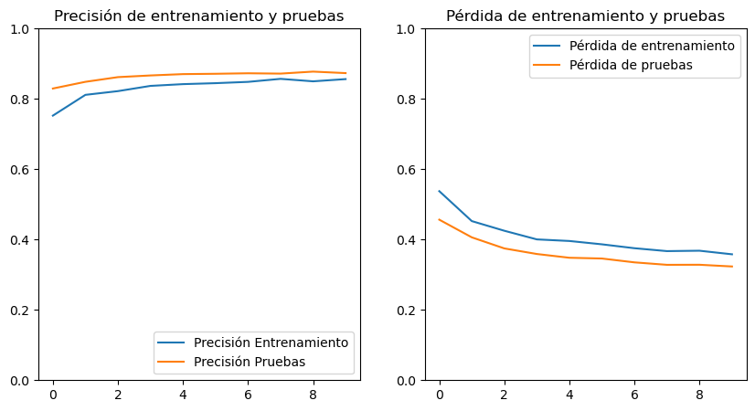

= Modelo EfficientNetV2: Entrenamiento y pruebas
Ebertz Ximena <xebertz@campus.ungs.edu.ar>; Franco Leandro <leandro00fr@gmail.com>; López Gonzalo <gonzagonzalopez20@gmail.com>; Venditto Pedro <pedrovenditto41@gmail.com>; Villalba Gastón <gastonleovillalba@gmail.com>;
v1, {docdate}
:toc:
:title-page:
:toc-title: Secciones
:numbered:
:source-highlighter: highlight.js
:tabsize: 4
:nofooter:
:pdf-page-margin: [3cm, 3cm, 3cm, 3cm]

== Modelo

EfficientNetV2 es una versión mejorada y más eficiente del modelo preentrenado EfficientNet...

== Entrenamiento

...

[soruce, console]
----
Epoch 1/10
263/263 [==============================] - 338s 1s/step - loss: 0.5376 - accuracy: 0.7524 - val_loss: 0.4565 - val_accuracy: 0.8295
Epoch 2/10
263/263 [==============================] - 321s 1s/step - loss: 0.4525 - accuracy: 0.8115 - val_loss: 0.4063 - val_accuracy: 0.8486
Epoch 3/10
263/263 [==============================] - 320s 1s/step - loss: 0.4250 - accuracy: 0.8221 - val_loss: 0.3748 - val_accuracy: 0.8619
Epoch 4/10
263/263 [==============================] - 317s 1s/step - loss: 0.4004 - accuracy: 0.8370 - val_loss: 0.3589 - val_accuracy: 0.8667
Epoch 5/10
263/263 [==============================] - 319s 1s/step - loss: 0.3959 - accuracy: 0.8420 - val_loss: 0.3482 - val_accuracy: 0.8705
Epoch 6/10
263/263 [==============================] - 315s 1s/step - loss: 0.3864 - accuracy: 0.8447 - val_loss: 0.3461 - val_accuracy: 0.8714
Epoch 7/10
263/263 [==============================] - 318s 1s/step - loss: 0.3754 - accuracy: 0.8484 - val_loss: 0.3351 - val_accuracy: 0.8729
Epoch 8/10
263/263 [==============================] - 317s 1s/step - loss: 0.3671 - accuracy: 0.8570 - val_loss: 0.3281 - val_accuracy: 0.8719
Epoch 9/10
263/263 [==============================] - 314s 1s/step - loss: 0.3683 - accuracy: 0.8500 - val_loss: 0.3283 - val_accuracy: 0.8776
Epoch 10/10
263/263 [==============================] - 314s 1s/step - loss: 0.3581 - accuracy: 0.8563 - val_loss: 0.3234 - val_accuracy: 0.8733
----

...

== Conclusión

...