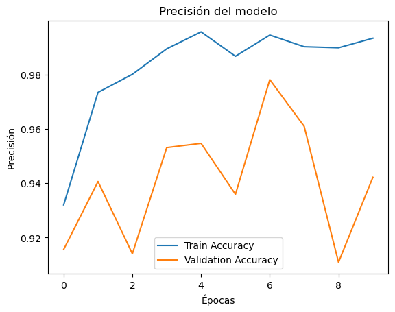
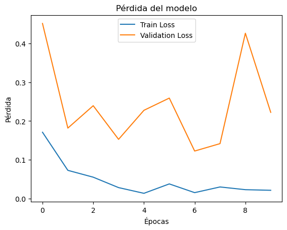

= Modelo InceptionResNetV2 - Pulmones: Entrenamiento y pruebas
Ebertz Ximena <xebertz@campus.ungs.edu.ar>; Franco Leandro <leandro00fr@gmail.com>; López Gonzalo <gonzagonzalopez20@gmail.com>; Venditto Pedro <pedrovenditto41@gmail.com>; Villalba Gastón <gastonleovillalba@gmail.com>;
v1, {docdate}
:toc:
:title-page:
:toc-title: Secciones
:numbered:
:source-highlighter: highlight.js
:tabsize: 4
:nofooter:
:pdf-page-margin: [3cm, 3cm, 3cm, 3cm]

== InceptionResNetV2

Las redes Inception se caracterizan por su capacidad para procesar información a diferentes escalas y resoluciones, utilizando módulos de convolución de diferentes tamaños. Por otro lado, las redes ResNet introdujeron el concepto de conexiones residuales, que ayudan a resolver el problema de la desaparición del gradiente en redes neuronales profundas.

InceptionResNetV2 combina estos dos enfoques, utilizando módulos Inception y conexiones residuales para crear una red profunda y eficiente que puede aprender a representar características de imágenes de manera efectiva. Esto la hace adecuada para tareas como la clasificación de imágenes y la detección de objetos en imágenes.

== Modelo Implementado

Nuestro modelo trabaja con un dataset creado por nosotros en base a otros dataset obtenidos de Kaggle. Para obtener nuestro dataset dar click https://www.kaggle.com/datasets/gonzajl/neumona-x-rays-dataset[aquí].

Nuestro modelo se trata de uno binario, es decir, dos clases. En este caso, se trata de clasificar imágenes de los pulmones, generadas por radiografías, para decidir si tienen neumonía o no.

La implementación del modelo en este caso es una aplicación del modelo pre-entrenado llamado InceptionReNetV2. Este modelo es uno de los más pesados computacionalmente, por lo que el entrenamiento del mismo se realizó con una cantidad de imágenes menor a otros modelos y en este dominio, logramos dar 10 vueltas de entrenamiento.

== Entrenamiento

Teniendo en cuenta que el modelo es uno de los más pesados, reducimos la cantidad de imágenes. La cantidad total de imágenes es de 3200, donde cada clase tiene 1600. Se redujo a esa cantidad porque el Kernel de la plataforma Saturn Cloud colapsa. Además, si se aumentaba la cantidad de imágenes, al finalizar las 10 vueltas colapsa el Kernel también. 

====
[source,python]
.Ejemplo: Obtener las imágenes para cada clase.
----
.
.
.
datos = pd.read_csv('data.csv')
cant_max = 1600

neumonia_df = datos[datos['neumonia'] == 1].head(cant_max)
no_neumonia_df = datos[datos['no_neumonia'] == 1].head(cant_max)

datos = pd.concat([neumonia_df, no_neumonia_df], ignore_index=True)
----
====

Tras obtener las imágenes, las dividimos en 80% de entrenamiento y 20% de test.
Aclaración: InceptionResNetV2 solo acepta imágenes con colores.

====
[source,python]
.Ejemplo: División de las imágenes para el modelo   .
----
.
.
.
imagenes = []
etiquetas = []
# Leer y procesar todas las imágenes
for i, fila in datos.iterrows():
    if fila['neumonia'] == 1 or fila['no_neumonia'] == 1:
        ruta_imagen = fila['imagen']
        # Leer la imagen desde la ruta
        imagen = cv2.imread(ruta_imagen, cv2.IMREAD_COLOR)
        imagen = cv2.resize(imagen, (224, 224))
        imagenes.append(imagen)
        if fila['neumonia'] == 1:
            etiquetas.append(1)
        elif fila['no_neumonia'] == 1:
            etiquetas.append(0)
----
====

== Resultados obtenidos

Tras dividir las imágenes, entrenamos el modelo y obtuvimos estos resultados:

[source, console]
----
Epoch 1/10
80/80 [==============================] - 469s 5s/step - loss: 0.1710 - accuracy: 0.9320 - val_loss: 0.4518 - val_accuracy: 0.9156
Epoch 2/10
80/80 [==============================] - 435s 5s/step - loss: 0.0727 - accuracy: 0.9734 - val_loss: 0.1817 - val_accuracy: 0.9406
Epoch 3/10
80/80 [==============================] - 434s 5s/step - loss: 0.0551 - accuracy: 0.9801 - val_loss: 0.2395 - val_accuracy: 0.9141
Epoch 4/10
80/80 [==============================] - 431s 5s/step - loss: 0.0282 - accuracy: 0.9895 - val_loss: 0.1527 - val_accuracy: 0.9531
Epoch 5/10
80/80 [==============================] - 428s 5s/step - loss: 0.0134 - accuracy: 0.9957 - val_loss: 0.2276 - val_accuracy: 0.9547
Epoch 6/10
80/80 [==============================] - 427s 5s/step - loss: 0.0377 - accuracy: 0.9867 - val_loss: 0.2592 - val_accuracy: 0.9359
Epoch 7/10
80/80 [==============================] - 426s 5s/step - loss: 0.0152 - accuracy: 0.9945 - val_loss: 0.1225 - val_accuracy: 0.9781
Epoch 8/10
80/80 [==============================] - 428s 5s/step - loss: 0.0298 - accuracy: 0.9902 - val_loss: 0.1416 - val_accuracy: 0.9609
Epoch 9/10
80/80 [==============================] - 429s 5s/step - loss: 0.0228 - accuracy: 0.9898 - val_loss: 0.4266 - val_accuracy: 0.9109
Epoch 10/10
80/80 [==============================] - 437s 5s/step - loss: 0.0212 - accuracy: 0.9934 - val_loss: 0.2223 - val_accuracy: 0.9422
----

=== Resultados por clase

[source, console]
----
Cantidad de predicciones: 640
Etiquetas:       [Neumonía, No_Neumonía]
Total:           [334, 306]
Correctas:       [329, 274]
Incorrectas:     [5, 32]
----

=== Gráficos

.Precisión del modelo por vueltas.

.Perdida del modelo por vueltas.
