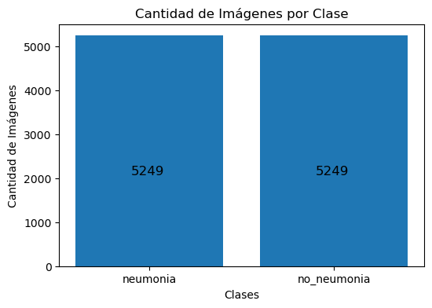

= Preparación de datos
Ebertz Ximena <xebertz@campus.ungs.edu.ar>; Franco Leandro <leandro00fr@gmail.com>; López Gonzalo <gonzagonzalopez20@gmail.com>; Venditto Pedro <pedrovenditto41@gmail.com>; Villalba Gastón <gastonleovillalba@gmail.com>;
v1, {docdate}
:toc:
:title-page:
:toc-title: Secciones
:numbered:
:source-highlighter: highlight.js
:tabsize: 4
:nofooter:
:pdf-page-margin: [3cm, 3cm, 3cm, 3cm]

== Introducción

Este código descarga datasets de imágenes médicas de rayos X de Kaggle, organiza las imágenes en carpetas específicas, las redimensiona, crea un DataFrame para gestionar los datos y genera gráficos que representan la distribución de clases. Luego, filtra y almacena un número específico de imágenes en cada clase antes de eliminar las imágenes no deseadas.

== Dependencias

* OpenDatasets (opendatasets)
* OpenCV (cv2)
* Matplotlib (matplotlib.pyplot)
* NumPy (numpy)
* PIL (Pillow)
* Pandas (pandas)

== Descripción

=== Descarga de datasets

Se descargan dos datasets de Kaggle que contienen imágenes médicas de rayos X. Uno de ellos se utiliza para imágenes de "neumonía" y el otro para imágenes de "no-neumonía". Los conjuntos de datos se descargan utilizando la biblioteca OpenDatasets.

[source, python]
----
od.download("https://www.kaggle.com/datasets/pcbreviglieri/pneumonia-xray-images?select=train")
od.download("https://www.kaggle.com/datasets/vivek468/beginner-chest-xray-image-classification")
----

=== Organización de imágenes

Se crean directorios específicos para organizar las imágenes descargadas en dos clases: "neumonía" y "no-neumonía". Las imágenes se mueven a las carpetas correspondientes utilizando comandos de shell.

[source, python]
----
!mkdir dataset
!mkdir dataset/neumonia
!mkdir dataset/no-neumonia

!mv ./beginner-chest-xray-image-classification/chest_xray/pred/NORMAL/* ./dataset/no-neumonia
!mv ./beginner-chest-xray-image-classification/chest_xray/test/NORMAL/* ./dataset/no-neumonia
!mv ./beginner-chest-xray-image-classification/chest_xray/train/NORMAL/* ./dataset/no-neumonia

!mv ./beginner-chest-xray-image-classification/chest_xray/pred/PNEUMONIA/* ./dataset/neumonia
!mv ./beginner-chest-xray-image-classification/chest_xray/test/PNEUMONIA/* ./dataset/neumonia
!mv ./beginner-chest-xray-image-classification/chest_xray/train/PNEUMONIA/* ./dataset/neumonia

!mv ./pneumonia-xray-images/test/normal/* ./dataset/no-neumonia
!mv ./pneumonia-xray-images/train/normal/* ./dataset/no-neumonia
!mv ./pneumonia-xray-images/val/normal/* ./dataset/no-neumonia

!mv ./pneumonia-xray-images/test/opacity/* ./dataset/neumonia
!mv ./pneumonia-xray-images/train/opacity/* ./dataset/neumonia
!mv ./pneumonia-xray-images/val/opacity/* ./dataset/neumonia
----

=== Redimensionamiento de imágenes

Se define una función `refinar_imagenes` que redimensiona las imágenes en una carpeta específica a un tamaño deseado (224x224 píxeles) utilizando OpenCV.

[source, python]
----
def refinar_imagenes(ruta_carpeta, tamaño_imagenes):
    for archivo in os.listdir(ruta_carpeta):
        if es_imagen(archivo):

            # Leemos la imagen
            ruta_imagen = os.path.join(ruta_carpeta, archivo)
            imagen = cv2.imread(ruta_imagen)
            
            # Le cambiamos el tamaño
            imagen = cv2.resize(imagen, (tamaño_imagenes, tamaño_imagenes))
            imagen = imagen.reshape(tamaño_imagenes, tamaño_imagenes, 3)

            # Guardamos la imagen
            cv2.imwrite(ruta_imagen, imagen)
----

Las imágenes en las carpetas "neumonía" y "no-neumonía" se redimensionan a 224x224 píxeles utilizando esta función.

[source, python]
----
refinar_imagenes("./dataset/neumonia", 224)
refinar_imagenes("./dataset/no-neumonia", 224)
----

=== Creación de DataFrame

Se define una función `agregar_filas` que agrega información de imágenes a una lista de filas. La información incluye la ruta de la imagen y etiquetas para las clases "neumonía" y "no-neumonía".

[source, python]
----
def agregar_filas(filas, ruta_carpeta, etiquetas):
    for archivo in os.listdir(ruta_carpeta):
        if es_imagen(archivo):
            ruta_imagen = os.path.join(ruta_carpeta, archivo)
            fila = {"imagen": ruta_imagen, "neumonia": etiquetas[0], "no_neumonia": etiquetas[1]}
            filas.append(fila)
----

Se inicializa una lista de filas y se agrega información de imágenes de las carpetas "neumonía" y "no-neumonía" al DataFrame. Las imágenes de "neumonía" se etiquetan con [1, 0], y las imágenes de "no-neumonía" con [0, 1].

[source, python]
----
filas = []
agregar_filas(filas, "dataset/neumonia", [1, 0])
agregar_filas(filas, "dataset/no-neumonia", [0, 1])

columnas = ["imagen", "neumonia", "no_neumonia"]

df = pd.DataFrame(filas, columns=columnas)
----

=== Visualización de gráfico de clases

Se define una función `mostrar_grafico_clases` que crea un gráfico de barras que muestra la cantidad de imágenes en cada clase. Esto se logra contando las ocurrencias de las etiquetas en el DataFrame.

[source, python]
----
def mostrar_grafico_clases(datos):
    cant_neumonia = (datos["neumonia"] == 1).sum()
    cant_no_neumonia = (datos["no_neumonia"] == 1).sum()

    categorias = ["neumonia", "no_neumonia"]
    cantidades = [cant_neumonia, cant_no_neumonia]

    plt.figure(figsize=(6, 4))
    barras = plt.bar(categorias, cantidades)

    for bar, cantidad in zip(barras, cantidades):
        plt.text(bar.get_x() + bar.get_width() / 2 - 0.1, bar.get_height() / 2 - 550, str(cantidad), fontsize=12)

    plt.xlabel("Clases")
    plt.ylabel("Cantidad de Imágenes")
    plt.title("Cantidad de Imágenes por Clase")

    plt.show()
----

=== Nivelación de Clases

En esta sección, se establece un límite en la cantidad de imágenes a mantener en cada clase (`cant_imagenes`). Luego, se filtran las imágenes de "neumonía" y "no-neumonía" para mantener solo el número deseado de imágenes en cada clase.

[source, python]
----
# Establecer un límite en la cantidad de imágenes a mantener en cada clase
cant_imagenes = 5249

# Filtrar las imágenes de "neumonía" para mantener un número específico
df_neumonia = df[df.neumonia == 1][:cant_imagenes]

# Filtrar las imágenes de "no-neumonía" para mantener un número específico
df_no_neumonia = df[df.no_neumonia == 1][:cant_imagenes]

# Identificar las imágenes que se deben eliminar
archivos_a_eliminar = pd.concat([df[df.neumonía == 1][cant_imagenes:], df[df.no_neumonia == 1][cant_imagenes:]])

# Seleccionar solo la columna "imagen" de las imágenes a eliminar
archivos_a_eliminar = archivos_a_eliminar["imagen"]
----

Al llamar a la función `mostrar_grafico_clases(df)`, anteriormente mencionada, podemos observar el siguiente gráfico de clases:

.Gráfico de clases

=== Exportación de datos

Después de nivelar las clases, se procede a exportar los datos a un archivo CSV para su posterior uso en tareas de clasificación.

[source, python]
----
# Concatenar los DataFrames filtrados
df = pd.concat([df_neumonia, df_no_neumonia])

# Exportar el DataFrame a un archivo CSV
df.to_csv("./dataset/datos.csv", index=False)
----

=== Eliminación de imágenes no deseadas

En esta parte del código, se eliminan las imágenes que exceden el límite establecido, manteniendo así el número deseado de imágenes en cada clase.

[source, python]
----
for archivo in archivos_a_eliminar:
    os.remove(archivo)
----

== Conclusión

La preparación de estas imágenes se llevó a cabo con el propósito de que puedan ser cargadas en la plataforma Kaggle y compartidas entre todos los miembros del equipo. Esto asegura que todos trabajen con el mismo conjunto de imágenes, previamente refinadas y niveladas. Esta estrategia evita que cada miembro tenga que realizar las mismas tareas de procesamiento de forma individual, lo que optimiza considerablemente la eficiencia del equipo. Además, ayuda a eliminar duplicaciones y garantiza un dataset coherente y listo para ser utilizado de manera colaborativa.
