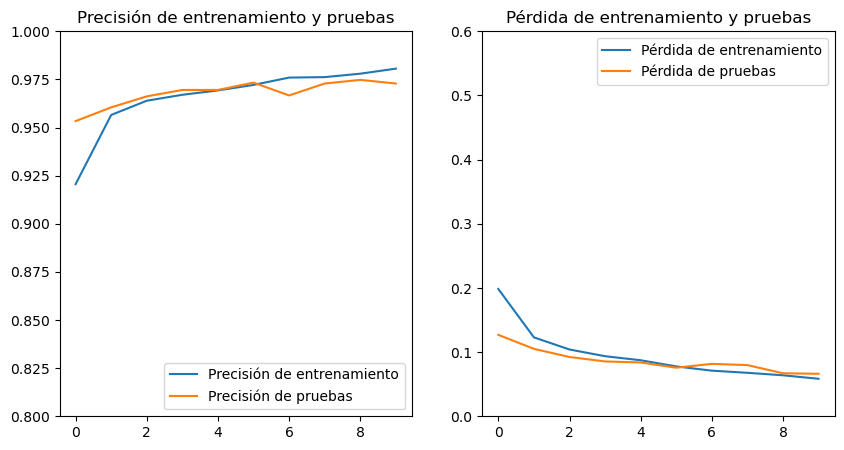

= Modelo ResNet: Entrenamiento y pruebas
Ebertz Ximena <xebertz@campus.ungs.edu.ar>; Franco Leandro <leandro00fr@gmail.com>; López Gonzalo <gonzagonzalopez20@gmail.com>; Venditto Pedro <pedrovenditto41@gmail.com>; Villalba Gastón <gastonleovillalba@gmail.com>;
v1, {docdate}
:toc:
:title-page:
:toc-title: Secciones
:numbered:
:source-highlighter: highlight.js
:tabsize: 4
:nofooter:
:pdf-page-margin: [3cm, 3cm, 3cm, 3cm]

== Modelo

ResNet, que es la abreviatura de "Redes Residuales" (en inglés, "Residual Networks"), es un modelo preentrenado que ha demostrado ser muy efectivo en tareas de clasificación de imágenes, detección de objetos, segmentación semántica y otras tareas relacionadas con el procesamiento de imágenes. Ha establecido récords en varios conjuntos de datos de referencia y se ha convertido en una base importante para muchas aplicaciones de visión por computadora.

Utilizamos la variante _ResNet50V2_ de dicho modelo preentrenado. Para incorporarlo en nuestra aplicación, importamos el modelo y le agregamos una capa de entrada (input layer) diseñada para adaptarse a nuestras imágenes, una capa de pooling y una capa de salida. Para aprovechar la técnica de _transfer learning_, hemos congelado el modelo, lo que significa que hemos mantenido los pesos que adquirió durante su entrenamiento previo con el conjunto de datos _ImageNet_.

== Entrenamiento

Realizamos los entrenamientos utilizando nuestro https://www.kaggle.com/datasets/gonzajl/neumona-x-rays-dataset[dataset] diseñado para la detección de neumonía en imágenes de rayos X de tórax. Este conjunto de datos consta de un total de 10,498 imágenes, de las cuales 5,249 son radiografías de pacientes diagnosticados con neumonía y las restantes 5,249 corresponden a pacientes que no presentan la enfermedad.

El entrenamiento se realizó utilizando el siguiente modelo:

[source, python]
----
base_model = tf.keras.applications.ResNet50V2(
    include_top=False,
    weights="imagenet",
    input_shape=(224, 224, 3),
)

base_model.trainable = False

num_classes = 2
x = layers.GlobalAveragePooling2D()(base_model.output)
output = layers.Dense(num_classes, activation="softmax")(x)
model = Model(inputs=base_model.input, outputs=output)
----

Luego, el modelo se compiló de la siguiente manera:

[source, python]
----
model.compile(optimizer="adam", loss="categorical_crossentropy", metrics=["categorical_accuracy"])
----

=== Entrenamiento de 10 épocas

Se utilizó el 80% de las imágenes para el entrenamiento del modelo y el 20% restante para las pruebas, lo que se traduce en 8,398 imágenes de entrenamiento y 2,100 imágenes de prueba. Durante diez épocas de entrenamiento, los resultados fueron los siguientes:

[source, console]
----
Epoch 1/10
2023-10-19 15:51:50.138173: W tensorflow/tsl/framework/cpu_allocator_impl.cc:83] Allocation of 5056536576 exceeds 10% of free system memory.
263/263 [==============================] - 210s 792ms/step - loss: 0.1984 - categorical_accuracy: 0.9206 - val_loss: 0.1269 - val_categorical_accuracy: 0.9533
Epoch 2/10
263/263 [==============================] - 205s 781ms/step - loss: 0.1230 - categorical_accuracy: 0.9565 - val_loss: 0.1051 - val_categorical_accuracy: 0.9605
Epoch 3/10
263/263 [==============================] - 205s 781ms/step - loss: 0.1041 - categorical_accuracy: 0.9639 - val_loss: 0.0924 - val_categorical_accuracy: 0.9662
Epoch 4/10
263/263 [==============================] - 206s 782ms/step - loss: 0.0936 - categorical_accuracy: 0.9670 - val_loss: 0.0855 - val_categorical_accuracy: 0.9695
Epoch 5/10
263/263 [==============================] - 206s 784ms/step - loss: 0.0873 - categorical_accuracy: 0.9693 - val_loss: 0.0839 - val_categorical_accuracy: 0.9695
Epoch 6/10
263/263 [==============================] - 206s 784ms/step - loss: 0.0777 - categorical_accuracy: 0.9721 - val_loss: 0.0757 - val_categorical_accuracy: 0.9733
Epoch 7/10
263/263 [==============================] - 204s 777ms/step - loss: 0.0711 - categorical_accuracy: 0.9759 - val_loss: 0.0817 - val_categorical_accuracy: 0.9667
Epoch 8/10
263/263 [==============================] - 205s 781ms/step - loss: 0.0678 - categorical_accuracy: 0.9762 - val_loss: 0.0798 - val_categorical_accuracy: 0.9729
Epoch 9/10
263/263 [==============================] - 205s 778ms/step - loss: 0.0639 - categorical_accuracy: 0.9780 - val_loss: 0.0670 - val_categorical_accuracy: 0.9748
Epoch 10/10
263/263 [==============================] - 207s 787ms/step - loss: 0.0584 - categorical_accuracy: 0.9806 - val_loss: 0.0662 - val_categorical_accuracy: 0.9729
----

Es relevante señalar que la advertencia que se muestra al principio indica que no es factible entrenar el modelo con un conjunto de datos más extenso debido a limitaciones de memoria del sistema, lo que impide considerar la opción de ampliar el conjunto de datos para mejorar la predicción.

Con los datos obtenidos del entrenamiento, es posible generar gráficos que permitan una visualización más clara de la evolución del modelo a lo largo de su entrenamiento.

Como se puede apreciar, se logró una precisión del 98% en el conjunto de entrenamiento y una precisión del 97% en el conjunto de pruebas.

Posteriormente, se procedió a evaluar el modelo utilizando las 2,100 imágenes del conjunto de pruebas, y se registraron los siguientes resultados:

[source, console]
----
66/66 [==============================] - 43s 633ms/step
Cantidad de predicciones: 2100
Etiquetas:   [neumonia, no-neumonia]
Total:       [1051, 1049]
Correctas:   [1035, 1008]
Incorrectas: [16, 41]
----

=== Entrenamiento de 20 épocas

...

== Conclusión

