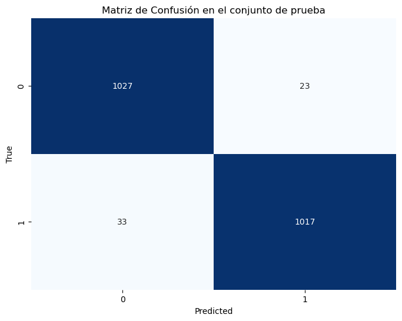

= SVM Neumonía: Entrenamiento y pruebas
Ebertz Ximena <xebertz@campus.ungs.edu.ar>; Franco Leandro <leandro00fr@gmail.com>; López Gonzalo <gonzagonzalopez20@gmail.com>; Venditto Pedro <pedrovenditto41@gmail.com>; Villalba Gastón <gastonleovillalba@gmail.com>;
v1, {docdate}
:toc:
:title-page:
:toc-title: Secciones
:numbered:
:source-highlighter: highlight.js
:tabsize: 4
:nofooter:
:pdf-page-margin: [3cm, 3cm, 3cm, 3cm]

== Modelo

SVM esta relacionado con problemas de clasificación y regresión. Dado un conjunto de ejemplos de formación (de muestras) podemos etiquetar las clases y formar una SVM para construir un modelo que prediga la clase de una nueva muestra. Intuitivamente, una SVM es un modelo que representa a los puntos de muestra en el espacio, separando las clases a 2 espacios lo más amplios posibles mediante un hiperplano de separación definido como el vector entre los 2 puntos, de las 2 clases, más cercanos al que se llama vector soporte. Cuando las nuevas muestras se ponen en correspondencia con dicho modelo, en función de los espacios a los que pertenezcan, pueden ser clasificadas a una o la otra clase. 

Las SVM son inherentemente para dominios binarios, es decir, problemas de clasificación donde es o no es. Por ejemplo: un modelo para clasificar imágenes donde pueden ser una banana o no serlo.

== Implementación

Para su uso se utiliza la librería _sklearn_.

Como nuestro problema entra en el dominio de la multiclases, SVM no es precisamente la mejor solución. Pero decidimos utilizar el método de *Dividir y conquistar*, o sea, dividir el dominio en sub-dominios para conseguir una predicción multiclase utilizando SVM que es inherentemente binario. 

En nuestro dominio tenemos dos tipos de clases:

* neumonia
* no_neumonia

En total contamos con 10498 imágenes para el entrenamiento el modelo, donde se componen de x de neumonía y x de no_neumonia.

====
[source,python]
.Ejemplo: Creación del modelo sobre pulmones con posible neumonía.
----
.
.
.
# Preparo las imágenes para el modelo SVM de neumonía o no_neumonía
# Preparo listas para almacenar imágenes y etiquetas
imagenes = []
etiquetas = []

# Leer y procesar todas las imágenes
for i, fila in df.iterrows():
    if fila['neumonia'] == 1 or fila['no_neumonia'] == 1:
        ruta_imagen = fila['imagen']
        # Leer la imagen desde la ruta
        imagen = cv2.imread(ruta_imagen, cv2.IMREAD_GRAYSCALE)
        imagen_normalizada = (imagen / 255.0 * 255).astype('uint8')
        # Etiqueta según la categoría (neumonía o no_neumonía)
        imagenes.append(imagen_normalizada.flatten())
        if fila['neumonia'] == 1:
            etiquetas.append(1)
        elif fila['no_neumonia'] == 1:
            etiquetas.append(0)

# Dividir los datos en conjuntos de entrenamiento y prueba
X_train, X_test, y_train, y_test = train_test_split(imagenes, etiquetas, test_size=0.2, random_state=123)

# Entrenar un modelo SVM
svm_model = SVC(kernel='linear')
svm_model.fit(X_train, y_train)
----
====

== Exportación 

Para la exportación del modelo se utiliza la libreria de _Joblib_, que es compatible con _sklearn_.

El modelo exportado tiene un tamaño razonable de 560 mb. No es problema para la plataforma de Google Cloud Run, porque no limita el espacio de disco; ya que el enfoque principal del PaaS de Google es la ejecución de contenedores de manera eficiente y escalable sin preocuparse por la gestión del espacio en disco.

== Conclusiones

El entremiento del modelo a resultado eficaz con una precisión del 97%, con 7 minutos de entrenamiento.

A continuación la matriz de confunsión del modelo:

.neumonia o no_neumonia

Por lo anteriormente mostrado, el modelo SVM es las opciones más potables para utilizarlo en el proyecto. 