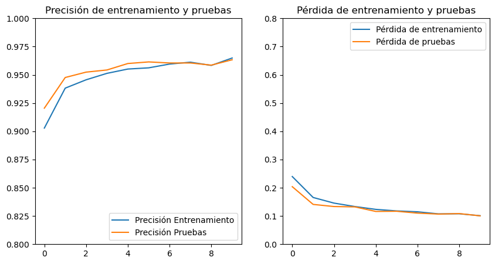
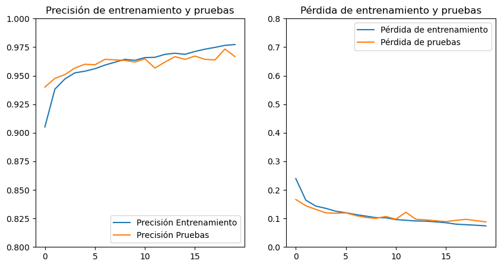
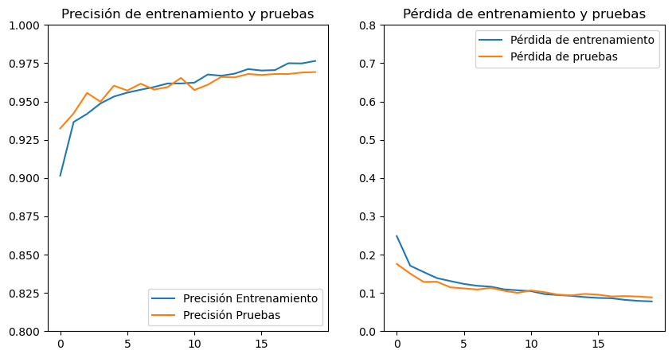

= Modelo Xception - Pulmones: Entrenamiento y pruebas
Ebertz Ximena <xebertz@campus.ungs.edu.ar>; Franco Leandro <leandro00fr@gmail.com>; López Gonzalo <gonzagonzalopez20@gmail.com>; Venditto Pedro <pedrovenditto41@gmail.com>; Villalba Gastón <gastonleovillalba@gmail.com>;
v1, {docdate}
:toc:
:title-page:
:toc-title: Secciones
:numbered:
:source-highlighter: highlight.js
:tabsize: 4
:nofooter:
:pdf-page-margin: [3cm, 3cm, 3cm, 3cm]

== Modelo

El modelo _Xception_ es un modelo preentrenado con diversos usos. En particular, fue utilizado para la detección y clasificación de tumores cerebrales, obteniendo un nivel de precisión de más del 90%.

Para utilizarlo, importamos el modelo y le añadimos una capa de _input_, para que se adapte a nuestras imágenes, una capa de _pooling_, y una capa de _output_. El modelo fue _freezado_, es decir, se mantuvieron los pesos que obtuvo durante el entrenamiento con el dataset _imagenet_, para utilizar la técnica _transfer learning_.

== Entrenamiento

Los entrenamientos se llevan a cabo con nuestro https://www.kaggle.com/datasets/gonzajl/neumona-x-rays-dataset[dataset] para la detección de neumonía en imágenes de rayos X de tórax. Este dataset cuenta con 10498 imágenes, siendo 5249 de radiografías de pacientes con neumonía, y 5249 de pacientes sin la enfermedad.

=== Primer entrenamiento

El primer entrenamiento se llevó a cabo con el siguiente modelo:

[source, python]
----
xception = tf.keras.applications.xception.Xception(
    include_top=False,
    weights='imagenet',
    input_shape=(224, 224, 3),
)

xception.trainable = False

inputs = keras.Input(shape=(224, 224, 3))
x = xception(inputs, training=False)

x = keras.layers.GlobalAveragePooling2D()(x)
outputs = keras.layers.Dense(2, activation='softmax')(x)
model = keras.Model(inputs, outputs)
----

Y se compiló de la siguiente manera:

----
model.compile(optimizer='adam',
              loss='categorical_crossentropy',
              metrics=['categorical_accuracy'])
----

Se utilizó el 80% de las imágenes para el entrenamiento del modelo, y el siguiente 20% para las pruebas. Es decir, 8398 imágenes de entrenamiento y 2100 imágenes de prueba. Para diez vueltas de entrenamiento, el resultado fue el siguiente:

[source, console]
----
Epoch 1/10
263/263 [==============================] - 340s 1s/step - loss: 0.2397 - categorical_accuracy: 0.9028 - val_loss: 0.2038 - val_categorical_accuracy: 0.9205
Epoch 2/10
263/263 [==============================] - 337s 1s/step - loss: 0.1656 - categorical_accuracy: 0.9382 - val_loss: 0.1410 - val_categorical_accuracy: 0.9476
Epoch 3/10
263/263 [==============================] - 338s 1s/step - loss: 0.1456 - categorical_accuracy: 0.9456 - val_loss: 0.1335 - val_categorical_accuracy: 0.9524
Epoch 4/10
263/263 [==============================] - 337s 1s/step - loss: 0.1335 - categorical_accuracy: 0.9513 - val_loss: 0.1322 - val_categorical_accuracy: 0.9543
Epoch 5/10
263/263 [==============================] - 341s 1s/step - loss: 0.1234 - categorical_accuracy: 0.9551 - val_loss: 0.1161 - val_categorical_accuracy: 0.9600
Epoch 6/10
263/263 [==============================] - 339s 1s/step - loss: 0.1179 - categorical_accuracy: 0.9562 - val_loss: 0.1167 - val_categorical_accuracy: 0.9614
Epoch 7/10
263/263 [==============================] - 338s 1s/step - loss: 0.1148 - categorical_accuracy: 0.9595 - val_loss: 0.1101 - val_categorical_accuracy: 0.9605
Epoch 8/10
263/263 [==============================] - 342s 1s/step - loss: 0.1075 - categorical_accuracy: 0.9612 - val_loss: 0.1068 - val_categorical_accuracy: 0.9605
Epoch 9/10
263/263 [==============================] - 333s 1s/step - loss: 0.1079 - categorical_accuracy: 0.9583 - val_loss: 0.1085 - val_categorical_accuracy: 0.9586
Epoch 10/10
263/263 [==============================] - 336s 1s/step - loss: 0.1010 - categorical_accuracy: 0.9649 - val_loss: 0.1006 - val_categorical_accuracy: 0.9633
----

En base a estos datos, se pueden generar gráficos para visualizar la evolución del modelo.

.gráficos del primer entrenamiento

El modelo alcanzó un nivel de pérdida muy bajo, y una precisión del 96%. Se puede ver que a mayor cantidad de vueltas, la pérdida es menor y la precisión es mayor, tanto en entrenamiento como en validación. Esto es clave, ya que indica que el modelo está prediciendo correctamente, sin "acostumbrarse" a las imágenes de entrenamiento.

Durante el entrenamiento, se mostró la siguiente advertencia:

[source, console]
----
2023-10-17 17:48:17.322703: W tensorflow/tsl/framework/cpu_allocator_impl.cc:83] Allocation of 5056536576 exceeds 10% of free system memory.
----

Esto quiere decir que no se podría entrenar el modelo con más imágenes, por lo que aumentar el dataset para mejorar la predicción no es una opción.

Luego, el modelo fue probado con las 2100 imágenes del conjunto de pruebas, y se obtuvieron los siguientes resultados:

[source, console]
----
Cantidad de predicciones: 2100
Etiquetas:   [Neum, No_Neum]
Total:       [1051, 1049]
Correctas:   [1025, 998]
Incorrectas: [26, 51]
----

Se obtuvo un 95% de precisión, validando las métricas obtenidas previamente.

=== Segundo entrenamiento

Para mejorar la precisión, se aumentó la cantidad de vueltas de entenamiento a 20. Los resultados parciales son los siguientes:

[source, console]
----
Epoch 1/20
263/263 [==============================] - 344s 1s/step - loss: 0.2395 - categorical_accuracy: 0.9051 - val_loss: 0.1663 - val_categorical_accuracy: 0.9400
Epoch 2/20
263/263 [==============================] - 338s 1s/step - loss: 0.1640 - categorical_accuracy: 0.9382 - val_loss: 0.1445 - val_categorical_accuracy: 0.9476
Epoch 3/20
263/263 [==============================] - 339s 1s/step - loss: 0.1433 - categorical_accuracy: 0.9471 - val_loss: 0.1317 - val_categorical_accuracy: 0.9510
Epoch 4/20
263/263 [==============================] - 337s 1s/step - loss: 0.1353 - categorical_accuracy: 0.9525 - val_loss: 0.1196 - val_categorical_accuracy: 0.9567
Epoch 5/20
263/263 [==============================] - 338s 1s/step - loss: 0.1252 - categorical_accuracy: 0.9539 - val_loss: 0.1182 - val_categorical_accuracy: 0.9600
Epoch 6/20
263/263 [==============================] - 336s 1s/step - loss: 0.1199 - categorical_accuracy: 0.9561 - val_loss: 0.1197 - val_categorical_accuracy: 0.9595
Epoch 7/20
263/263 [==============================] - 336s 1s/step - loss: 0.1136 - categorical_accuracy: 0.9593 - val_loss: 0.1100 - val_categorical_accuracy: 0.9643
Epoch 8/20
263/263 [==============================] - 336s 1s/step - loss: 0.1082 - categorical_accuracy: 0.9618 - val_loss: 0.1034 - val_categorical_accuracy: 0.9638
Epoch 9/20
263/263 [==============================] - 339s 1s/step - loss: 0.0910 - categorical_accuracy: 0.9687 - val_loss: 0.0971 - val_categorical_accuracy: 0.9619
Epoch 14/20
263/263 [==============================] - 342s 1s/step - loss: 0.0905 - categorical_accuracy: 0.9696 - val_loss: 0.0948 - val_categorical_accuracy: 0.9667
Epoch 15/20
263/263 [==============================] - 340s 1s/step - loss: 0.0880 - categorical_accuracy: 0.9687 - val_loss: 0.0919 - val_categorical_accuracy: 0.9643
Epoch 16/20
263/263 [==============================] - 342s 1s/step - loss: 0.0850 - categorical_accuracy: 0.9712 - val_loss: 0.0889 - val_categorical_accuracy: 0.9671
Epoch 17/20
263/263 [==============================] - 343s 1s/step - loss: 0.0800 - categorical_accuracy: 0.9732 - val_loss: 0.0932 - val_categorical_accuracy: 0.9643
Epoch 18/20
263/263 [==============================] - 339s 1s/step - loss: 0.0780 - categorical_accuracy: 0.9748 - val_loss: 0.0970 - val_categorical_accuracy: 0.9638
Epoch 19/20
263/263 [==============================] - 338s 1s/step - loss: 0.0763 - categorical_accuracy: 0.9765 - val_loss: 0.0923 - val_categorical_accuracy: 0.9733
Epoch 20/20
263/263 [==============================] - 336s 1s/step - loss: 0.0738 - categorical_accuracy: 0.9773 - val_loss: 0.0880 - val_categorical_accuracy: 0.9667
----

.gráficos del segundo entrenamiento

Se puede ver que el nivel de pérdida es muy bajo y el nivel de precisión es muy alto. Estos resultados son excelentes, ya que determinan que el aprendizaje del modelo es consistente y eficaz, sin muchos errores.

Las pruebas arrojaron los siguientes resultados:

[source, console]
----
Cantidad de predicciones: 2100
Etiquetas:   [Neum, No_Neum]
Total:       [1040, 1060]
Correctas:   [1023, 1007]
Incorrectas: [17, 53]
----

Vemos que se producen más errores en las imágenes que no presentan neumonía, pero la cantidad de errores es muy baja con respecto al total de las imágenes. Esto es, aproximadamente, un 95% de precisión.

=== Tercer entrenamiento

Finalmente, como última prueba, se decidió modificar el conjunto de entrenamiento y de prueba, de forma que el conjunto de entrenamiento corresponda al 70% de las imágenes, y el de prueba al 30% restante. Los valores finales de entrenamiento, para la vuelta número 20, fueron los siguientes:

[source, console]
----
Epoch 20/20
230/230 [==============================] - 340s 1s/step - loss: 0.0777 - categorical_accuracy: 0.9765 - val_loss: 0.0883 - val_categorical_accuracy: 0.9692
----

El rendimiento general se puede ver en los siguientes gráficos:

.gráficos del tercer entrenamiento

Para 3150 imágenes de prueba, se obtuvieron los siguientes resultados:

[source, console]
----
Cantidad de predicciones: 3150
Etiquetas:   [Neum, No_Neum]
Total:       [1595, 1555]
Correctas:   [1559, 1494]
Incorrectas: [36, 61]
----

Esto es, aproximadamente, un 96% de precisión, lo cual es muy bueno para un modelo de IA. Sin embargo, el cambio no arrojó resultados significativos con respecto a la distribución de imágenes anterior.

== Conclusión

El modelo Xception ofrece un alto nivel de precisión y un extremadamente bajo nivel de error para la detección de neumonía en radiografías de tórax. Es una muy buena opción para tener en cuenta en la decisión del modelo final.