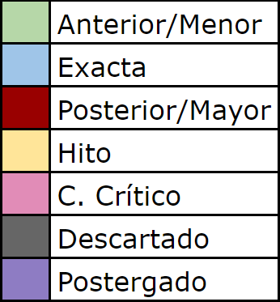
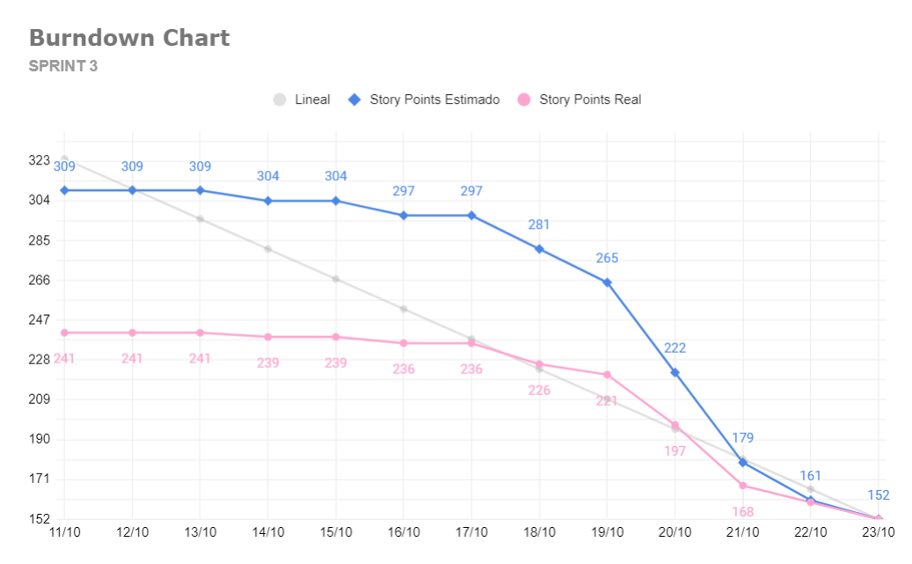

= TP Principal - Laboratorio de Construcción de Software - Sprint 3
Ebertz Ximena <xebertz@campus.ungs.edu.ar>; Franco Leandro <leandro00fr@gmail.com>; López Gonzalo <gonzagonzalopez20@gmail.com>; Venditto Pedro <pedrovenditto41@gmail.com>; Villalba Gastón <gastonleovillalba@gmail.com>;
v1, {docdate}
:toc:
:title-page:
:toc-title: Secciones
:numbered:
:source-highlighter: highlight.js
:tabsize: 4
:nofooter:
:pdf-page-margin: [3cm, 3cm, 3cm, 3cm]

== Introducción

La Inteligencia Artificial o _IA_ es un poderoso campo de estudio que está en constante crecimiento. Cada día, los modelos de Inteligencia Artificial evolucionan y se incorporan en nuestro día a día, funcionando como una potente herramienta de trabajo.

Existen muchos campos donde la Inteligencia Artificial se está desarrollando: detección de imágenes, texto, audio, etcétera. Resulta lógico pensar que se pueden desarrollar herramientas para campos más específicos, como medicina, finanzas, o investigación.

== Objetivos del proyecto

Nuestro objetivo es, mediante la aplicación de tecnologías relacionadas a las inteligencias artificiales, desarrollar un software que pueda ayudar a nuestros profesionales del área de la medicina a lograr un diagnóstico más rápido y preciso sobre alguna enfermedad o malestar en específico.

Para esto, realizaremos tareas de investigación, de análisis de datos y de desarrollo, entre otras.

== Objetivos del documento

El principal objetivo de este documento es especificar las decisiones que se tomen en los días previos al inicio del proyecto; tales como la distribución de roles de trabajo, los posibles riesgos del equipo y del proyecto, el tema a trabajar, las metodologías que se utilizarán, entre otras cosas relacionadas a la organización necesaria del proyecto.

== Metodología de trabajo

Somos parte del _Agile Release Train_ (que plantea el marco de trabajo *_SAFe_*) en conjunto con los demás grupos. Para coordinar nuestro trabajo adaptaremos el _framework_ ágil *_Scrum_* según las preferencias del equipo para optimizarla. Cada _sprint_ dura *dos semanas*.

- *_Sprint Planning_*: se realizará el primer día del _sprint_ y en ocasiones participará el _Release Train Engineer_.

- *_Daily Scrum_* cada 2 días: los integrantes del equipo tienen tiempos diferentes y un día de trabajo quizá no sea suficiente para tener un avance considerable para plantearlo en las _Daily_. Por inconvenientes o bloqueo de un integrante, en el día que no hay _Daily_, se comunicarán por algunos de los medios detallados más adelante.

- *_Sprint Review_*: el último día del _sprint_ se hará una presentación de los informes solicitados mostrando el avance del equipo.

- *_Sprint Retrospective_*: luego de la revisión de cada _sprint_ se hará una retrospectiva del avance.

== Equipo de trabajo y roles

Los roles que se utilizarán en el equipo son los siguientes:

[cols="2,2,2", options="header"]
|===
|Rol            |Encargado         |Suplente

|Product Owner | Dikenstein, Leandro|
|Scrum Master   |Villalba, Gastón  |Ebertz, Ximena
|Líder Técnico  |Ebertz, Ximena    |Franco, Leandro
|Machine Learning Engineer  |López, Gonzalo    |
|Data Scientist  |Franco, Leandro   |
|Data Scientist  |Venditto, Pedro   |
|===

== Gestión

=== Visión

Nuestra visión es utilizar la tecnología de inteligencia artificial y aprendizaje automático para mejorar la atención médica y el diagnóstico. A través de nuestro trabajo en el presente trabajo práctico, buscamos desarrollar un modelo de clasificación de imágenes médicas que asista a los profesionales de la salud en la toma de decisiones clínicas. 

=== Misión

Nuestra misión es aplicar nuestros conocimientos y habilidades en procesamiento de imágenes y aprendizaje automático para crear soluciones innovadoras y efectivas que impacten positivamente en el ámbito sanitario y el bienestar de las personas.

=== Alcance

Desarrollo y Entrenamiento del Modelo de IA:

- Investigación exhaustiva de algoritmos de aprendizaje automático, con el objetivo de seleccionar el más adecuado para el problema de clasificación de imágenes médicas.
- Implementación y entrenamiento del modelo utilizando el conjunto de datos previamente preparado.
- Optimización y validación del modelo para asegurar su eficacia y precisión en la clasificación de las imágenes médicas.
- Se considerará la posibilidad de mejorar el modelo de inteligencia artificial si es necesario.
- Despliegue del modelo de IA. Recibe como inputs una imagen y determiados datos y devuelve un resultado.
- Almacenar imágenes y sus etiquetas para un posterior reentrenamiento de los modelos de IA.

=== Requerimientos
Cada modelo de IA debe cumplir los siguientes requerimientos:

==== Requerimientos Funcionales

1. El modelo debe recibir imágenes y procesarlas de acuerdo a la arquitectura del modelo.

2. El modelo debe realizar una predicción de la imagen mediante técnicas de _Machine Learning_.

3. El modelo debe retornar el resultado de la predicción mostrando el porcentaje de probabilidad de cada etiqueta.

4. El modelo puede reentrenarse, para ello se deben almacenar las imágenes con sus etiquetas y determinados datos extra para mejorar el proceso de reentrenamiento.

==== Requerimientos No Funcionales
1. El modelo debe responder rápidamente. Para ello se aplicarán las mejores prácticas para aumentar su *rendimiento*.

2. El modelo debe mantener un porcentaje de aciertos mayor o igual al 85% para mantener la *confiabilidad*.

3. El modelo debe estar *disponible* para su uso en cualquier momento. Para comprobarlo se creará un _endpoint_ el cual retornará el estado del servicio.

=== WBS
Diagrama completo, luego de correcciones en el anterior _sprint review_.

.WBS

==== WBS _Sprint_ 3
Definimos las tareas para este _sprint_.

.Tareas _sprint_ 3
image::.img/wbs-s3.svg[]

=== Diccionario WBS Sprint 3

[cols="1,2,6,6,1", options="header"]
|===
|ID
|Nombre
|Descripción
|Tarea
|Peso
|1.0.3.1
|Riesgos
|Tener en consideración los riesgos internos del equipo y los riesgos externos con otros grupos.
|Realizar una matriz de riesgos y actualizarla cuando lo requiera.
|4
|1.0.3.2
|Cambios
|Estar al tanto de cualquier cambio en cuanto al alcance del proyecto o tecnología a utilizar.
|Documentar los cambios.
|1
|1.0.3.A
|Refinar documentación
|Una vez realizado la documentación sobre el desarrollo de modelos y temas relacionados, se refinarán la documentación para una mejor lectura.
|Releer la documentación generada y refinarla.
|3
|1.0.3.B
|Informe
|Muestra del avance del equipo al **Product Owner**.
|Realizar el informe de avance y presentación para la Reunión Formal.
|5
|II
|Corregir documentación previa
|Luego del segundo sprint review se informó que la documentación no se encuentra completa.
|Completar la documentación referida a los informes de avance.
|15
|1.1.2.B
|Clasificación de enfermedades pulmonares
|Conocer las formas en la que se analizan las imágenes de los pulmones.
|Leer artículos y publicaciones relacionados con la clasificación de imágenes médicas para comprender mejor el problema y las técnicas utilizadas en la industria.
|8
|1.1.3.A
|Profesional neurólogo
|Entrevistar a un profesional de la salud sobre este dominio para proporcionarnos información relevante sobre el desarrollo del proyecto.
|Entrevistar a expertos en el campo médico para obtener información sobre las características importantes a considerar en la clasificación de imágenes médicas. 
|15
|1.1.3.B
|Neumonóloga pediátrica
|Entrevistar a un profesional de la salud sobre este dominio para proporcionarnos información relevante sobre el desarrollo del proyecto.
|Entrevistar a expertos en el campo médico para obtener información sobre las características importantes a considerar en la clasificación de imágenes médicas. 
|13
|1.1.4.B
|Dataset enfermedades pulmonares
|Los pulmones pueden padecer de varias enfermedades, por lo que se debe considerar al momento de seleccionar el o los datasets.
|Realizar una búsqueda de datasets sobre enfermedades pulmonares.
|5
|1.2.1.2.B
|Refinamiento de pulmones
|El dataset elegido puede no cumplir con un mínimo establecido para que los modelos entrenen relativamente bien, por lo que se deben aplicar algunas técnicas de refinamiento.
|Refinar el dataset de enfermedades pulmonares para que todos los miembros del equipo realicen el entrenamiento de modelos con el mismo contenido.
|3
|1.2.1.3.B
|Nivelación de pulmones
|El dataset elegido puede no cumplir con un mínimo establecido para que los modelos entrenen relativamente bien, por lo que se deben aplicar algunas técnicas de nivelación.
|Nivelar el dataset de enfermedades pulmonares para que todos los miembros del equipo realicen el entrenamiento de modelos con el mismo contenido.
|3
|1.2.1.B
|Subir dataset de tumores cerebrales
|Para que todo el equipo realice el entrenamiento con el mismo contenido, se subirá el dataset generado a la plataforma Kaggle.
|Subir dataset de tumores cerebrales a Kaggle.
|1
|1.2.2.2.B
|Modelo de Detección de Enfermedades Pulmonares
|Un modelo de IA que pueda detectar distintos tipos de enfermedades pulmonares dado una imagen.
|Desarrollar, entrenar, probar y optimizar varios modelos de IA para comprobar sus resultados en la clasificación de imágenes.
|64
|1.2.2.2.Y
|Definición de arquitectura MDEP
|Llegar a un acuerdo con el equipo sobre cuál arquitectura interna del modelo es la que mejor resultados arrojó.
|Definir la arquitectura del modelo de clasificación de imágenes médicas, seleccionar las capas adecuadas, definir la estructura general del modelo y especificar los hiperparámetros necesarios para entrenar el modelo.
|1
|III
|Preparación de entorno de trabajo extra
|Saturn Cloud ha reducido el tiempo máximo de uso gratis, por lo que se deben tener cuentas alternativas en caso de que se agoten las horas en la cuenta principal.
|Crear, por lo menos, una cuenta de backup de Saturn Cloud.
|2
|1.2.3.B
|Deploy MDEP
|Se requiere configurar el servidor para que la API funcione correctamente.
|Realizar el despliegue del modelo de machine learning en la plataforma elegida.
|5
|1.3.1| Integración con otros equipos
|Integrar lo realizado con los otros equipos del tren SAFe. El objetivo es definir estándares para una mejor comunicación.
|Acordar estándares para imágenes, modelo y API con otros grupos.
|8
|1.3.A
|Refinamiento API MDTC
|Se tendrá en cuenta el rendimiento y la simpleza en la comunicación mediante API de otros grupos.
|Reconfigurar API.
|5
|1.3.B
|Refinamiento API MDEP
|Se tendrá en cuenta el rendimiento y la simpleza en la comunicación mediante API de otros grupos.
|Reconfigurar API.
|5
|===

=== Diagrama de precedencia

.Diagrama de precedencia completo

=== Calendario
==== Estimado

.Calendario 
image::.img/calendario.svg[]

Consideramos como **hito** definir la arquitectura del modelo de IA y el despliegue del mismo para su consumo mediante API.

==== Comparativa estimado vs real

.Comparativa
image::.img/comparativa.png[]

.Referencia de color

==== Camino crítico
.Camino crítico

El camino crítico del proyecto es de **56 días**.

=== Plan de comunicaciones

Nuestros medios de comunicación son:

*Gather*: es una plataforma que nos permite tener una oficina virtual, donde cada uno tiene su personaje dentro de esta oficina. La utilizamos porque no tiene límites de tiempo, permite la comunicación a través de voz, compartir pizarras y es menos monótona que otras plataformas como _Meet_. Es una vía de comunicación formal que empleamos para las ceremonias _Scrum_.

*WhatsApp*: es un medio de comunicación informal que utilizamos para coordinar los horarios de las reuniones en _Gather_ y discutir cuestiones relacionadas con el proyecto que no requieran la presencia de todo el equipo en ese momento. Se trata de un método de comunicación [.underline]#asincrónica#.

*Telegram*: similar al uso que le damos a WhatsApp, pero para contactarnos con los demás equipos de trabajo. Principalmente es para coordinar reuniones o solicitar ayuda con alguna cuestión del proyecto.

*Email*: en caso de que sea necesario, por algún inconveniente externo que no permita las vías convencionales, utilizaremos el email de los integrantes para coordinar al equipo. Además, es la principal vía para comunicarnos con nuestro _Product Owner_.

*Jira/Trello*: comunicación de tareas y responsables de la ejecución de las mismas.

*Moodle*: se realizarán las entregas de documentación solicitada para realizar el _Sprint Review_.

La actualización de la documentación se hará formalmente al final de cada _sprint_.

==== Horarios

Se armó una tabla con rangos de horarios en los cuales cada integrante del equipo indicaba cuándo se encontraba disponible en el _sprint_.

.Horarios Sprint 3

=== Riesgos

Matriz de evaluación de riesgos.

[cols="3,1,1,1,3,3,1", options="header"]
|===
|Descripción
|Prob
|Sev
|Exp
|Mitigación
|Contingencia
|Resp
|Imposibilidad de entrevista a profesional|3|3|9
|Contactar con gran variedad de profesionales
|Estudiar diagnósticos previos y compararlos con el modelo
|GV
|Cancelación de entrevista a profesional|3|3|9
|Acordar fecha y hora de entrevista. Consultar por posibles inconvenientes
|Reagendar entrevista
|GV
|Ausencia de miembros del equipo el 2023-10-18 y 2023-10-19 por motivos de estudio|3|3|9
|Definir reemplazantes, planificar ausencias
|Reemplazos
|XE
|Dificultades en la integración con otros grupos del proyecto|2|3|6
|Establecer estándares de comunicación entre APIs
|Comunicar por los medios acordados los inconvenientes surgidos
|VG;XE
|Escasez de recursos o mal funcionamiento de plataforma de despliegue|2|3|6
|Investigar la capacidad de las plataformas de despliegue y buscar nuevas alternativas
|Migrar el modelo a otra plataforma
|LF
|Escasez de recursos computacionales|2|3|6
|Tener alternativas de entornos de trabajo
|Cambiar de entorno de trabajo
|XE
|Ausencia de miembros del equipo por estudio|3|2|6
|Calendarización de ausencia
|Reemplazo
|XE
|Pérdida de posibilidad de trabajo en el entorno|1|3|3
|Backups periódicos, alternativas de entornos
|Cambiar de entorno de trabajo, restablecer backup
|XE;GL
|Mala comunicación con los otros grupos del proyecto
|1|1|1
|===

==== Nivel de Riesgo

.Nivel de Riesgo 3 _sprints_ 

=== Administración en el Manejo de bugs
Los _bugs_ encontrados serán agregados como _card_ en el tablero del equipo en *Trello*.

=== Administración de Cambios

Tras recibir una petición de cambio, documentaremos las nuevas funcionalidades que se solicitan y posteriormente se agregarán al _Product Backlog_. Esta nueva modificación se evaluará, se estimará con los integrantes del proyecto, se modificará la WBS, Diccionario y se agregará al _Sprint Backlog_.

En este _sprint_ contamos con dos cambios:

- Plataforma de despliegue: por recursos computacionales, se decidió migrar el proyecto a *Google Cloud Run*.

- Cambio de alcance: se pide que las imágenes se persistan en una base de datos con sus etiquetas para recibir _feedback_ del profesional de la salud, permitiendo un posible reentrenamiento de modelos a futuro.

=== Indicadores
*Burndown Chart*: Al utilizar _Scrum_ precisamos ver el avance de nuestro trabajo de cada _sprint_. 
El trabajo se expresará en Story Points, teniendo en cuenta que un Story Point es igual a 1 hora.

.Burndown Chart Sprint 3

Tuvimos una estimación más precisa que en _sprints_ anteriores.

El _cliff_ que se puede apreciar entre las fechas 19/10 al 21/10 se debe a que en este período se completaron las tareas de desarrollo de modelos de IA, las cuales eran 6 (cada una estimada en 8 _story points_), sumado a las tareas pesadas, como la corrección de documentación previa y la entrevista con el profesional de la salud.

== Tecnologías

Las tecnologías a utilizar serán las siguientes:

- *Saturn Cloud* para el desarrollo del modelo de IA, ya que el entorno de trabajo contiene todo lo necesario.
- *Python* como lenguaje de programación, por su simplicidad y utilidad en el desarrollo de este tipo de modelos.
- *TensorFlow - Keras* como biblioteca principal de desarrollo, ya que provee distintas funcionalidades para la creación de modelos de IA.
- *NumPy* debido a la necesidad de trabajar las imágenes como arrays multidimensionales o _tensores_.
- *Pandas* ya que permite obtener información de archivos .csv.
- *cv2* como biblioteca de lectura y procesamiento de imágenes.
- *matplotlib.pyplot* para generar gráficos.
- *GitHub* como repositorio de trabajo.

=== Repositorio de GitHub

El repositorio de GitHub se encuentra https://github.com/ximeeb/tp-principal-grupo-0-lcs.git[aquí].