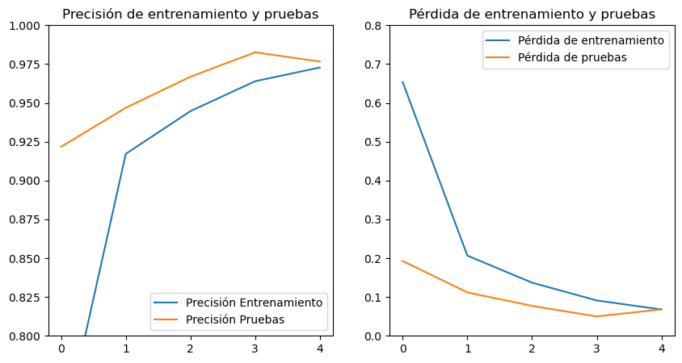
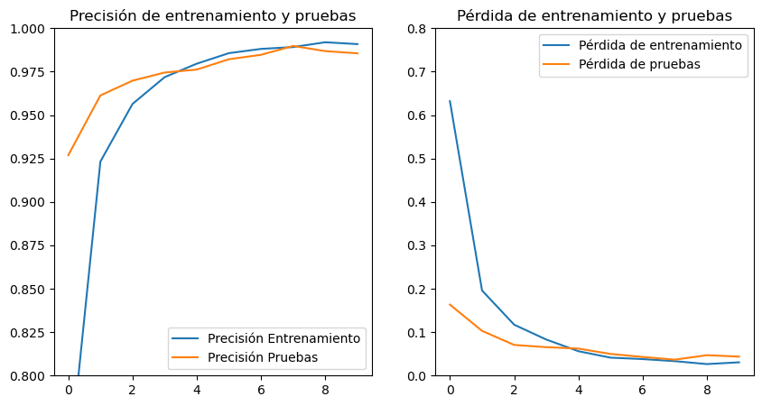
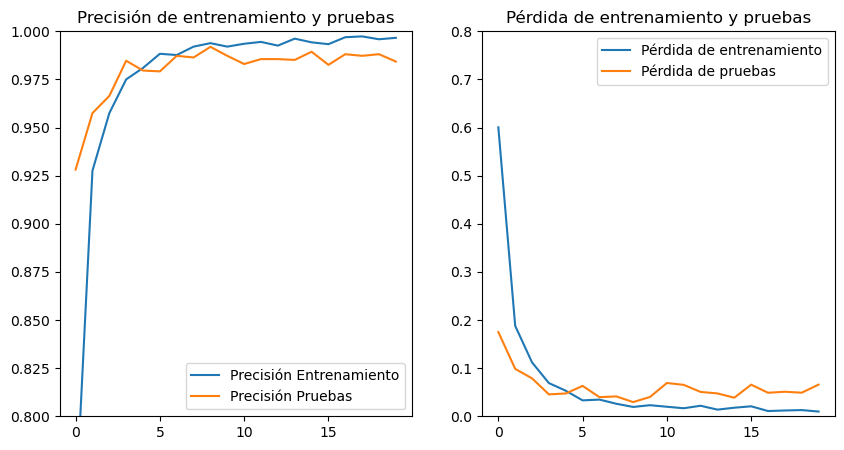
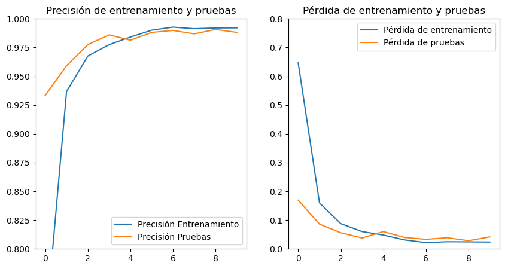

= Modelo CNN Manual - Riñones: Entrenamiento y pruebas
Ebertz Ximena <xebertz@campus.ungs.edu.ar>; Franco Leandro <leandro00fr@gmail.com>; López Gonzalo <gonzagonzalopez20@gmail.com>; Venditto Pedro <pedrovenditto41@gmail.com>; Villalba Gastón <gastonleovillalba@gmail.com>;
v1, {docdate}
:toc:
:title-page:
:toc-title: Secciones
:numbered:
:source-highlighter: highlight.js
:tabsize: 4
:nofooter:
:pdf-page-margin: [3cm, 3cm, 3cm, 3cm]

== Modelo

Utilizamos una arquitectura definida manualmente para el entrenamiento un modelo de detección de enfermedades renales a partir de imágenes de tomografía computarizada. La arquitectura establecida es la siguiente:

[source, python]
----
modelo_cnn = tf.keras.models.Sequential([
    tf.keras.layers.Conv2D(16, (3, 3), activation='relu', input_shape=(224, 224, 1)),
    tf.keras.layers.MaxPooling2D(3, 3),
    tf.keras.layers.Conv2D(32, (3, 3), activation='relu'),
    tf.keras.layers.MaxPooling2D(2, 2),
    tf.keras.layers.Dropout(0.3),
    tf.keras.layers.Flatten(),
    tf.keras.layers.Dense(64, activation='relu'),
    tf.keras.layers.Dropout(0.2),
    tf.keras.layers.Dense(32, activation='relu'),
    tf.keras.layers.Dropout(0.3),
    tf.keras.layers.Dense(2, activation='sigmoid')
])
----

== Entrenamiento

Los entrenamientos se llevan a cabo con nuestro https://www.kaggle.com/datasets/gonzajl/riones-cyst-stone-tumor-normal-dataset[dataset] para la detección de enfermedades renales a partir de imágenes de tomografías computarizadas. Este dataset cuenta con 11756 imágenes, balanceado a 2939 imágenes por clase. Las clases son: _cyst_, _stone_, _tumor_ y _normal_.

Se dividió la totalidad de las imágenes en dos conjuntos, uno de entrenamiento y otro de prueba; con una relación de 80-20%. En total, se utilizaron 9404 imágenes para el entrenamiento, y 2352 imágenes para pruebas.

=== Primer entrenamiento

El primer entrenamiento se llevó a cabo con cinco _epochs_, para realizar una primer aproximación a la performance del modelo.

Para la última vuelta, se obtuvo un nivel de precisión de 97% y un nivel de error de 0.06%.

[source, console]
----
Epoch 1/5
294/294 [==============================] - 62s 207ms/step - loss: 0.6536 - categorical_accuracy: 0.7306 - val_loss: 0.1927 - val_categorical_accuracy: 0.9218
Epoch 2/5
294/294 [==============================] - 59s 202ms/step - loss: 0.2065 - categorical_accuracy: 0.9172 - val_loss: 0.1118 - val_categorical_accuracy: 0.9469
Epoch 3/5
294/294 [==============================] - 59s 201ms/step - loss: 0.1369 - categorical_accuracy: 0.9447 - val_loss: 0.0770 - val_categorical_accuracy: 0.9668
Epoch 4/5
294/294 [==============================] - 59s 201ms/step - loss: 0.0911 - categorical_accuracy: 0.9640 - val_loss: 0.0499 - val_categorical_accuracy: 0.9826
Epoch 5/5
294/294 [==============================] - 59s 201ms/step - loss: 0.0677 - categorical_accuracy: 0.9728 - val_loss: 0.0682 - val_categorical_accuracy: 0.9766
----

Estos resultados son excelentes en cuanto a métricas, lo que insinúa que el modelo puede ser muy potable para el problema.

.primer entrenamiento: 5 vueltas

Sin embargo, en las pruebas podemos observar que tiene una tendencia a cometer errores en la detección de piedras en los riñones.

[source, console]
----
Cantidad de predicciones: 2352
Etiquetas:   [C, S, T, N]
Total:       [553, 651, 599, 549]
Correctas:   [553, 604, 599, 541]
Incorrectas: [0, 47, 0, 8]
----

Para mejorar esto, realizamos un segundo entrenamiento.

=== Segundo entrenamiento

El segundo entrenamiento se realizó con la misma arquitectura, aumentando la cantidad de vueltas a 10. Obtuvimos resultados buenos, pero no tanto como esperábamos.

[source, console]
----
Epoch 1/10
294/294 [==============================] - 61s 206ms/step - loss: 0.6319 - categorical_accuracy: 0.7428 - val_loss: 0.1634 - val_categorical_accuracy: 0.9269
Epoch 2/10
294/294 [==============================] - 59s 201ms/step - loss: 0.1959 - categorical_accuracy: 0.9232 - val_loss: 0.1030 - val_categorical_accuracy: 0.9613
Epoch 3/10
294/294 [==============================] - 59s 201ms/step - loss: 0.1172 - categorical_accuracy: 0.9564 - val_loss: 0.0706 - val_categorical_accuracy: 0.9698
Epoch 4/10
294/294 [==============================] - 59s 200ms/step - loss: 0.0830 - categorical_accuracy: 0.9718 - val_loss: 0.0654 - val_categorical_accuracy: 0.9745
Epoch 5/10
294/294 [==============================] - 59s 200ms/step - loss: 0.0561 - categorical_accuracy: 0.9796 - val_loss: 0.0622 - val_categorical_accuracy: 0.9762
Epoch 6/10
294/294 [==============================] - 59s 200ms/step - loss: 0.0413 - categorical_accuracy: 0.9856 - val_loss: 0.0498 - val_categorical_accuracy: 0.9821
Epoch 7/10
294/294 [==============================] - 59s 201ms/step - loss: 0.0380 - categorical_accuracy: 0.9881 - val_loss: 0.0429 - val_categorical_accuracy: 0.9847
Epoch 8/10
294/294 [==============================] - 59s 200ms/step - loss: 0.0332 - categorical_accuracy: 0.9892 - val_loss: 0.0367 - val_categorical_accuracy: 0.9898
Epoch 9/10
294/294 [==============================] - 59s 201ms/step - loss: 0.0265 - categorical_accuracy: 0.9919 - val_loss: 0.0469 - val_categorical_accuracy: 0.9868
Epoch 10/10
294/294 [==============================] - 59s 201ms/step - loss: 0.0305 - categorical_accuracy: 0.9909 - val_loss: 0.0437 - val_categorical_accuracy: 0.9855
----

Si graficamos estos resultados, vemos que el nivel de error bajó y el de precisión aumentó.

.segundo entrenamiento: 10 vueltas

Pero, nuevamente, en los resultados de prueba obtuvimos una tendencia a error en la clase _stone_.

[source, console]
----
Cantidad de predicciones: 2352
Etiquetas:   [C, S, T, N]
Total:       [554, 634, 599, 565]
Correctas:   [554, 606, 599, 559]
Incorrectas: [0, 28, 0, 6]
----

=== Tercer entrenamiento

Para tercer entrenamiento, aumentamos la cantidad de vueltas a 20 y vimos que el modelo no mejoraba.

[source, console]
----
294/294 [==============================] - 59s 202ms/step - loss: 0.0098 - categorical_accuracy: 0.9966 - val_loss: 0.0658 - val_categorical_accuracy: 0.9843
----

.tercer entrenamiento: 20 vueltas

A pesar de obtener un nivel de precisión del 99%, los errores estaban muy desbalanceados.

[source, console]
----
Cantidad de predicciones: 2352
Etiquetas:   [C, S, T, N]
Total:       [556, 636, 594, 566]
Correctas:   [554, 608, 594, 559]
Incorrectas: [2, 28, 0, 7]
----

Vemos que para la etiqueta _stone_ el nivel de error es de 4.5%.

=== Cuarto entrenamiento

Con la finalidad de mejorar el modelo lo más posible, modificamos la arquitectura del modelo. 

.nueva arquitectura
[source, python]
----
modelo_cnn = tf.keras.models.Sequential([
    tf.keras.layers.Conv2D(16, (3, 3), activation='relu', input_shape=(224, 224, 1)),
    tf.keras.layers.MaxPooling2D(3, 3),
    tf.keras.layers.Conv2D(32, (3, 3), activation='relu'),
    tf.keras.layers.MaxPooling2D(2, 2),
    tf.keras.layers.Dropout(0.3),
    tf.keras.layers.Flatten(),
    tf.keras.layers.Dense(128, activation='relu'),
    tf.keras.layers.Dropout(0.2),
    tf.keras.layers.Dense(64, activation='relu'),
    tf.keras.layers.Dropout(0.3),
    tf.keras.layers.Dense(4, activation='sigmoid')
])
----

Aumentamos la cantidad de neuronas en las capas densas para que la clasificación final sea más precisa. Esto aumenta el tiempo de ejecución, pero puede mejorar la precisión final. Para diez vueltas, los resultados fueron los siguientes:

[source, console]
----
Epoch 1/10
294/294 [==============================] - 65s 219ms/step - loss: 0.6464 - categorical_accuracy: 0.7267 - val_loss: 0.1692 - val_categorical_accuracy: 0.9332
Epoch 2/10
294/294 [==============================] - 62s 212ms/step - loss: 0.1597 - categorical_accuracy: 0.9366 - val_loss: 0.0861 - val_categorical_accuracy: 0.9592
Epoch 3/10
294/294 [==============================] - 62s 212ms/step - loss: 0.0877 - categorical_accuracy: 0.9676 - val_loss: 0.0561 - val_categorical_accuracy: 0.9775
Epoch 4/10
294/294 [==============================] - 62s 212ms/step - loss: 0.0602 - categorical_accuracy: 0.9775 - val_loss: 0.0379 - val_categorical_accuracy: 0.9860
Epoch 5/10
294/294 [==============================] - 62s 211ms/step - loss: 0.0481 - categorical_accuracy: 0.9840 - val_loss: 0.0602 - val_categorical_accuracy: 0.9813
Epoch 6/10
294/294 [==============================] - 62s 211ms/step - loss: 0.0312 - categorical_accuracy: 0.9900 - val_loss: 0.0396 - val_categorical_accuracy: 0.9881
Epoch 7/10
294/294 [==============================] - 63s 214ms/step - loss: 0.0219 - categorical_accuracy: 0.9927 - val_loss: 0.0332 - val_categorical_accuracy: 0.9898
Epoch 8/10
294/294 [==============================] - 62s 211ms/step - loss: 0.0248 - categorical_accuracy: 0.9913 - val_loss: 0.0387 - val_categorical_accuracy: 0.9868
Epoch 9/10
294/294 [==============================] - 62s 212ms/step - loss: 0.0244 - categorical_accuracy: 0.9919 - val_loss: 0.0284 - val_categorical_accuracy: 0.9906
Epoch 10/10
294/294 [==============================] - 62s 212ms/step - loss: 0.0238 - categorical_accuracy: 0.9920 - val_loss: 0.0417 - val_categorical_accuracy: 0.9881
----

.cuarto entrenamiento: 10 vueltas

Si comparamos estos resultados con los de la arquitectura previa, vemos que hay una leve mejoría en cuanto a métricas.

----
# arquitectura previa
294/294 [==============================] - 59s 201ms/step - loss: 0.0305 - categorical_accuracy: 0.9909 - val_loss: 0.0437 - val_categorical_accuracy: 0.9855

# arquitectura nueva
294/294 [==============================] - 62s 212ms/step - loss: 0.0238 - categorical_accuracy: 0.9920 - val_loss: 0.0417 - val_categorical_accuracy: 0.9881
----

En las pruebas, obtuvimos los siguientes resultados:

----
Cantidad de predicciones: 2352
Etiquetas:   [C, S, T, N]
Total:       [557, 621, 593, 581]
Correctas:   [554, 605, 593, 572]
Incorrectas: [3, 16, 0, 9]
----

Podemos ver un error de 2.6% en la etiqueta _stone_, una notable mejoría en cuanto an 4.5% previo. También, se ve que aumentó el nivel de error en las etiquetas _cyst_ y _normal_, pero el aumento fue mínimo.

=== Quinto entrenamiento

Para el último entrenamiento, utilizamos la misma arquitectura que en el entrenamiento anterior, aumentando la cantidad de vueltas a 25. Al finalizar las 25 vueltas, el nivel de error fue de 0.0048, y el de precisión fue de 0.9987.

[source, console]
----
Epoch 25/25
294/294 [==============================] - 62s 212ms/step - loss: 0.0048 - categorical_accuracy: 0.9987 - val_loss: 0.0377 - val_categorical_accuracy: 0.9928
----

Vemos en los gráficos como el modelo mejoró de forma muy acelerada, llegando casi al 100% de precisión y bajando sus niveles de error a niveles muy cercanos al 0%.

.quinto entrenamiento: 25 vueltas

En las pruebas, el modelo mostró resultados extraordinarios: de 2352 imágenes, sólo clasificó erróneamente 17, mostrando un resultado mucho más balanceado que los previos.

[source, console]
----
Cantidad de predicciones: 2352
Etiquetas:   [C, S, T, N]
Total:       [558, 606, 596, 592]
Correctas:   [554, 602, 596, 583]
Incorrectas: [4, 4, 0, 9]
----

== Conclusiones

Este modelo, en su quinta versión, mostró resultados sorprendentes en cuanto a la clasificación de enfermedades de riñón. No cabe duda que al aumentar la cantidad de vueltas de entrenamiento, el modelo mejoraría cada vez más. Por lo pronto es un modelo excelente, con un nivel de precisión de más del 99%, altamente útil para nuestro problema.