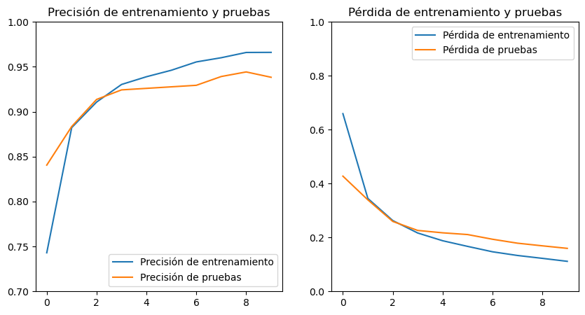
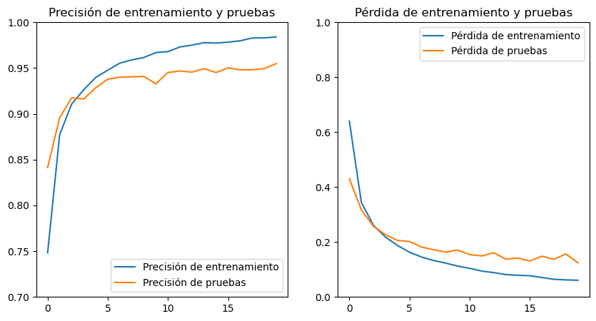

= Modelo ResNet: Entrenamiento y pruebas
Ebertz Ximena <xebertz@campus.ungs.edu.ar>; Franco Leandro <leandro00fr@gmail.com>; López Gonzalo <gonzagonzalopez20@gmail.com>; Venditto Pedro <pedrovenditto41@gmail.com>; Villalba Gastón <gastonleovillalba@gmail.com>;
v1, {docdate}
:toc:
:title-page:
:toc-title: Secciones
:numbered:
:source-highlighter: highlight.js
:tabsize: 4
:nofooter:
:pdf-page-margin: [3cm, 3cm, 3cm, 3cm]

== Modelo

_ResNet_, que es la abreviatura de "Redes Residuales" (en inglés, "Residual Networks"), es un modelo preentrenado que ha demostrado ser muy efectivo en tareas de clasificación de imágenes, detección de objetos, segmentación semántica y otras tareas relacionadas con el procesamiento de imágenes. Ha establecido récords en varios conjuntos de datos de referencia y se ha convertido en una base importante para muchas aplicaciones de visión por computadora.

Utilizamos la variante _ResNet50V2_ de dicho modelo preentrenado. Para incorporarlo en nuestra aplicación, importamos el modelo y le agregamos una capa de entrada (input layer) diseñada para adaptarse a nuestras imágenes, una capa de pooling y una capa de salida. Para aprovechar la técnica de _transfer learning_, hemos congelado el modelo, lo que significa que hemos mantenido los pesos que adquirió durante su entrenamiento previo con el conjunto de datos _ImageNet_.

== Entrenamiento

Llevamos a cabo los entrenamientos utilizando nuestro https://www.kaggle.com/datasets/gonzajl/riones-cyst-stone-tumor-normal-dataset[dataset] disponible en Kaggle, el cual hemos diseñado para la clasificación de imágenes de riñones. Este dataset incluye un total de 11756 imágenes, distribuidas equitativamente en cuatro clases: "cyst", "stone", "tumor" y "normal", con 2939 imágenes en cada categoría.

El entrenamiento se realizó utilizando el siguiente modelo:

[source, python]
----
base_model = tf.keras.applications.ResNet50V2(
    include_top=False,
    weights="imagenet",
    input_shape=(224, 224, 3),
)

base_model.trainable = False

num_classes = 4
x = layers.GlobalAveragePooling2D()(base_model.output)
output = layers.Dense(num_classes, activation="softmax")(x)
model = Model(inputs=base_model.input, outputs=output)
----

Luego, el modelo se compiló de la siguiente manera:

[source, python]
----
model.compile(optimizer="adam", loss="categorical_crossentropy", metrics=["categorical_accuracy"])
----

=== Entrenamiento de 10 épocas

Se utilizó el 80% de las imágenes para el entrenamiento del modelo y el 20% restante para las pruebas, lo que se traduce en 9404 imágenes de entrenamiento y 2352 imágenes de prueba. Durante las diez épocas de entrenamiento, los resultados fueron los siguientes:

[source, console]
----
Epoch 1/10
2023-10-28 16:35:58.405225: W tensorflow/tsl/framework/cpu_allocator_impl.cc:83] Allocation of 5662261248 exceeds 10% of free system memory.
294/294 [==============================] - 289s 975ms/step - loss: 0.6310 - categorical_accuracy: 0.7516 - val_loss: 0.4226 - val_categorical_accuracy: 0.8376
Epoch 2/10
294/294 [==============================] - 285s 970ms/step - loss: 0.3377 - categorical_accuracy: 0.8806 - val_loss: 0.3133 - val_categorical_accuracy: 0.8882
Epoch 3/10
294/294 [==============================] - 281s 955ms/step - loss: 0.2588 - categorical_accuracy: 0.9111 - val_loss: 0.2644 - val_categorical_accuracy: 0.9090
Epoch 4/10
294/294 [==============================] - 281s 958ms/step - loss: 0.2143 - categorical_accuracy: 0.9312 - val_loss: 0.2414 - val_categorical_accuracy: 0.9205
Epoch 5/10
294/294 [==============================] - 281s 957ms/step - loss: 0.1870 - categorical_accuracy: 0.9395 - val_loss: 0.2232 - val_categorical_accuracy: 0.9269
Epoch 6/10
294/294 [==============================] - 282s 961ms/step - loss: 0.1672 - categorical_accuracy: 0.9453 - val_loss: 0.1997 - val_categorical_accuracy: 0.9294
Epoch 7/10
294/294 [==============================] - 281s 956ms/step - loss: 0.1461 - categorical_accuracy: 0.9544 - val_loss: 0.1851 - val_categorical_accuracy: 0.9328
Epoch 8/10
294/294 [==============================] - 282s 960ms/step - loss: 0.1302 - categorical_accuracy: 0.9623 - val_loss: 0.1693 - val_categorical_accuracy: 0.9401
Epoch 9/10
294/294 [==============================] - 281s 958ms/step - loss: 0.1189 - categorical_accuracy: 0.9638 - val_loss: 0.1584 - val_categorical_accuracy: 0.9460
Epoch 10/10
294/294 [==============================] - 287s 977ms/step - loss: 0.1088 - categorical_accuracy: 0.9686 - val_loss: 0.1503 - val_categorical_accuracy: 0.9503
----

Es relevante señalar que la advertencia que se muestra al principio indica que no es factible entrenar el modelo con un conjunto de datos más extenso debido a limitaciones de memoria del sistema, lo que impide considerar la opción de ampliar el conjunto de datos para mejorar la predicción.

Con los datos obtenidos del entrenamiento, es posible generar gráficos que permitan una visualización más clara de la evolución del modelo a lo largo de su entrenamiento.

image::imgs/graficos-resultados-1.png[]

Como se puede apreciar, se logró una precisión del 96% en el conjunto de entrenamiento y una precisión del 95% en el conjunto de pruebas.

Posteriormente, se procedió a evaluar el modelo utilizando las 2352 imágenes del conjunto de pruebas, y se registraron los siguientes resultados:

[source, console]
----
74/74 [==============================] - 57s 758ms/step
Cantidad de predicciones: 2352
Etiquetas:   [C,  S,  T,  N]
Total:       [555, 641, 598, 558]
Correctas:   [549, 573, 594, 519]
Incorrectas: [6, 68, 4, 39]
----

Estos resultados muestran el desempeño del modelo en la clasificación de las imágenes de prueba, con un desglose de predicciones correctas e incorrectas en las categorías "cyst", "stone", "tumor" y "normal".

=== Entrenamiento de 20 épocas

De manera similar al entrenamiento anterior, se empleó el 80% de las imágenes para entrenar el modelo, reservando el 20% restante para las pruebas. Durante las veinte épocas de entrenamiento, se obtuvieron los siguientes resultados:

[source, console]
----
Epoch 1/20
2023-10-28 17:50:32.081035: W tensorflow/tsl/framework/cpu_allocator_impl.cc:83] Allocation of 5662261248 exceeds 10% of free system memory.
294/294 [==============================] - 281s 948ms/step - loss: 0.6695 - categorical_accuracy: 0.7399 - val_loss: 0.4412 - val_categorical_accuracy: 0.8346
Epoch 2/20
294/294 [==============================] - 275s 937ms/step - loss: 0.3469 - categorical_accuracy: 0.8778 - val_loss: 0.3071 - val_categorical_accuracy: 0.9026
Epoch 3/20
294/294 [==============================] - 276s 939ms/step - loss: 0.2678 - categorical_accuracy: 0.9071 - val_loss: 0.2844 - val_categorical_accuracy: 0.9026
Epoch 4/20
294/294 [==============================] - 277s 941ms/step - loss: 0.2222 - categorical_accuracy: 0.9240 - val_loss: 0.2306 - val_categorical_accuracy: 0.9247
Epoch 5/20
294/294 [==============================] - 278s 946ms/step - loss: 0.1924 - categorical_accuracy: 0.9370 - val_loss: 0.2092 - val_categorical_accuracy: 0.9290
Epoch 6/20
294/294 [==============================] - 276s 940ms/step - loss: 0.1653 - categorical_accuracy: 0.9489 - val_loss: 0.2021 - val_categorical_accuracy: 0.9328
Epoch 7/20
294/294 [==============================] - 276s 940ms/step - loss: 0.1491 - categorical_accuracy: 0.9537 - val_loss: 0.2310 - val_categorical_accuracy: 0.9218
Epoch 8/20
294/294 [==============================] - 277s 942ms/step - loss: 0.1340 - categorical_accuracy: 0.9580 - val_loss: 0.1893 - val_categorical_accuracy: 0.9371
Epoch 9/20
294/294 [==============================] - 275s 936ms/step - loss: 0.1236 - categorical_accuracy: 0.9627 - val_loss: 0.1600 - val_categorical_accuracy: 0.9435
Epoch 10/20
294/294 [==============================] - 275s 937ms/step - loss: 0.1126 - categorical_accuracy: 0.9655 - val_loss: 0.1655 - val_categorical_accuracy: 0.9366
Epoch 11/20
294/294 [==============================] - 272s 926ms/step - loss: 0.1058 - categorical_accuracy: 0.9694 - val_loss: 0.1527 - val_categorical_accuracy: 0.9405
Epoch 12/20
294/294 [==============================] - 273s 929ms/step - loss: 0.1002 - categorical_accuracy: 0.9707 - val_loss: 0.1452 - val_categorical_accuracy: 0.9464
Epoch 13/20
294/294 [==============================] - 272s 925ms/step - loss: 0.0890 - categorical_accuracy: 0.9742 - val_loss: 0.1469 - val_categorical_accuracy: 0.9473
Epoch 14/20
294/294 [==============================] - 276s 940ms/step - loss: 0.0843 - categorical_accuracy: 0.9777 - val_loss: 0.1407 - val_categorical_accuracy: 0.9498
Epoch 15/20
294/294 [==============================] - 277s 943ms/step - loss: 0.0772 - categorical_accuracy: 0.9810 - val_loss: 0.1443 - val_categorical_accuracy: 0.9494
Epoch 16/20
294/294 [==============================] - 275s 936ms/step - loss: 0.0734 - categorical_accuracy: 0.9801 - val_loss: 0.1398 - val_categorical_accuracy: 0.9473
Epoch 17/20
294/294 [==============================] - 277s 942ms/step - loss: 0.0715 - categorical_accuracy: 0.9785 - val_loss: 0.1280 - val_categorical_accuracy: 0.9498
Epoch 18/20
294/294 [==============================] - 277s 944ms/step - loss: 0.0692 - categorical_accuracy: 0.9806 - val_loss: 0.1363 - val_categorical_accuracy: 0.9460
Epoch 19/20
294/294 [==============================] - 275s 936ms/step - loss: 0.0630 - categorical_accuracy: 0.9828 - val_loss: 0.1311 - val_categorical_accuracy: 0.9507
Epoch 20/20
294/294 [==============================] - 276s 938ms/step - loss: 0.0619 - categorical_accuracy: 0.9827 - val_loss: 0.1303 - val_categorical_accuracy: 0.9515
----

Para visualizar estos resultados, se generaron los siguientes gráficos:

image::imgs/graficos-resultados-2.png[]

Los resultados reflejan una impresionante precisión del 98% en el conjunto de entrenamiento y un sólido 95% en el conjunto de pruebas, además de una pérdida excepcionalmente baja.

Al evaluar el modelo con las 2352 imágenes del conjunto de pruebas, se obtuvieron los siguientes resultados:

[source, console]
----
74/74 [==============================] - 55s 738ms/step
Cantidad de predicciones: 2352
Etiquetas:   [C,  S,  T,  N]
Total:       [563, 631, 589, 569]
Correctas:   [554, 569, 589, 526]
Incorrectas: [9, 62, 0, 43]
----

=== Tercer entrenamiento

[source, console]
----
Epoch 1/10
2023-10-29 18:21:16.575880: W tensorflow/tsl/framework/cpu_allocator_impl.cc:83] Allocation of 5662261248 exceeds 10% of free system memory.
294/294 [==============================] - 284s 958ms/step - loss: 0.6595 - categorical_accuracy: 0.7430 - val_loss: 0.4276 - val_categorical_accuracy: 0.8406
Epoch 2/10
294/294 [==============================] - 277s 942ms/step - loss: 0.3449 - categorical_accuracy: 0.8823 - val_loss: 0.3397 - val_categorical_accuracy: 0.8835
Epoch 3/10
294/294 [==============================] - 276s 940ms/step - loss: 0.2629 - categorical_accuracy: 0.9108 - val_loss: 0.2596 - val_categorical_accuracy: 0.9137
Epoch 4/10
294/294 [==============================] - 277s 942ms/step - loss: 0.2167 - categorical_accuracy: 0.9303 - val_loss: 0.2262 - val_categorical_accuracy: 0.9243
Epoch 5/10
294/294 [==============================] - 280s 952ms/step - loss: 0.1880 - categorical_accuracy: 0.9390 - val_loss: 0.2174 - val_categorical_accuracy: 0.9260
Epoch 6/10
294/294 [==============================] - 280s 951ms/step - loss: 0.1670 - categorical_accuracy: 0.9462 - val_loss: 0.2109 - val_categorical_accuracy: 0.9277
Epoch 7/10
294/294 [==============================] - 280s 955ms/step - loss: 0.1470 - categorical_accuracy: 0.9554 - val_loss: 0.1935 - val_categorical_accuracy: 0.9294
Epoch 8/10
294/294 [==============================] - 280s 952ms/step - loss: 0.1333 - categorical_accuracy: 0.9601 - val_loss: 0.1789 - val_categorical_accuracy: 0.9392
Epoch 9/10
294/294 [==============================] - 279s 950ms/step - loss: 0.1226 - categorical_accuracy: 0.9660 - val_loss: 0.1691 - val_categorical_accuracy: 0.9443
Epoch 10/10
294/294 [==============================] - 282s 958ms/step - loss: 0.1116 - categorical_accuracy: 0.9661 - val_loss: 0.1597 - val_categorical_accuracy: 0.9384
----

[source, console]
----
74/74 [==============================] - 57s 753ms/step
Cantidad de predicciones: 2352
Etiquetas:   [C,  S,  T,  N]
Total:       [559, 623, 590, 580]
Correctas:   [550, 554, 586, 517]
Incorrectas: [9, 69, 4, 63]
----

=== Cuarto entrenamiento

[source, console]
----
Epoch 1/20
2023-10-29 19:28:30.893918: W tensorflow/tsl/framework/cpu_allocator_impl.cc:83] Allocation of 5662261248 exceeds 10% of free system memory.
294/294 [==============================] - 286s 967ms/step - loss: 0.6402 - categorical_accuracy: 0.7483 - val_loss: 0.4306 - val_categorical_accuracy: 0.8414
Epoch 2/20
294/294 [==============================] - 282s 959ms/step - loss: 0.3439 - categorical_accuracy: 0.8773 - val_loss: 0.3167 - val_categorical_accuracy: 0.8958
Epoch 3/20
294/294 [==============================] - 279s 951ms/step - loss: 0.2611 - categorical_accuracy: 0.9108 - val_loss: 0.2574 - val_categorical_accuracy: 0.9175
Epoch 4/20
294/294 [==============================] - 282s 959ms/step - loss: 0.2180 - categorical_accuracy: 0.9263 - val_loss: 0.2270 - val_categorical_accuracy: 0.9162
Epoch 5/20
294/294 [==============================] - 282s 961ms/step - loss: 0.1875 - categorical_accuracy: 0.9398 - val_loss: 0.2059 - val_categorical_accuracy: 0.9286
Epoch 6/20
294/294 [==============================] - 281s 955ms/step - loss: 0.1629 - categorical_accuracy: 0.9477 - val_loss: 0.2017 - val_categorical_accuracy: 0.9379
Epoch 7/20
294/294 [==============================] - 282s 959ms/step - loss: 0.1454 - categorical_accuracy: 0.9554 - val_loss: 0.1815 - val_categorical_accuracy: 0.9401
Epoch 8/20
294/294 [==============================] - 279s 950ms/step - loss: 0.1328 - categorical_accuracy: 0.9590 - val_loss: 0.1719 - val_categorical_accuracy: 0.9405
Epoch 9/20
294/294 [==============================] - 277s 943ms/step - loss: 0.1233 - categorical_accuracy: 0.9616 - val_loss: 0.1636 - val_categorical_accuracy: 0.9409
Epoch 10/20
294/294 [==============================] - 278s 946ms/step - loss: 0.1124 - categorical_accuracy: 0.9669 - val_loss: 0.1706 - val_categorical_accuracy: 0.9328
Epoch 11/20
294/294 [==============================] - 281s 958ms/step - loss: 0.1041 - categorical_accuracy: 0.9680 - val_loss: 0.1544 - val_categorical_accuracy: 0.9452
Epoch 12/20
294/294 [==============================] - 283s 962ms/step - loss: 0.0943 - categorical_accuracy: 0.9731 - val_loss: 0.1493 - val_categorical_accuracy: 0.9469
Epoch 13/20
294/294 [==============================] - 283s 964ms/step - loss: 0.0886 - categorical_accuracy: 0.9751 - val_loss: 0.1609 - val_categorical_accuracy: 0.9456
Epoch 14/20
294/294 [==============================] - 280s 954ms/step - loss: 0.0815 - categorical_accuracy: 0.9778 - val_loss: 0.1377 - val_categorical_accuracy: 0.9494
Epoch 15/20
294/294 [==============================] - 279s 948ms/step - loss: 0.0790 - categorical_accuracy: 0.9774 - val_loss: 0.1418 - val_categorical_accuracy: 0.9452
Epoch 16/20
294/294 [==============================] - 279s 951ms/step - loss: 0.0773 - categorical_accuracy: 0.9783 - val_loss: 0.1308 - val_categorical_accuracy: 0.9503
Epoch 17/20
294/294 [==============================] - 281s 957ms/step - loss: 0.0709 - categorical_accuracy: 0.9798 - val_loss: 0.1484 - val_categorical_accuracy: 0.9481
Epoch 18/20
294/294 [==============================] - 281s 955ms/step - loss: 0.0642 - categorical_accuracy: 0.9829 - val_loss: 0.1368 - val_categorical_accuracy: 0.9481
Epoch 19/20
294/294 [==============================] - 280s 954ms/step - loss: 0.0621 - categorical_accuracy: 0.9830 - val_loss: 0.1567 - val_categorical_accuracy: 0.9494
Epoch 20/20
294/294 [==============================] - 282s 960ms/step - loss: 0.0607 - categorical_accuracy: 0.9840 - val_loss: 0.1243 - val_categorical_accuracy: 0.9549
----

[source, console]
----
74/74 [==============================] - 56s 751ms/step
Cantidad de predicciones: 2352
Etiquetas:   [C,  S,  T,  N]
Total:       [558, 645, 594, 555]
Correctas:   [554, 578, 593, 521]
Incorrectas: [4, 67, 1, 34]
----

== Conclusión

El modelo _ResNet_ ha demostrado resultados sumamente prometedores, como era de esperar. Es indudablemente una opción destacada para la selección del modelo definitivo destinado a la clasificación de imágenes de riñones.