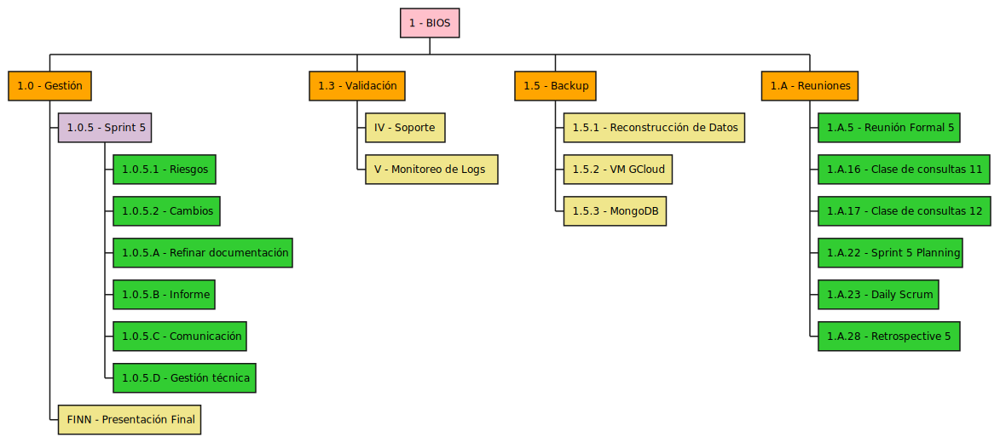
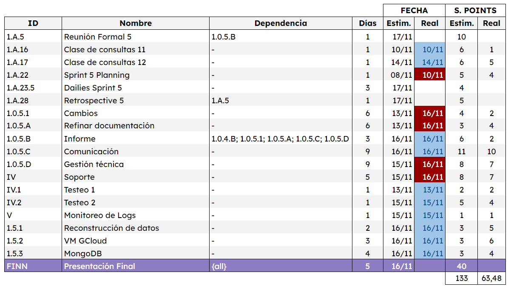
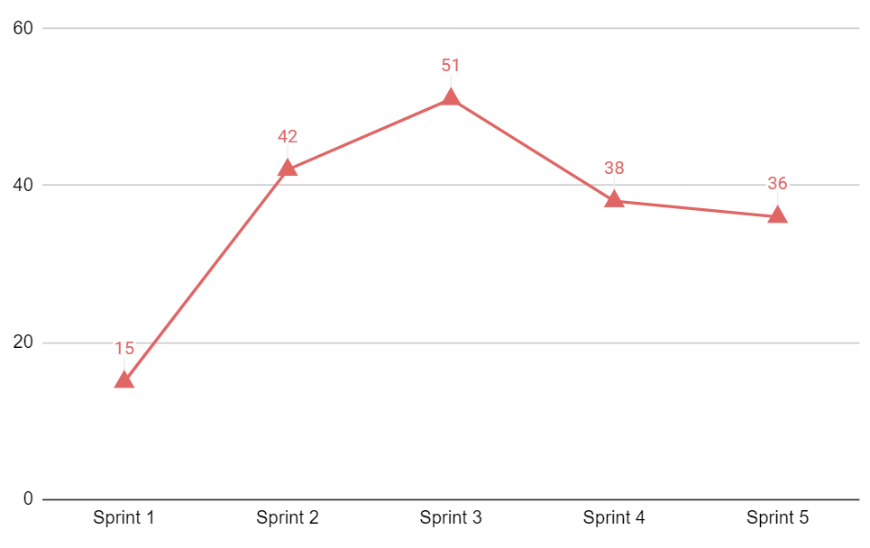
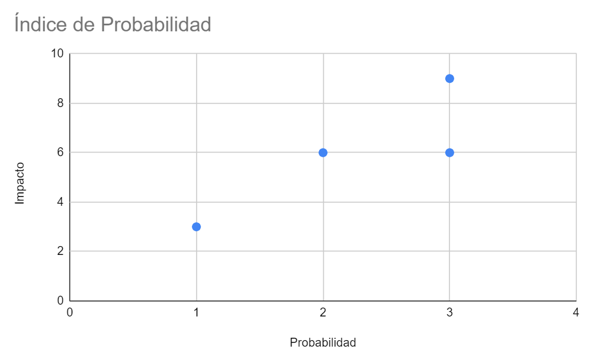
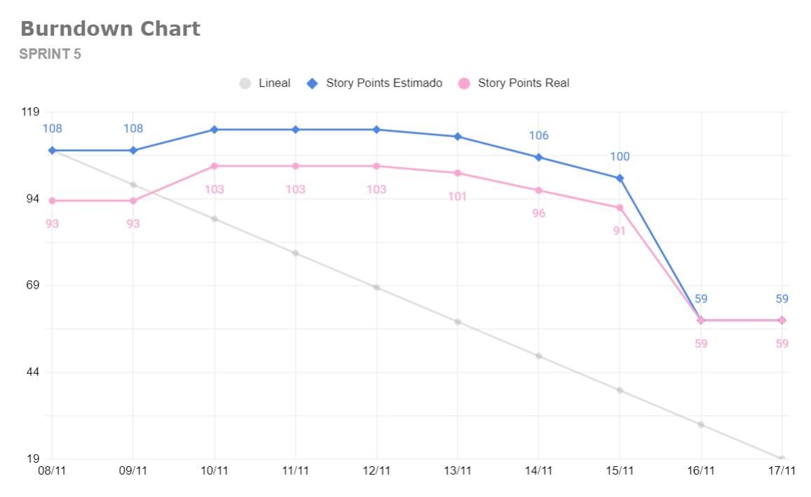
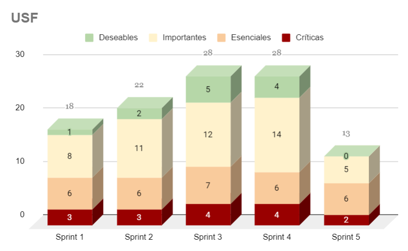
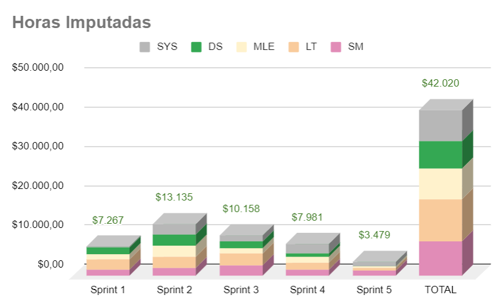
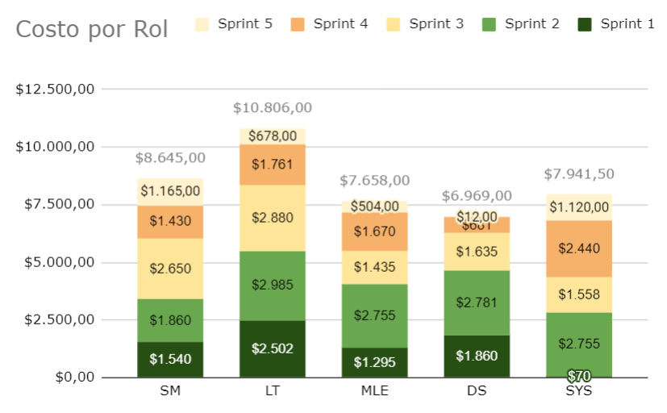
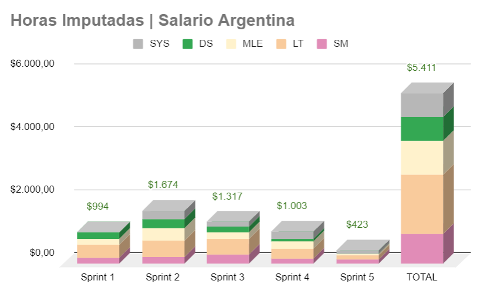
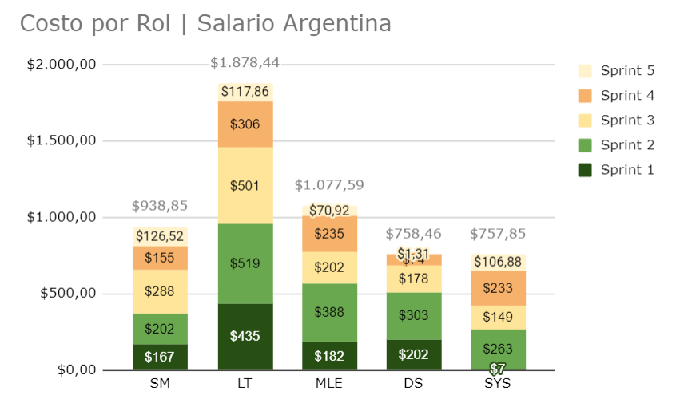

= TP Principal - Laboratorio de Construcción de Software - Sprint 5
Ebertz Ximena <xebertz@campus.ungs.edu.ar>; Franco Leandro <leandro00fr@gmail.com>; López Gonzalo <gonzagonzalopez20@gmail.com>; Venditto Pedro <pedrovenditto41@gmail.com>; Villalba Gastón <gastonleovillalba@gmail.com>;
v1, {docdate}
:toc:
:title-page:
:toc-title: Secciones
:numbered:
:source-highlighter: highlight.js
:tabsize: 4
:nofooter:
:pdf-page-margin: [3cm, 3cm, 3cm, 3cm]

== Introducción

La Inteligencia Artificial o _IA_ es un poderoso campo de estudio que está en constante crecimiento. Cada día, los modelos de Inteligencia Artificial evolucionan y se incorporan en nuestro día a día, funcionando como una potente herramienta de trabajo.

Existen muchos campos donde la Inteligencia Artificial se está desarrollando: detección de imágenes, texto, audio, etcétera. Resulta lógico pensar que se pueden desarrollar herramientas para campos más específicos, como medicina, finanzas, o investigación.

== Objetivos del proyecto

Nuestro objetivo es, mediante la aplicación de tecnologías relacionadas a las inteligencias artificiales, desarrollar un software que pueda ayudar a nuestros profesionales del área de la medicina a lograr un diagnóstico más rápido y preciso sobre alguna enfermedad o malestar en específico.

Para esto, realizaremos tareas de investigación, de análisis de datos y de desarrollo, entre otras.

== Objetivos del documento

El principal objetivo de este documento es especificar las decisiones que se tomen en los días previos al inicio del proyecto; tales como la distribución de roles de trabajo, los posibles riesgos del equipo y del proyecto, el tema a trabajar, las metodologías que se utilizarán, entre otras cosas relacionadas a la organización necesaria del proyecto.

== Metodología de trabajo

Somos parte del _Agile Release Train_ (que plantea el marco de trabajo *_SAFe_*) en conjunto con los demás grupos. Para coordinar nuestro trabajo adaptaremos el _framework_ ágil *_Scrum_* según las preferencias del equipo para optimizarla. Cada _sprint_ dura *dos semanas*.

- *_Sprint Planning_*: se realizará el primer día del _sprint_ y en ocasiones participará el _Release Train Engineer_.

- *_Daily Scrum_* cada 2 días: los integrantes del equipo tienen tiempos diferentes y un día de trabajo quizá no sea suficiente para tener un avance considerable para plantearlo en las _Daily_. Por inconvenientes o bloqueo de un integrante, en el día que no hay _Daily_, se comunicarán por algunos de los medios detallados más adelante.

- *_Sprint Review_*: el último día del _sprint_ se hará una presentación de los informes solicitados mostrando el avance del equipo.

- *_Sprint Retrospective_*: luego de la revisión de cada _sprint_ se hará una retrospectiva del avance.

== Equipo de trabajo y roles

Los roles que se utilizarán en el equipo son los siguientes:

[cols="2,2,2", options="header"]
|===
|Rol            |Encargado         |Suplente

|Product Owner | Dikenstein, Leandro|
|Scrum Master   |Villalba, Gastón  |Ebertz, Ximena
|Líder Técnico  |Ebertz, Ximena    |Franco, Leandro
|Machine Learning Engineer  |López, Gonzalo    |
|SysAdmin |Franco, Leandro   |
|SysAdmin |Venditto, Pedro   |
|===

== Gestión

=== Visión

Nuestra visión es utilizar la tecnología de inteligencia artificial y aprendizaje automático para mejorar la atención médica y el diagnóstico. A través de nuestro trabajo en el presente trabajo práctico, buscamos desarrollar un modelo de clasificación de imágenes médicas que asista a los profesionales de la salud en la toma de decisiones clínicas. 

=== Misión

Nuestra misión es aplicar nuestros conocimientos y habilidades en procesamiento de imágenes y aprendizaje automático para crear soluciones innovadoras y efectivas que impacten positivamente en el ámbito sanitario y el bienestar de las personas.

=== Alcance

Desarrollo y Entrenamiento del Modelo de IA:

- Investigación exhaustiva de algoritmos de aprendizaje automático, con el objetivo de seleccionar el más adecuado para el problema de clasificación de imágenes médicas.
- Implementación y entrenamiento del modelo utilizando el conjunto de datos previamente preparado.
- Optimización y validación del modelo para asegurar su eficacia y precisión en la clasificación de las imágenes médicas.
- Se considerará la posibilidad de mejorar el modelo de inteligencia artificial si es necesario.
- Despliegue del modelo de IA. Recibe como inputs una imagen y determinados datos y devuelve un resultado.
- Almacenar imágenes y sus etiquetas para un posterior reentrenamiento de los modelos de IA.

=== Requerimientos
Cada modelo de IA debe cumplir los siguientes requerimientos:

==== Requerimientos Funcionales

1. El modelo debe recibir imágenes y procesarlas de acuerdo a la arquitectura del modelo.

2. El modelo debe realizar una predicción de la imagen mediante técnicas de _Machine Learning_.

3. El modelo debe retornar el resultado de la predicción mostrando el porcentaje de probabilidad de cada etiqueta.

4. El modelo puede reentrenarse, para ello se deben almacenar las imágenes con sus etiquetas y determinados datos extra para mejorar el proceso de reentrenamiento.

5. Se debe permitir la descarga de los datos para su futuro reentrenamiento. 

6. Cada modelo recibirá _feedback_ de cada predicción que se almacene.

==== Requerimientos No Funcionales
1. El modelo debe responder rápidamente. Para ello se aplicarán las mejores prácticas para aumentar su *rendimiento*.

2. El modelo debe mantener un porcentaje de aciertos mayor o igual al 85% para mantener la *confiabilidad*.

3. El modelo debe estar *disponible* para su uso en cualquier momento. Para comprobarlo se creará un _endpoint_ el cual retornará el estado del servicio.

=== WBS

.Tareas _sprint_ 5

=== Diccionario WBS Sprint 5

[cols="1,2,6,6,1", options="header"]
|===
|ID
|Nombre
|Descripción
|Tarea
|Peso
|1.A.5
|Reunión Formal 5
|Presentar los avances al Product Owner.
|Asistir a la Reunión Formal del 17-11-2023.
|10
|1.A.16
|Clase de consultas 11
|Consultas sobre el proyecto.
|Asistir a la clase de consultas del 10-11-2023.
|6
|1.A.17
|Clase de consultas 12
|Consultas sobre el proyecto.
|Asistir a la clase de consultas del 14-11-2023.
|6
|1.A.22
|Sprint 5 Planning
|Planificación sobre el proyecto enfocado en este sprint.
|Asistir a la reunión de planificación del 08-11-2023.
|5
|1.A.27
|Retrospective 5
|Se plantean los puntos buenos y malos del sprint.
|Asistir a las ceremonia de retrospectiva.
|5
|1.0.5.1
|Cambios
|Estar al tanto de cualquier cambio en cuanto al alcance del proyecto o tecnología a utilizar.
|Documentar los cambios.
|4
|1.0.5.A
|Refinar documentación
|Una vez realizado la documentación sobre el desarrollo de modelos y temas relacionados, se refinarán la documentación para una mejor lectura.
|Releer la documentación generada y refinarla.
|3
|1.0.5.B
|Informe
|Muestra del avance del equipo al Product Owner.
|Realizar el informe de avance y presentación para la Reunión Formal.
|6
|1.0.5.C
|Comunicación
|Las tareas del Scrum Master para gestionar el proyecto.
|Actualizar las tareas realizadas en el dashboard.
|12
|1.0.5.D
|Gestión técnica
|Last tareas del Líder Técnico para gestionar el desarrollo.
|Asignar tareas, confirmar desarrollo y cambios.
|10
|IV 
|Soporte
|Estar a la escucha de cualquier inconveniente surgido en nuestro dominio.
|Realizar tareas de mantenimiento y testeo.
|6
|V
|Monitoreo de Logs
|La actividad del servidor puede ser exportada a _json_ o _csv_ para su análisis.
|Revisar los logs del servidor para determinar la causa de la eliminación de los datos.
|1
|FINN
|Presentación Final
|Preparación de presentación ante jurado.
|Presentar ante jurado el día 21-11-2023
|40
|===

=== Calendario

.Calendario Sprint 5

.Referencia de color
image:../sprint-2-cerebro/gestion/sprint-5/comparativa-color.png[120,120, align="center"]

=== Plan de comunicaciones

Nuestros medios de comunicación son:

*Gather*: es una plataforma que nos permite tener una oficina virtual, donde cada uno tiene su personaje dentro de esta oficina. La utilizamos porque no tiene límites de tiempo, permite la comunicación a través de voz, compartir pizarras y es menos monótona que otras plataformas como _Meet_. Es una vía de comunicación formal que empleamos para las ceremonias _Scrum_.

*WhatsApp*: es un medio de comunicación informal que utilizamos para coordinar los horarios de las reuniones en _Gather_ y discutir cuestiones relacionadas con el proyecto que no requieran la presencia de todo el equipo en ese momento. Se trata de un método de comunicación [.underline]#asincrónica#.

*Telegram*: similar al uso que le damos a WhatsApp, pero para contactarnos con los demás equipos de trabajo. Principalmente es para coordinar reuniones o solicitar ayuda con alguna cuestión del proyecto.

*Email*: en caso de que sea necesario, por algún inconveniente externo que no permita las vías convencionales, utilizaremos el email de los integrantes para coordinar al equipo. Además, es la principal vía para comunicarnos con nuestro _Product Owner_.

*Jira/Trello*: comunicación de tareas y responsables de la ejecución de las mismas.

*Moodle*: se realizarán las entregas de documentación solicitada para realizar el _Sprint Review_.

La actualización de la documentación se hará formalmente al final de cada _sprint_.

==== Horarios

Se armó una tabla con rangos de horarios en los cuales cada integrante del equipo indicaba cuándo se encontraba disponible en el _sprint_.

.Horarios Sprint 5
image::../sprint-2-cerebro/gestion/sprint-5/horarios-sprint.png[align="center"]

=== Riesgos

Matriz de evaluación de riesgos.

[cols="1,3,1,1,1,3,3,1", options="header"]
|===
|ID
|Descripción
|Prob
|Sev
|Exp
|Mitigación
|Contingencia
|Resp
|1
|Ausencia de miembros del equipo en fechas 2023-11-08, 2023-11-09, 2023-11-13 por motivos de estudio
|3
|3
|9
|Adelantar lo más posible la actividad por la que se lleva a cabo la ausencia. 
|Reemplazos
|XE
|2
|Ausencia de miembros del equipo el 2023-11-16
|3
|2
|6
|Adelantar lo más posible la actividad por la que se lleva a cabo la ausencia. 
|Reemplazos
|XE
|3
|Dificultades en la integración con otros grupos del proyecto
|2
|3
|6
|Establecer estándares de comunicación entre APIs
|Comunicar por los medios acordados los inconvenientes surgidos
|GV;XE
|4
|Escasez de recursos o mal funcionamiento de plataforma de despliegue
|2
|3
|6
|Investigar la capacidad de las plataformas de despliegue y buscar nuevas alternativas
|Migrar el modelo a otra plataforma
|LF
|5
|Mal funcionamiento de API o modelos en la integración
|1
|3
|3
|Constante validación con todos los equipos
|Gestión de bugs, arreglo de problema
|GV;XE
|6
|Ausencia de miembros del equipo por enfermedad
|1
|3
|3
|Comunicación en el equipo
|Reemplazos
|XE
|7
|Pérdida de posibilidad de trabajo en el entorno
|1
|3
|3
|Backups periódicos, alternativas de entornos
|Cambiar de entorno de trabajo, restablecer backup
|XE;GL
|8
|Mala comunicación con los otros grupos del proyecto
|1
|1
|1
|Acordar medios de comunicación y horarios disponibles
|Comunicar por los medios acordados los inconvenientes surgidos
|GV;XE
|9
|Escasez de recursos computacionales
|1
|1
|1
|Tener alternativas de entornos de trabajo
|Cambiar de entorno de trabajo
|XE
|===

==== Nivel de Riesgo

.Nivel de Riesgo 

==== Índices de riesgos extra

Para simplificar la visualización de riesgos, no se mostró la tabla de riesgos completa. Los campos faltantes son:

[cols="1,2,1,1,2,2", options="header"]
|===
|ID
|Estado del plan de mitigación
|Impacto Potencial Reducido
|Índice de Mitigación
|Estado del Riesgo
|Fecha Revisión
|1
|Ejecutado
|2
|22,22
|No activo
|14/11/23
|2
|En curso
|6
|100
|Activo
|16/11/23
|3
|En curso
|6
|100
|Activo
|16/11/23
|4
|Pendiente
|6
|100
|Activo
|10/11/23
|5
|En curso
|3
|100
|Activo
|16/11/23
|6
|Pendiente
|3
|100
|Activo
|10/11/23
|7
|Ejecutado
|1
|33,33
|No activo
|16/11/23
|8
|Ejecutado
|0
|0
|No activo
|16/11/23
|9
|Ejecutado
|0
|0
|No activo
|===

Teniendo un Impacto Potencial Reducido de 27, siendo 38 el impacto original con un Índice de Mitigación del 71%.

.Índice de probabilidad

.Índice de mitigación 
image::gestion/sprint-5/indice-mitigación.png[420,420,align="center"]

=== Administración en el Manejo de bugs
Los _bugs_ encontrados serán agregados como _card_ en el tablero del equipo en *Trello*.

=== Administración de Cambios

Tras recibir una petición de cambio, documentaremos las nuevas funcionalidades que se solicitan y posteriormente se agregarán al _Product Backlog_. Esta nueva modificación se evaluará, se estimará con los integrantes del proyecto, se modificará la WBS, Diccionario y se agregará al _Sprint Backlog_.

Durante este _sprint_ tuvimos **x** cambios:

- Cambio de prioridad: Se priorizó la integración y testeo de todas las funcionalidades de nuestra API, dejando la preparación de la presentación final en un nivel bajo de prioridad.

- Creación de un nuevo _endpoint_ *"_retrieve_"* para facilitar el testeo de nuestra API.

=== *Burndown Chart*

Al utilizar _Scrum_ precisamos ver el avance de nuestro trabajo de cada _sprint_. 
El trabajo se expresará en Story Points, teniendo en cuenta que un Story Point es igual a 1 hora.

El _sprint_ tuvo su comienzo con **x** _story points_ estimados. Se estimó completar **y _story points_**, quedando un total de **z** para el siguiente _sprint_.

.Burndown Chart Sprint 5

== User Stories Finalizadas

.USF

== Horas Imputadas

.Horas imputadas de cada rol por _sprint_ 

.Participación de cada rol en el proyecto 

=== Salario Argentina

.Horas imputadas de cada rol por _sprint_ | Arg

.Participación de cada rol en el proyecto | Arg

Fuente: https://sueldos.openqube.io/encuesta-sueldos-2023.02/[encuesta openqube]

== Tecnologías

Las tecnologías a utilizadas fueron las siguientes:

- *Saturn Cloud* para el desarrollo del modelo de IA, ya que el entorno de trabajo contiene todo lo necesario.
- *Python* como lenguaje de programación, por su simplicidad y utilidad en el desarrollo de este tipo de modelos.
- *TensorFlow - Keras* como biblioteca principal de desarrollo, ya que provee distintas funcionalidades para la creación de modelos de IA.
- *NumPy* debido a la necesidad de trabajar las imágenes como arrays multidimensionales o _tensores_.
- *Pandas* ya que permite obtener información de archivos .csv.
- *cv2* como biblioteca de lectura y procesamiento de imágenes.
- *matplotlib.pyplot* para generar gráficos.
- *GitHub* como repositorio de trabajo.
- *Google Spreadsheets* como _dashboard_ para la gestión del proyecto.

=== Repositorio de GitHub

El repositorio de GitHub se encuentra https://github.com/ximeeb/tp-principal-grupo-0-lcs.git[aquí].
